# 01 — Website Core: Services, Data, Agents, Storage

> Part of the Amach Health architecture map. See `00-master-map.md` for the full doc set index. Sibling docs: `02-website-ui.md` (React components/pages), `05-integration-storj.md`, `06-integration-privy.md`, `07-integration-venice-ai.md`, `08-integration-zk-contracts.md`, `09-data-flows-website.md`.

## Overview

This chapter covers every non-UI module of the Next.js website: the multi-agent AI analysis system, the Venice AI transport layer, the local (IndexedDB) and remote (Storj) data/storage stacks, the wallet and blockchain-facing hooks, cross-cutting config/lib modules, the shared type system, and the nascent client-side ZK helper layer. Together these modules take raw Apple Health exports and parsed lab/DEXA reports, aggregate and validate them, persist them locally and in encrypted Storj buckets, feed them to seven specialist AI agents coordinated into a single synthesized insight, and expose on-chain profile/attestation/proof operations against ZKsync Era Sepolia. It is the plumbing beneath the UI documented in `02-website-ui.md`.

A recurring theme across nearly every module: **parallel/duplicate implementations** of the same concern (day-bucketing and aggregation, Venice API transport, on-chain profile reads, RPC URL fallbacks, ABI definitions, BM25 search, encryption) built at different times without consolidation, plus a substantial amount of **orphaned scaffolding** (an entire ~1,500-line AI memory subsystem, four abstraction interfaces with zero implementers, several dead services) left in the tree from abandoned or paused initiatives.

---

## Tests — Security Hardening (`src/__tests__/`)

A single top-level regression suite guarding supply-chain and security configuration, independent of any one module above.

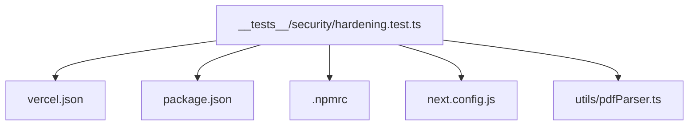

| File                                     | Lines | Role                                                                                                                  | Verdict | Issues |
| ---------------------------------------- | ----- | --------------------------------------------------------------------------------------------------------------------- | ------- | ------ |
| src/**tests**/security/hardening.test.ts | 223   | Static regression suite validating dependency pinning, CSP headers, and npm registry locking without a running server | good    | None   |

---

## Agents (`src/agents/`)

Seven specialist AI agents (Activity/Energy, Cardiovascular, Recovery/Stress, Sleep, Bloodwork, DEXA, Gut Health) each extend `BaseHealthAgent`, which owns the shared analyze-pipeline: extract data, assess quality, build a Venice AI prompt, call the API with retry, and parse a structured JSON insight. `CoordinatorAgent` runs all seven concurrently (staggered, `Promise.allSettled`, cached), derives cross-agent signals, and asks Venice to synthesize one combined summary. A `utils/dataAggregation.ts` helper provides tiered time-bucketing for prompts, and `types.ts` defines the shared agent contract.

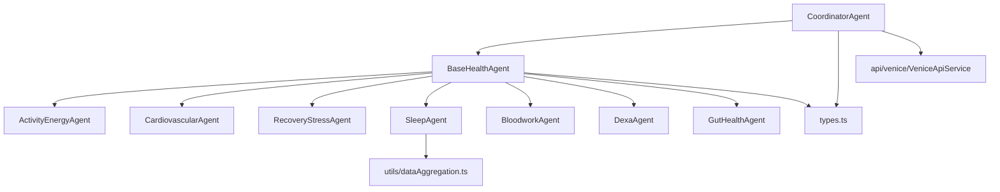

| File                                | Lines | Role                                                                                     | Verdict    | Issues                                                                                                                                                                                                                                                                                                                                                      |
| ----------------------------------- | ----- | ---------------------------------------------------------------------------------------- | ---------- | ----------------------------------------------------------------------------------------------------------------------------------------------------------------------------------------------------------------------------------------------------------------------------------------------------------------------------------------------------------- |
| src/agents/ActivityEnergyAgent.ts   | 1158  | Extracts 6mo activity data, computes tiered averages, builds Venice prompt               | needs-work | `findValueForDay` only takes first sample per day despite comment claiming summation; quadratic day/sample scan; two windowing strategies mixed (`slice(-days)` vs date filter); day-bucketing helpers duplicated across agents; ~360-line near-identical prompt string blocks; 30-day average computed twice; hardcoded age/max-HR fallbacks               |
| src/agents/RecoveryStressAgent.ts   | 659   | HRV/RHR/respiratory/sleep/energy daily summaries and tiered prompt context               | acceptable | Day-bucketing helpers byte-identical to CardiovascularAgent; positional `slice(-days)` windowing; sleep-hours unit assumption unchecked; metadata keys don't match what CoordinatorAgent expects (dead cross-signal); no historicalStats integration                                                                                                        |
| src/agents/CardiovascularAgent.ts   | 615   | Daily HR/HRV/exercise/VO2max aggregation and tiered prompt context                       | acceptable | Helpers byte-identical duplicates of RecoveryStressAgent; feeds LLM physiologically meaningless summed bpm/ms totals; `findValueForDay` undercounts and is quadratic; positional windowing; metadata keys missing for cross-signal; VO2 trend uses only first/last sample                                                                                   |
| src/agents/CoordinatorAgent.ts      | 596   | Orchestrates all 7 agents, builds cross-signals, synthesizes combined summary via Venice | needs-work | Checks metadata keys (`sleepConsistencyScore`, `recoveryHRVVolatility`, `cardioAverageVO2Max`) that no agent ever writes — two cross-signals are dead code; brittle keyword-blocklist filtering; duplicated TTL computation; chatty unconditional logging; hand-rolled JSON fence-stripping likely duplicated elsewhere; error-insight fallback built twice |
| src/agents/SleepAgent.ts            | 550   | Sleep/HRV/RHR/respiratory/temp extraction, quality assessment, tiered formatting         | needs-work | Dead `\|\| allSleepSamples` fallback (filter never returns falsy); `normalizeSamples`/`calculateStdDev` duplicated in RecoveryStressAgent; repeated inline metadata casts; UTC vs local-timezone day-key inconsistency within the same agent; verbose production console.log; 320-line mixed-concern formatter                                              |
| src/agents/BaseHealthAgent.ts       | 517   | Abstract base: analyze() pipeline, prompt/parsing/error scaffolding for all agents       | needs-work | ~90 lines of parsing logic duplicated between try and catch-retry blocks; thinking-tag stripping regex has mismatched tags (dead/broken); logs full prompts containing health data unconditionally (PII leak); slow-response retry discards an already-successful response, doubling API cost; system prompt computed twice per attempt                     |
| src/agents/utils/dataAggregation.ts | 330   | Time-bucketing (day/week/month) and tiered format for prompts                            | duplicate  | Duplicates fuller `src/utils/tieredDataAggregation.ts` (which handles cumulative vs average metrics correctly); always averages, wrong for cumulative metrics; `formatTieredDataForPrompt` is a dead export; only one consumer (SleepAgent) for ~200 lines                                                                                                  |
| src/agents/BloodworkAgent.ts        | 233   | Filters/ranks bloodwork reports by flag severity for Venice prompt                       | good       | No-op `buildDetailedPrompt` override (dead code, pattern repeated in DexaAgent); flagged/in-range partitioning logic done twice                                                                                                                                                                                                                             |
| src/agents/DexaAgent.ts             | 181   | DEXA scan/region summaries and quality scoring                                           | good       | No-op `buildDetailedPrompt` override; assumes `reports[0]` is latest without sorting by scan date                                                                                                                                                                                                                                                           |
| src/agents/GutHealthAgent.ts        | 153   | Gut microbiome report extraction and formatting, delegates to `reportFormatters`         | good       | Assumes `reports[0]` is latest without date sort; not listed in CLAUDE.md's 6-agent roster (docs drift only)                                                                                                                                                                                                                                                |
| src/agents/types.ts                 | 120   | Shared agent contract: AgentInsight, MetricSample, execution context, quality assessment | good       | String-literal unions collapse to plain `string`, defeating narrowing; untyped index signature on `AgentAvailableData`; mid-file import breaks top-of-file convention                                                                                                                                                                                       |

---

## AI (`src/ai/`)

This directory holds two very different things: a **live** optimization/tooling layer (`ai/optimization/`, `ai/tools/`) actively used by `LumaAiService`, and an **entirely orphaned** ~1,500-line "Phase 2" AI memory subsystem (`ai/memory/`) plus a dead `RelevanceScorer`/`ContextPreprocessor` pipeline — none of it reachable from any live entry point, verified by repo-wide grep. The live layer handles Venice tool-call routing, pre-computed metric summaries, and cached coordinator insights, all gated by `config/featureFlags.ts`.

```mermaid
flowchart TD
    Luma[LumaAiService] --> ToolExec[ai/tools/ToolExecutor]
    Luma --> ToolDefs[ai/tools/ToolDefinitions]
    Luma --> ToolParser[ai/tools/ToolResponseParser]
    Luma --> PreComp[ai/optimization/PreComputedMetrics]
    Luma --> CacheStore[ai/optimization/CachedInsightsStore]
    Luma --> DataHasher[ai/optimization/DataHasher]
    Luma --> RelScorer[ai/RelevanceScorer]
    OptIndex[ai/optimization/index.ts] --> PreComp
    OptIndex --> CacheStore
    OptIndex --> DataHasher

    subgraph Orphaned Memory Subsystem
        MemIndex[ai/memory/index.ts] --> LocalAdapter[ai/memory/LocalStorageAdapter]
        MemIndex --> HybridSearch[ai/memory/HybridSearchIndex]
        MemIndex --> DailyLog[ai/memory/DailyLogService]
        MemIndex --> ProfileStore[ai/memory/HealthProfileStore]
        MemIndex --> MemEncrypt[ai/memory/MemoryEncryption]
        HybridSearch -.duplicates.-> BM25[ai/memory/bm25.ts]
        AiIndex[ai/index.ts] --> RelScorer
        AiIndex --> CtxPre[ai/ContextPreprocessor]
    end
```

| File                                         | Lines | Role                                                                                                  | Verdict        | Issues                                                                                                                                                                                                                                                                             |
| -------------------------------------------- | ----- | ----------------------------------------------------------------------------------------------------- | -------------- | ---------------------------------------------------------------------------------------------------------------------------------------------------------------------------------------------------------------------------------------------------------------------------------- |
| src/ai/memory/LocalStorageAdapter.ts         | 518   | Tiered (hot/warm/cold) storage adapter for AI memory system                                           | dead-or-orphan | Zero external consumers (only used within the unreachable memory module); cold tier (Storj) is a stub that discards data; re-encrypts and rewrites entire log on every read; embeds Storj creds in client config; stats hardcoded to zero                                          |
| src/ai/memory/HybridSearchIndex.ts           | 488   | In-memory BM25 index + fake TF-IDF embeddings for memory search                                       | dead-or-orphan | Orphaned; discards metadata passed to `addDocument`; re-indexing without removal corrupts BM25 stats over time; pseudo-embeddings are not real vector search; `Math.max(...emptyIterator)` bug yields `-Infinity`                                                                  |
| src/ai/memory/DailyLogService.ts             | 471   | Daily health-summary log generation/dedup/scheduling                                                  | dead-or-orphan | Orphaned; `generateSummary` is hardcoded rule-based text explicitly marked "in production would call LLM"; `deleteLog` never actually deletes from storage; stats hardcoded; date/dataProvider mismatch in auto-generation                                                         |
| src/ai/RelevanceScorer.ts                    | 433   | Scores health metrics 0-1 by goal/baseline/clinical/recency/frequency; ranks/groups/detects anomalies | acceptable     | `rankMetricsByRelevance` is live (used by LumaAiService); about half the exports are only consumed by orphaned `ContextPreprocessor`; substring-based impact-weight matching is fragile; goal correlation is binary despite doc claiming weighted factor                           |
| src/ai/tools/ToolExecutor.ts                 | 391   | Routes AI tool calls to a DataSource implementation, computes Pearson correlations                    | acceptable     | Live (LumaAiService, `/api/health/query`); inline `ReportData` shape repeated 5x instead of importing the type; unconditional full param logging; no type/enum param validation                                                                                                    |
| src/ai/optimization/PreComputedMetrics.ts    | 382   | Pre-computes 7/30/90-day/all-time metric summaries cached by data fingerprint                         | acceptable     | Live behind `usePreComputedMetrics` flag; redundant instance/static dual API; plaintext localStorage for health aggregates (inconsistent with encrypted-at-rest policy elsewhere); sample-count-based (not time-based) trend detection; overlaps dashboard stat-card average logic |
| src/ai/memory/types.ts                       | 381   | Type definitions for the Phase-2 memory subsystem                                                     | dead-or-orphan | Only imported within the unreachable memory module; duplicates feature-flag concern already in `config/featureFlags.ts`; domain types parallel but incompatible with live `healthData.ts`/`healthEventTypes.ts`                                                                    |
| src/ai/ContextPreprocessor.ts                | 363   | Ranks metrics, extracts patterns, builds markdown AI context, caches encrypted in Storj               | dead-or-orphan | Orphaned — LumaAiService does its own context assembly directly via RelevanceScorer; `cachePreprocessedContext` writes a new timestamped Storj object per miss with no cleanup (unbounded accumulation); unused encryption-key param; hardcoded TODO events array                  |
| src/ai/**tests**/contextPreprocessor.test.ts | 328   | Jest suite nominally covering AI context preprocessing                                                | needs-work     | Every function under test is redefined inline in the test file rather than imported from production code — can never catch a regression                                                                                                                                            |
| src/ai/tools/ToolDefinitions.ts              | 313   | Declares the 5 health-query tools exposed to Venice, formats them into system prompt                  | good           | Repeated `as ParameterSchema` casts; placeholder descriptions add noise (stripped before prompt use)                                                                                                                                                                               |
| src/ai/optimization/CachedInsightsStore.ts   | 283   | localStorage cache for CoordinatorAgent results, fingerprint + 4hr TTL invalidation                   | good           | Redundant instance/static API; unconditional console.log bypasses feature-flag gating used elsewhere                                                                                                                                                                               |
| src/ai/memory/bm25.ts                        | 273   | Standalone functional BM25 search implementation                                                      | dead-or-orphan | Zero importers; duplicated by `HybridSearchIndex.ts`'s own from-scratch BM25 implementation in the same directory; O(n) recompute of avg doc length per insert                                                                                                                     |
| src/ai/memory/MemoryEncryption.ts            | 248   | AES-GCM Web Crypto encryption for the memory system, PBKDF2 key derivation                            | dead-or-orphan | Orphaned; weak KDF (salt derived from key material itself, defeating the purpose); per-record salt generated but never used in decrypt; duplicates concern of `utils/walletEncryption.ts` with a weaker construction                                                               |
| src/ai/memory/HealthProfileStore.ts          | 211   | Curated long-term profile store: sleep pattern/correlation detection, persona, goals                  | dead-or-orphan | Orphaned; stores profiles in plaintext localStorage despite `MemoryEncryption` existing in the same module; pattern detection wholesale-replaces history each run; concurrent-tab writes clobber each other                                                                        |
| src/ai/optimization/DataHasher.ts            | 154   | djb2-based fingerprints of health data for cache invalidation                                         | good           | Live (LumaAiService, CachedInsightsStore); instance method wraps static unnecessarily; hash granularity (count + latest timestamp) is coarse but documented as acceptable                                                                                                          |
| src/ai/tools/ToolResponseParser.ts           | 126   | Parses Venice responses for tool calls (JSON/fenced/tagged formats), strips them from display         | acceptable     | Live (LumaAiService, aiStore); bare-JSON regex fallback can't match nested braces so unfenced tool-call JSON leaks into user-visible replies; strips ALL json fences including legitimate ones                                                                                     |
| src/ai/memory/index.ts                       | 93    | Barrel/factory (`initMemorySystem`) wiring the entire memory subsystem together                       | dead-or-orphan | `initMemorySystem`/`searchMemory` have zero call sites anywhere — the entire ~1,500-line subsystem is unreachable                                                                                                                                                                  |
| src/ai/index.ts                              | 29    | Barrel re-exporting RelevanceScorer + ContextPreprocessor as `@/ai`                                   | dead-or-orphan | No file imports from `@/ai`; the one real consumer (LumaAiService) imports RelevanceScorer directly, bypassing the barrel                                                                                                                                                          |
| src/ai/optimization/index.ts                 | 23    | Barrel for DataHasher/CachedInsightsStore/PreComputedMetricsGenerator                                 | good           | Actively imported by LumaAiService; canonical live barrel                                                                                                                                                                                                                          |

---

## API (`src/api/`)

A single file: the Venice AI transport client used across the entire AI layer.

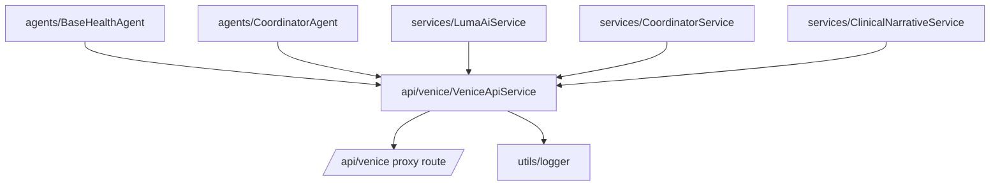

| File                               | Lines | Role                                                                                                                                                                                   | Verdict    | Issues                                                                                                                                                                                                                                                                                                                                                                                                                                                                                                                                                                              |
| ---------------------------------- | ----- | -------------------------------------------------------------------------------------------------------------------------------------------------------------------------------------- | ---------- | ----------------------------------------------------------------------------------------------------------------------------------------------------------------------------------------------------------------------------------------------------------------------------------------------------------------------------------------------------------------------------------------------------------------------------------------------------------------------------------------------------------------------------------------------------------------------------------- |
| src/api/venice/VeniceApiService.ts | 628   | Axios client for Venice AI chat-completions via `/api/venice` proxy; core transport for BaseHealthAgent, CoordinatorAgent, LumaAiService, CoordinatorService, ClinicalNarrativeService | needs-work | Duplicated by an entirely separate client in `data/hooks/useVeniceAI.ts` (own retry/backoff/parsing); mobile fetch-path re-implements request logic with weaker parsing (no reasoning_content fallback → mobile Safari errors); logs full model responses to console unconditionally; mobile detection forks HTTP stack entirely (axios interceptors never run on mobile, so mobile gets zero retries); hardcoded GLM fallback model; misleading timeout error message; rate-limit reset-time parsing assumes wrong epoch format; dead `'error' in response` check on AxiosResponse |

---

## Config (`src/config/`)

A single client-side feature-flag module gating the (mostly unused) AI optimization rollout.

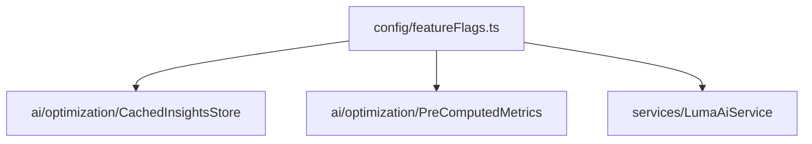

| File                       | Lines | Role                                                                                                                                                                | Verdict    | Issues                                                                                                                                                                                                                                                                                         |
| -------------------------- | ----- | ------------------------------------------------------------------------------------------------------------------------------------------------------------------- | ---------- | ---------------------------------------------------------------------------------------------------------------------------------------------------------------------------------------------------------------------------------------------------------------------------------------------- |
| src/config/featureFlags.ts | 307   | Feature flags for AI pipeline optimization rollout (caching, precomputed metrics, memory phases, hybrid search) with localStorage/env/percentage-rollout resolution | needs-work | Only `getFeatureFlags` is actually consumed (2 flags read downstream); 5+ flags defined and wired into rollout logic but never read anywhere; JSDoc advertises a "Ctrl+Shift+F" dev panel that does not exist in the codebase; percentage-rollout bucketing machinery serves one dead-end flag |

---

## Core (`src/core/`)

A single hardcoded metric-registry config file for the dashboard metric picker.

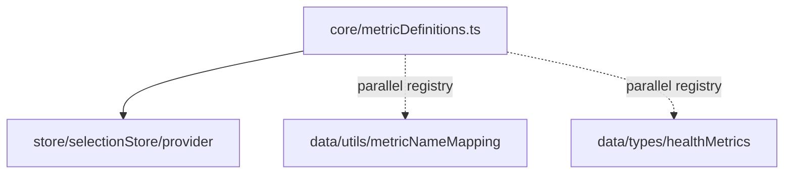

| File                          | Lines | Role                                                                          | Verdict    | Issues                                                                                                                                                                                                                                                                                   |
| ----------------------------- | ----- | ----------------------------------------------------------------------------- | ---------- | ---------------------------------------------------------------------------------------------------------------------------------------------------------------------------------------------------------------------------------------------------------------------------------------- |
| src/core/metricDefinitions.ts | 94    | Hardcoded whitelist of 9 "core" HealthKit metrics for the metric-selection UI | needs-work | Only 2 of 6 exports are used anywhere; `optionalMetrics` is a permanently empty stub; one of several scattered independent sources of HealthKit identifier strings across the repo (agents, `data/types/healthMetrics.ts`, `data/utils/metricNameMapping.ts`) with no canonical registry |

---

## Data (`src/data/`)

The largest module: local IndexedDB persistence (`data/store/`), Apple Health XML parsing (`data/parsers/`), aggregation/processing (`data/processors/`), typed metric registries (`data/types/`, `data/utils/`), the DataSource abstraction for AI tool queries (`data/sources/`), validation (`data/validation/`), and React Query hooks bridging all of it to the UI (`data/hooks/`). `HealthDataProcessor` and `healthDataStore` are the true center of gravity — nearly everything in the app that needs historical health data eventually reads through one of them.

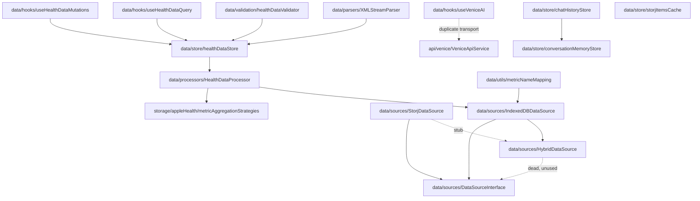

| File                                                | Lines | Role                                                                                                               | Verdict        | Issues                                                                                                                                                                                                                                                                                                                  |
| --------------------------------------------------- | ----- | ------------------------------------------------------------------------------------------------------------------ | -------------- | ----------------------------------------------------------------------------------------------------------------------------------------------------------------------------------------------------------------------------------------------------------------------------------------------------------------------- |
| src/data/store/healthDataStore.ts                   | 1001  | IndexedDB persistence for raw health data, goals, daily scores, uploaded files, processed aggregates               | needs-work     | Silently discards raw samples older than 180 days on every save, with no signal to callers expecting full history; ~40 ungated console.log/error statements; mixes five unrelated concerns (5 IndexedDB stores) in one monolithic class; migration-history comments will go stale                                       |
| src/data/processors/HealthDataProcessor.ts          | 809   | Central aggregation service: raw XML → daily aggregates/processed sleep data, tiered getter APIs for scores/viz/AI | needs-work     | `deduplicateSamplesByDate` is a third parallel implementation of day-bucketing logic alongside `tieredDataAggregation.ts` and `dataDeduplicator.ts`; ~25 ungated console statements; heart-rate visualization data returns `[]` by comment-only contract; heart-rate raw-sample fallback silently truncated to 180 days |
| src/data/processors/**tests**/deduplication.test.ts | 688   | Characterization tests pinning `dataDeduplicator`/`tieredDataAggregation` behavior ahead of consolidation          | good           | Does not cover `HealthDataProcessor`'s own `deduplicateSamplesByDate`, the third parallel implementation                                                                                                                                                                                                                |
| src/data/parsers/XMLStreamParser.ts                 | 569   | Streaming chunked parser for large Apple Health export XML into HealthDataPoint arrays                             | needs-work     | `parseString()` duplicates ~130 lines of `processRecordElement()`'s logic and is only used by its own test, not production; three empty catch blocks silently swallow per-record parse errors; regex-based attribute extraction (no real XML parser); dead empty-if in `standardizeUnit`                                |
| src/data/sources/IndexedDBDataSource.ts             | 535   | DataSource implementation over IndexedDB, translates tool-style QueryParams into results                           | needs-work     | 20+ verbose console logs per query; duplicated processor→raw-store fallback logic; imported directly by LumaAiService and the API route, bypassing the intended `HybridDataSource` router entirely (making that router dead code)                                                                                       |
| src/data/utils/metricNameMapping.ts                 | 402   | Lookup tables mapping Apple HealthKit identifiers ↔ canonical/display metric names                                 | good           | Covers ~15 metric types while `data/types/healthMetrics.ts` is a separate, narrower/overlapping registry — two parallel sources of truth                                                                                                                                                                                |
| src/data/parsers/**tests**/XMLStreamParser.test.ts  | 357   | Unit tests for XML parsing, date normalization, time-frame filtering, file validation                              | good           | None                                                                                                                                                                                                                                                                                                                    |
| src/data/hooks/useVeniceAI.ts                       | 317   | React Query mutation hook calling `/api/venice` directly with its own sanitization/retry                           | needs-work     | Duplicates `VeniceApiService`'s transport responsibilities entirely — two independent Venice client code paths; fragile regex-based think-tag/LaTeX/reasoning-dump sanitization; logs full prompt previews                                                                                                              |
| src/data/types/healthMetrics.ts                     | 315   | Type-safe validated metric definitions (per-HealthKit interfaces, SOURCE_PRIORITIES)                               | acceptable     | Only 8 metric types vs. 15 in `metricNameMapping.ts` — overlapping but non-identical registries; `filterMetricsBySource` can divide by zero on a zero-length time window                                                                                                                                                |
| src/data/store/conversationMemoryStore.ts           | 282   | IndexedDB persistence for Luma conversation memory (facts, session summaries, preferences)                         | good           | Direct console.log/error instead of shared logger (consistent with rest of data layer)                                                                                                                                                                                                                                  |
| src/data/hooks/useStorjAppleHealthQuery.ts          | 270   | React Query hook fetching Apple Health export + timeline events from Storj                                         | acceptable     | Duplicates the 1s/3s/8s key-availability polling pattern verbatim with `useStorjHealthScores.ts`; errors only console.warn'd, returning silent partial/empty data                                                                                                                                                       |
| src/data/store/chatHistoryStore.ts                  | 269   | IndexedDB chat-thread store: session boundaries via inactivity/topic-shift detection                               | good           | None                                                                                                                                                                                                                                                                                                                    |
| src/data/store/storjItemsCache.ts                   | 240   | IndexedDB cache of Storj object listings per user address                                                          | good           | `cacheItems` does full delete-then-reinsert on every refresh instead of diff/upsert                                                                                                                                                                                                                                     |
| src/data/validation/healthDataValidator.ts          | 153   | Static validation of parsed HealthMetric records before persistence                                                | good           | Calls `navigator.userAgent` directly in an error branch — latent ReferenceError risk if ever run server-side                                                                                                                                                                                                            |
| src/data/sources/HybridDataSource.ts                | 140   | Intended IndexedDB/Storj routing layer split by 90-day threshold                                                   | dead-or-orphan | Zero importers anywhere — LumaAiService and the API route import `IndexedDBDataSource` directly, bypassing this router; the hybrid-routing design intent is unenforced                                                                                                                                                  |
| src/data/hooks/useStorjHealthScores.ts              | 136   | React Query hook fetching pre-computed daily health scores from Storj                                              | acceptable     | Duplicates key-availability polling from `useStorjAppleHealthQuery.ts` verbatim; imports a type from an API route file, coupling client hook to route module                                                                                                                                                            |
| src/data/sources/StorjDataSource.ts                 | 95    | Storj-backed DataSource implementation, planned "Phase 5" feature                                                  | needs-work     | Every method is an unimplemented TODO stub returning empty/null/false — non-functional even though wired into `HybridDataSource`; unused constructor fields marked `@ts-expect-error`                                                                                                                                   |
| src/data/sources/DataSourceInterface.ts             | 87    | Shared TypeScript contract implemented by IndexedDB/Storj/Hybrid data sources                                      | good           | None                                                                                                                                                                                                                                                                                                                    |
| src/data/hooks/useHealthDataMutations.ts            | 81    | React Query mutations for saving/updating/clearing local health data                                               | acceptable     | Leftover verbose debug console logging with emoji prefixes                                                                                                                                                                                                                                                              |
| src/data/hooks/useHealthDataQuery.ts                | 40    | React Query hook adapting HealthMetric[] → HealthDataPoint[] for UI                                                | good           | None                                                                                                                                                                                                                                                                                                                    |
| src/data/hooks/useGoalsMutation.ts                  | 21    | React Query mutation to persist health goals                                                                       | good           | None                                                                                                                                                                                                                                                                                                                    |
| src/data/hooks/useGoalsQuery.ts                     | 11    | React Query hook fetching saved health goals                                                                       | good           | None                                                                                                                                                                                                                                                                                                                    |

---

## Hooks (`src/hooks/`)

The wallet/blockchain integration layer. `usePrivyWalletService.ts` is the de facto central service for the entire app — auth, encryption key derivation, on-chain profile CRUD, transactions — accessed by most consumers through the thin `useWalletService` facade. Several hooks here are dead legacy code from the pre-Privy (ZKsync SSO / injected wallet) era.

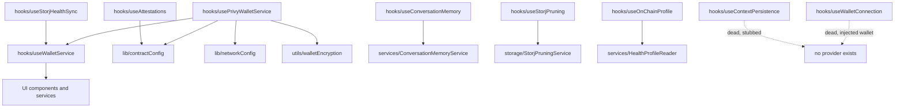

| File                               | Lines | Role                                                                                                                               | Verdict        | Issues                                                                                                                                                                                                                                                                                                                                                                                                                                                                           |
| ---------------------------------- | ----- | ---------------------------------------------------------------------------------------------------------------------------------- | -------------- | -------------------------------------------------------------------------------------------------------------------------------------------------------------------------------------------------------------------------------------------------------------------------------------------------------------------------------------------------------------------------------------------------------------------------------------------------------------------------------- |
| src/hooks/usePrivyWalletService.ts | 1673  | Central wallet orchestration: auth, encryption, on-chain profile CRUD, verification/allocation tx, context vault, balance/transfer | needs-work     | Mixes 6+ concerns in one 1673-line hook (~25 returned methods); 2 `any` escapes; gas-fee calc duplicated verbatim 3x; inline hand-written ABIs instead of `contractConfig`; hardcoded RPC fallback duplicated elsewhere; `connect()` relies on `setTimeout(2000)` + stale closure state; busy-wait polling for concurrent signature requests; heavy unconditional logging of wallet internals; legacy localStorage decryption fallback duplicates `secureHealthEncryption` logic |
| src/hooks/useConversationMemory.ts | 369   | React wrapper over ConversationMemoryService: fact CRUD, extraction, Storj sync, pruning                                           | acceptable     | `useActiveGoals`/`useMemoryStats` exported but never imported (dead); every mutation triggers a full reload plus a CustomEvent causing double reloads; `processConversationEnd` swallows errors inconsistently vs. other mutations                                                                                                                                                                                                                                               |
| src/hooks/useStorjHealthSync.ts    | 369   | Login-time hook: caches encryption key, fetches Apple Health export from Storj, seeds IndexedDB                                    | acceptable     | Sleep-stage reconstruction intentionally mirrors `storjAppleHealthConverter` (acknowledged drift risk); `METRIC_MAP` duplicates mapping knowledge; swallows all fetch errors to null; double unsafe casts to `HealthMetric`                                                                                                                                                                                                                                                      |
| src/hooks/useStorjPruning.ts       | 323   | Stateful wrapper over StorjPruningService/Integration: analyze/execute/stats                                                       | acceptable     | Returned functions not memoized; `performCompletePruning` re-implements the analyze step instead of composing it; verbose ungated logging                                                                                                                                                                                                                                                                                                                                        |
| src/hooks/useAttestations.ts       | 211   | Fetches attestation counts/tiers from SecureHealthProfile V4 contract                                                              | acceptable     | Hardcoded RPC URLs duplicating `lib/networkConfig`; up to 8 sequential `readContract` calls not parallelized; fragile positional struct decoding with heuristic bp-vs-percent normalization                                                                                                                                                                                                                                                                                      |
| src/hooks/useContextPersistence.ts | 155   | Intended auto-save of extracted goals/interventions from chat every 10 messages                                                    | dead-or-orphan | Zero importers anywhere; core persistence step is a TODO stub that only console.logs; `useEffect` deps include a ref value that never triggers re-runs                                                                                                                                                                                                                                                                                                                           |
| src/hooks/useWalletConnection.ts   | 133   | Legacy connector for a pre-Privy `window.amachWallet` injected provider                                                            | dead-or-orphan | Zero importers; depends on an injected object nothing provides; would be a battery-draining 1s poll if ever mounted; stale duplicate also exists in untracked `src 2/hooks/`                                                                                                                                                                                                                                                                                                     |
| src/hooks/useOnChainProfile.ts     | 95    | Read-only on-chain profile loader via HealthProfileReader                                                                          | good           | Sole consumer (`OnChainProfileDisplay`) invokes it with a hardcoded debug wallet address; overlaps conceptually with `usePrivyWalletService`'s own profile-reading path                                                                                                                                                                                                                                                                                                          |
| src/hooks/useWalletService.ts      | 24    | Thin facade aliasing `usePrivyWalletService` as the unified wallet service                                                         | good           | Facade not consistently used — several files import `usePrivyWalletService` directly, splitting the abstraction                                                                                                                                                                                                                                                                                                                                                                  |

---

## Interfaces (`src/interfaces/`)

Four type-only interfaces (`IStorageService`, `IHealthDataStore`, `IAuthService`, `IAiService`) intended to decouple web-specific implementations (Storj, IndexedDB, Privy, Venice) from future iOS equivalents (CloudKit, HealthKit/CoreData, WalletConnect, Apple Intelligence). None have production implementers — the entire module is aspirational scaffolding exercised only by in-memory mocks in its own test file.

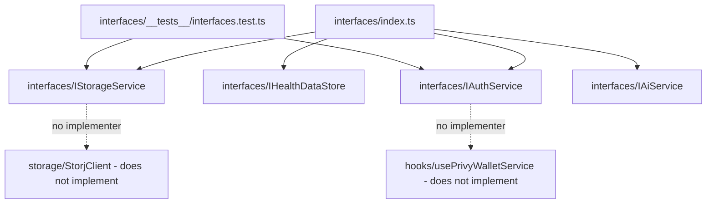

| File                                        | Lines | Role                                                                                          | Verdict        | Issues                                                                                                                      |
| ------------------------------------------- | ----- | --------------------------------------------------------------------------------------------- | -------------- | --------------------------------------------------------------------------------------------------------------------------- |
| src/interfaces/**tests**/interfaces.test.ts | 357   | Tests in-memory MockStorageService/MockAuthService against the interfaces                     | acceptable     | Only tests 2 of 4 interfaces; validates mocks that no production class implements, so passing tests give no real confidence |
| src/interfaces/IHealthDataStore.ts          | 216   | Contract for platform-agnostic local health data persistence (web IndexedDB vs iOS HealthKit) | dead-or-orphan | Zero implementers or consumers found anywhere in the codebase                                                               |
| src/interfaces/IAiService.ts                | 206   | Contract abstracting AI chat/analysis (Venice/web vs future Apple Intelligence/iOS)           | dead-or-orphan | No implementers; `CosaintAiService`/`LumaAiService` do not reference or implement it                                        |
| src/interfaces/IAuthService.ts              | 171   | Contract abstracting wallet auth and key derivation (Privy vs future native WalletConnect)    | dead-or-orphan | No implementers; `usePrivyWalletService` does not implement it — contract is aspirational only                              |
| src/interfaces/IStorageService.ts           | 117   | Contract abstracting encrypted storage (Storj vs future CloudKit)                             | dead-or-orphan | No implementers; real `StorjClient`/`StorjTimelineService`/`StorjReportService` classes do not implement it                 |
| src/interfaces/index.ts                     | 58    | Barrel re-exporting all four interfaces and types                                             | dead-or-orphan | Nothing in the app imports from `@/interfaces` — the entire barrel is unreferenced                                          |

---

## Lib (`src/lib/`)

Cross-cutting configuration: contract ABIs/addresses, network/chain definitions, blog content loading, and a misleadingly-named email-whitelist utility.

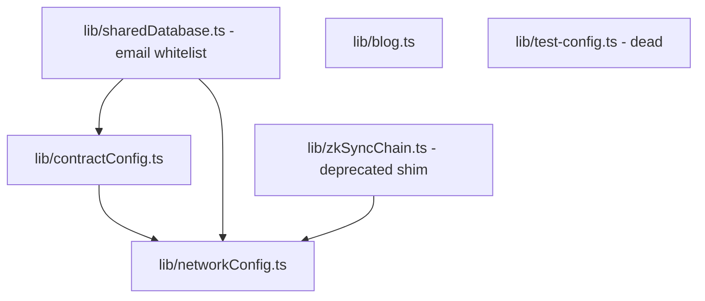

| File                      | Lines | Role                                                                                                              | Verdict        | Issues                                                                                                                                                                                                                                                                       |
| ------------------------- | ----- | ----------------------------------------------------------------------------------------------------------------- | -------------- | ---------------------------------------------------------------------------------------------------------------------------------------------------------------------------------------------------------------------------------------------------------------------------- |
| src/lib/contractConfig.ts | 789   | Registry of smart-contract ABIs (SecureHealthProfile V1-V4, etc.) and deployed addresses; `computeStorjEventHash` | needs-work     | Contract addresses duplicated between this file and `networkConfig.ts` for all but one contract — a network switch could silently keep testnet addresses; hand-maintained ABI merge risks drift from compiled artifacts; deprecated legacy exports still live and importable |
| src/lib/blog.ts           | 141   | Server-side blog markdown/MDX loader with hand-rolled frontmatter parser                                          | good           | None (deliberate workaround for a documented webpack/js-yaml version clash)                                                                                                                                                                                                  |
| src/lib/networkConfig.ts  | 141   | Single source of truth for chain definitions and per-network contract addresses                                   | acceptable     | Identical client/server branches in `getCurrentNetwork` are dead branching; mainnet addresses are all zero-address placeholders with no throw guard; testnet addresses partially duplicated in `contractConfig.ts`                                                           |
| src/lib/sharedDatabase.ts | 58    | Despite the name, checks email-whitelist status via a ZKsync contract read (no database involved)                 | needs-work     | Misleading filename; whitelist-check logic duplicated in 3 places across the codebase; swallowed errors make RPC outages indistinguishable from "not whitelisted"; logs raw email + hash (PII in server logs); computed `emailHash` never actually used                      |
| src/lib/test-config.ts    | 45    | Dev-only mock test wallet/email fixtures                                                                          | dead-or-orphan | Zero imports anywhere in the repo; email rotation getter never increments its index (already broken even if used)                                                                                                                                                            |
| src/lib/zkSyncChain.ts    | 11    | Deprecated backward-compat shim re-exporting from `networkConfig.ts`                                              | dead-or-orphan | Zero importers — every consumer already uses `networkConfig` directly                                                                                                                                                                                                        |

---

## Rules (`src/rules/`)

A single unused config-object file.

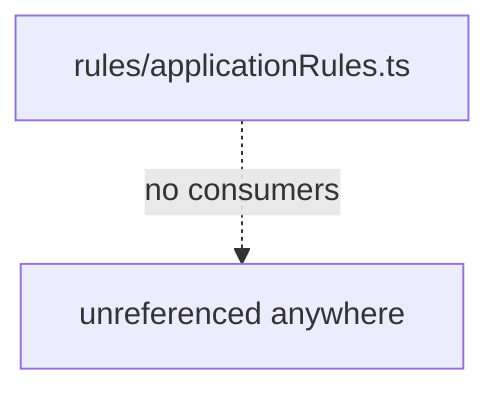

| File                          | Lines | Role                                                                                          | Verdict        | Issues                                                                                                                                                                                                                 |
| ----------------------------- | ----- | --------------------------------------------------------------------------------------------- | -------------- | ---------------------------------------------------------------------------------------------------------------------------------------------------------------------------------------------------------------------- |
| src/rules/applicationRules.ts | 292   | Static unused config object (API/data/styling/component/performance/security/logging "rules") | dead-or-orphan | Zero imports anywhere; color palette does not match the actual Amach brand system; Venice API config duplicates the real client config; validation constants duplicate concerns that belong with `healthEventTypes.ts` |

---

## Services (`src/services/`)

The service layer sitting between agents/UI and the storage/blockchain layers. `LumaAiService` is the largest and most central file — it builds prompts, routes Quick/Deep mode, runs the coordinator with caching, and executes the tool-call loop. `HealthEventService` and `CoordinatorService` are also live and heavily used. Several files here (`PrivyWalletService.ts`, `SecureHealthProfileService.ts`) are superseded dead scaffolding from earlier migration phases. The `proofGenerators/` and `proofs/` subfolders implement the ZK-adjacent health-metric attestation/proof pipeline.

```mermaid
flowchart TD
    Luma[services/LumaAiService] --> Coordinator[agents/CoordinatorAgent]
    Luma --> CoordService[services/CoordinatorService]
    Luma --> IndexedDBSource[data/sources/IndexedDBDataSource]
    HealthEvent[services/HealthEventService] --> ContractConfig[lib/contractConfig]
    HealthEvent --> WalletEncryption[utils/walletEncryption]
    ConvMemService[services/ConversationMemoryService] --> ConvMemStore[data/store/conversationMemoryStore]
    ConvMemService --> StorjConvService[storage/StorjConversationService]
    ConvMemService --> MemExtraction[services/MemoryExtractionService]
    QuarterlyAgg[services/QuarterlyAggregationService] --> StorageService[storage/StorageService]
    Attestations[services/attestations.ts] --> AttestationService[storage/AttestationService]
    Signing[services/signing.ts]
    ProfileReader[services/HealthProfileReader] --> ContractConfig
    ClinicalNarrative[services/ClinicalNarrativeService]
    ProofIndex[services/proofGenerators/index.ts] --> LabResult[services/proofGenerators/labResultGenerator]
    ProofIndex --> BodyComp[services/proofGenerators/bodyCompositionGenerator]
    ProofIndex --> MetricChange[services/proofGenerators/metricChangeGenerator]
    ProofIndex --> DataCompleteness[services/proofGenerators/dataCompletenessGenerator]
    ProofHash[services/proofs/hash.ts] --> ProofIndex
    DeadPrivy[services/PrivyWalletService.ts] -.dead.-> Nothing1[superseded by hooks/usePrivyWalletService]
    DeadSecure[services/SecureHealthProfileService.ts] -.dead.-> Nothing2[no importers]
```

| File                                                      | Lines | Role                                                                                                         | Verdict        | Issues                                                                                                                                                                                                                                                                                                                                            |
| --------------------------------------------------------- | ----- | ------------------------------------------------------------------------------------------------------------ | -------------- | ------------------------------------------------------------------------------------------------------------------------------------------------------------------------------------------------------------------------------------------------------------------------------------------------------------------------------------------------- |
| src/services/LumaAiService.ts                             | 1683  | Core Luma chat orchestration: prompts, Quick/Deep mode, coordinator caching, tool-call loop, goal generation | needs-work     | Bug: `formatToolsForPrompt` appended twice to system message under certain flag combos; dead `generateResponse`/`createPrompt` path; 1683-line file mixing 5 concerns; ~60 lines of hardcoded topical fallback advice strings; extensive ungated console logging of health context; hardcoded model fallback and disabled quick-mode token budget |
| src/services/HealthEventService.ts                        | 801   | Health timeline CRUD against SecureHealthProfile contract + encrypted Storj payloads                         | needs-work     | Dead `searchEventsByType` export; stale doc references a nonexistent `updateHealthEvent()`; N+1 perf trap — up to 3 sequential RPC calls + 1 Storj fetch per event in a for-loop; hardcoded RPC fallback duplicated 3x in file (~22x repo-wide); swallowed per-event errors render silently-incomplete timelines                                  |
| src/services/CoordinatorService.ts                        | 678   | Adapts raw health data into the CoordinatorAgent pipeline, normalizes profile                                | acceptable     | ~320-line legacy `transformMetricData` fallback duplicates aggregation already owned by `HealthDataProcessor`/`tieredDataAggregation`; triple-pass deduplication; unsafe cast bypassing type check; unbounded raw heart-rate samples fed to agents                                                                                                |
| src/services/**tests**/timelineDataFlow.test.ts           | 657   | Tests timeline pipeline: encryption round-trips, V1/V2 detection, timeline parsing                           | acceptable     | Several tests hand-copy production logic (`parseEventData`, icon map) instead of importing it — tautological coverage                                                                                                                                                                                                                             |
| src/services/ConversationMemoryService.ts                 | 639   | Orchestrates conversation memory: extraction, IndexedDB save, pruning, Storj sync                            | needs-work     | `scheduleSyncToCloud` is a stub that only console.logs and never syncs despite defaulting to enabled; all major methods swallow errors to null/false; 100-line inline cloud-memory shape duplicates a type that should live in `types/conversationMemory`                                                                                         |
| src/services/**tests**/memoryServices.test.ts             | 566   | Tests MemoryExtractionService/ConversationMemoryService with mocked Venice/store/Storj                       | good           | Fact-extraction-prompt test re-implements production formatting inline (tautological); no tests for AI-dependent JSON-parsing paths, the highest-risk code                                                                                                                                                                                        |
| src/services/**tests**/proofEndpoints.test.ts             | 524   | Tests canonical proof hashing, generator registry, iOS/web proof compatibility                               | acceptable     | Header claims signing/verification coverage that doesn't exist; fixture hardcodes a real testnet address that can drift from `contractConfig.ts`                                                                                                                                                                                                  |
| src/services/QuarterlyAggregationService.ts               | 518   | Computes quarterly health aggregates (min/max/avg/median/stddev/percentiles), stores encrypted in Storj      | needs-work     | Trend math breaks for <3 samples (NaN/Infinity, wrong default trend); `loadFromStorj`/`listAll` decrypt every object sequentially just to filter by quarter/year (should use upload metadata); percentile/median math duplicates `utils/historicalStats.ts`                                                                                       |
| src/services/MemoryExtractionService.ts                   | 396   | AI-powered fact/summary extraction from conversations via Venice, keyword topic ID                           | acceptable     | Hardcoded fallback model name; greedy regex JSON parsing fails silently on any trailing prose; hardcodes confidence 0.7 for every fact, ignoring model-reported importance                                                                                                                                                                        |
| src/services/PrivyWalletService.ts                        | 392   | Class-based skeleton Privy wallet service, superseded by the real hook                                       | dead-or-orphan | Zero importers; architecturally invalid (stores React hooks on a class instance outside render); ~8 stub methods return "Not yet implemented"; duplicates types that live in the hook                                                                                                                                                             |
| src/services/SecureHealthProfileService.ts                | 372   | Legacy-to-secure on-chain profile migration service                                                          | dead-or-orphan | Zero importers despite being listed in CLAUDE.md's key-files table; `getContract()` calls `getSigner()` on an unconnected provider — every write path would fail at runtime; inline ABI diverges from `contractConfig.ts`; fabricates default field values                                                                                        |
| src/services/attestations.ts                              | 256   | Server-side viem helpers for V4 attestation create/list/verify                                               | needs-work     | `createAttestation` is unused dead export within a live file, and writes fabricated placeholder data under the server wallet's address (not the user's) if it were ever called; failures swallowed into a stub `{txHash:'0x'}`                                                                                                                    |
| src/services/HealthProfileReader.ts                       | 183   | Read-only ethers v5 client for on-chain SecureHealthProfile reads                                            | acceptable     | Hardcoded RPC URL bypassing `networkConfig`; BigNumber-vs-bigint comparison bug makes an inactive-timestamp guard dead code; inline ABI duplicates `contractConfig.ts` fragments                                                                                                                                                                  |
| src/services/ClinicalNarrativeService.ts                  | 144   | Server-only generator turning structured reports into plain-language narratives via Venice                   | good           | None                                                                                                                                                                                                                                                                                                                                              |
| src/services/**tests**/healthMetricProof.test.ts          | 135   | Tests proof-hash stability and computeProofHash/FromParts equivalence                                        | acceptable     | Substantially overlaps `proofEndpoints.test.ts` — little unique coverage                                                                                                                                                                                                                                                                          |
| src/services/signing.ts                                   | 88    | Server-side ECDSA sign/verify helpers around `PRIVATE_KEY`                                                   | acceptable     | Server-wallet derivation boilerplate repeated 3x in this file and again in `attestations.ts`; `signProofHash` takes an unused `walletAddress` param, which is misleading                                                                                                                                                                          |
| src/services/proofGenerators/labResultGenerator.ts        | 75    | Bloodwork proof generator (LDL/HDL/triglycerides/HbA1c)                                                      | good           | Hardcoded "optimal" reference ranges baked into claim text rather than a shared table                                                                                                                                                                                                                                                             |
| src/services/proofGenerators/bodyCompositionGenerator.ts  | 58    | DEXA proof generator (body fat %, lean mass, visceral fat, bone density)                                     | good           | None                                                                                                                                                                                                                                                                                                                                              |
| src/services/proofGenerators/metricChangeGenerator.ts     | 55    | Metric-delta proof generator (absolute/percent change between dates)                                         | good           | Rounding can render a tiny negative delta as "-0.0" (cosmetic)                                                                                                                                                                                                                                                                                    |
| src/services/proofs/hash.ts                               | 52    | Canonical SHA-256 hashing of a HealthMetricProofDocument                                                     | good           | Canonicalization relies on JSON.stringify key-insertion order — fragile if iOS reconstructs objects with different key order                                                                                                                                                                                                                      |
| src/services/proofGenerators/dataCompletenessGenerator.ts | 43    | Apple Health data-completeness proof generator                                                               | good           | None                                                                                                                                                                                                                                                                                                                                              |
| src/services/proofGenerators/index.ts                     | 20    | Registry mapping proof type → generator                                                                      | good           | `metric_range` and `exercise_summary` types exist in the type union but have no registered generator                                                                                                                                                                                                                                              |
| src/services/proofGenerators/types.ts                     | 16    | Shared GeneratorContext/ProofGenerator interfaces                                                            | good           | None                                                                                                                                                                                                                                                                                                                                              |

---

## Storage (`src/storage/`)

The Storj-backed encrypted storage stack. `StorageService` (wrapping `StorjClient`) is the single choke point that everything else builds on: `StorjTimelineService`, `StorjConversationService`, `StorjReportService`, and the Apple Health-specific upload path all layer typed wrappers on top of it. `AttestationService` handles on-chain attestations separately. `StorjPruningService`/`StorjPruningIntegration` implement retention-policy pruning. One file (`StorjSyncService`) is dead.

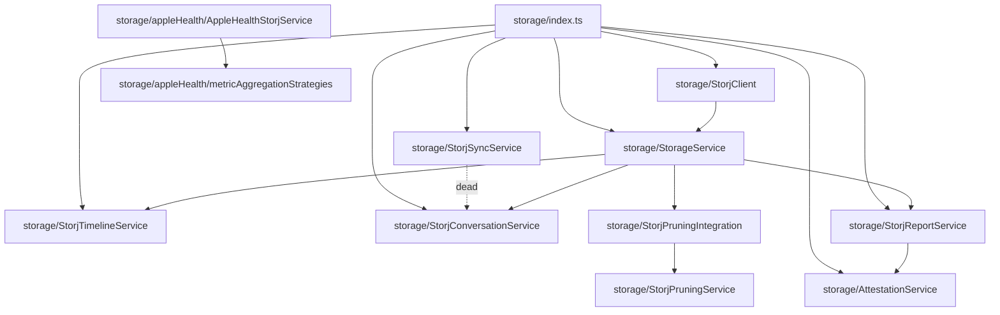

| File                                                  | Lines | Role                                                                                                 | Verdict    | Issues                                                                                                                                                                                                                                                                                    |
| ----------------------------------------------------- | ----- | ---------------------------------------------------------------------------------------------------- | ---------- | ----------------------------------------------------------------------------------------------------------------------------------------------------------------------------------------------------------------------------------------------------------------------------------------- |
| src/storage/StorjReportService.ts                     | 800   | Stores/retrieves DEXA/bloodwork/gut-health reports + clinical narratives on Storj in FHIR format     | acceptable | Three near-identical 90-line store methods per report type; `findDuplicate` does a full bucket listing (HEAD every object) on every store call; source recovered from FHIR via fragile regex match on conclusion text; uses deprecated `substr` with non-crypto randomness for report IDs |
| src/storage/AttestationService.ts                     | 799   | Creates/verifies on-chain health-data attestations against SecureHealthProfileV4                     | needs-work | Duplicate ~140-line inline ABI vs. `contractConfig.ts`'s own attestation ABI entries — two copies will drift on upgrades; duplicate tier logic vs. `utils/attestationTier.ts`; all read methods swallow errors to false/empty, indistinguishable from "no attestation"                    |
| src/storage/StorjClient.ts                            | 774   | Server-side S3-compatible client: per-wallet buckets, upload/download/delete/list of encrypted blobs | acceptable | `listUserData`/`listBucketByName` issue one HEAD request per object — O(n) round-trips, a serious perf trap at scale; near-duplicate 45-line list methods; no pagination handling (silently truncates buckets >1000 objects); logs partial access-key material to console                 |
| src/storage/**tests**/AppleHealthStorjService.test.ts | 693   | Tests `buildDailySummaries`: cumulative sums, sleep-stage aggregation, de-identification             | good       | Only covers `buildDailySummaries` — upload path, manifest building, and completeness scoring claimed in the header have no assertions                                                                                                                                                     |

---

### Storage — Apple Health submodule (`src/storage/appleHealth/`) and remaining storage files

| File                                                   | Lines | Role                                                                                                                                           | Verdict        | Issues                                                                                                                                                                                                                                      |
| ------------------------------------------------------ | ----- | ---------------------------------------------------------------------------------------------------------------------------------------------- | -------------- | ------------------------------------------------------------------------------------------------------------------------------------------------------------------------------------------------------------------------------------------- |
| src/storage/appleHealth/AppleHealthStorjService.ts     | 556   | Client-side daily aggregation of raw Apple Health points (with sleep-stage interval merging), incremental upload to `/api/apple-health/upload` | good           | `'latest'` aggregation strategy doesn't sort by timestamp before taking the last element; local-timezone day bucketing can differ across devices; manifest record-count naively adds without checking for overlap re-upload double-counting |
| src/storage/StorjConversationService.ts                | 455   | Stores/retrieves encrypted Luma conversation sessions/history on Storj                                                                         | acceptable     | Structural near-duplicate of `StorjTimelineService.ts`; `getSyncStatus` compares hashes of different byte streams (plaintext vs. encrypted blob) so `pendingChanges` is effectively always true                                             |
| src/storage/appleHealth/metricAggregationStrategies.ts | 398   | Registry mapping ~55 HealthKit identifiers to aggregation strategies (sum/avg/latest/etc.)                                                     | good           | None — canonical source of truth; flagged as needing a shared spec with the iOS Swift equivalent to avoid drift                                                                                                                             |
| src/storage/StorjPruningService.ts                     | 380   | Pure-function pruning engine: retention policies, dedup detection, golden-snapshot protection                                                  | acceptable     | Dead unreachable branch in `isGoldenSnapshot`'s quarterly check; O(n²) `.includes()` patterns in loops; "keep monthly snapshots" only works if a user happens to upload on the 1st of the month                                             |
| src/storage/StorjSyncService.ts                        | 362   | Intended two-way IndexedDB↔Storj conversation-memory sync layer                                                                                | dead-or-orphan | Zero consumers — actual sync lives in `ConversationMemoryService` via `StorjConversationService` directly; inherits the broken hash-comparison bug from `StorjConversationService.getSyncStatus`                                            |
| src/storage/StorageService.ts                          | 357   | Core storage orchestrator: JSON-serialize, encrypt, upload/download/verify via StorjClient                                                     | good           | `batchRetrieve` silently drops rejected promises with no per-item result; hash-mismatch on retrieve only warns, several callers ignore the `verified` flag                                                                                  |
| src/storage/StorjPruningIntegration.ts                 | 327   | Glue between StorageService and StorjPruningService: convert/perform/stats/format                                                              | acceptable     | `getSnapshotInfo` re-implements snapshot detection inline instead of reusing the canonical predicates; force-casts arbitrary dataType strings into a narrower union than reality                                                            |
| src/storage/StorjTimelineService.ts                    | 288   | Wraps StorageService for timeline-event storage (single/batch store/retrieve/list/delete)                                                      | acceptable     | Near-identical boilerplate to `StorjConversationService.ts`; batch upload fires unbounded concurrent Promise.allSettled requests                                                                                                            |
| src/storage/**tests**/storageService.test.ts           | 249   | Tests storage-layer shapes: hash normalization, URI parsing, bucket naming                                                                     | needs-work     | Imports nothing from the actual codebase — every function under test is reimplemented inline in the test, so it can never catch a regression; fixture `dataType` list has already drifted from production values                            |
| src/storage/index.ts                                   | 63    | Barrel export for the storage module                                                                                                           | good           | Re-exports the orphaned `StorjSyncService`, keeping dead code alive in the public surface                                                                                                                                                   |
| src/storage/appleHealth/index.ts                       | 28    | Barrel for the Apple Health storage submodule                                                                                                  | good           | None                                                                                                                                                                                                                                        |

---

## Store (`src/store/`)

React context providers for app-wide state: the AI chat provider (`aiStore.tsx`) and dashboard selection state (`selectionStore/`). One directory (`healthDataStore/`) is an empty dead placeholder that shadows the real store in `src/data/store/healthDataStore`.

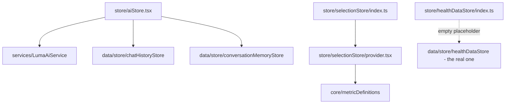

| File                                  | Lines | Role                                                                                                                                          | Verdict        | Issues                                                                                                                                                                                                                                                                                                                                    |
| ------------------------------------- | ----- | --------------------------------------------------------------------------------------------------------------------------------------------- | -------------- | ----------------------------------------------------------------------------------------------------------------------------------------------------------------------------------------------------------------------------------------------------------------------------------------------------------------------------------------- |
| src/store/aiStore.tsx                 | 657   | Context provider orchestrating the Luma AI chat: prompt context, sanitization, memory extraction, IndexedDB persistence, throttled Storj sync | needs-work     | Heavy un-gated logging of raw AI responses/user messages; `sendMessage` is a ~425-line function mixing 5 concerns; memory-extraction logic overlaps `contextExtractor`/`conversationMemoryStore`; `aiService` construction race (state instead of ref) can spawn multiple service instances; Storj sync throttle has a stale-closure race |
| src/store/selectionStore/provider.tsx | 166   | Context provider for dashboard metric/timeframe selection state                                                                               | needs-work     | Write-only localStorage persistence — saved every change but never read back on mount, so selections reset on reload; provider double-mounted (layout.tsx and dashboard/page.tsx both wrap it), the inner instance shadowing the outer; debug global flag left in                                                                         |
| src/store/healthDataStore/index.ts    | 1     | Empty placeholder — comment-only file exporting nothing                                                                                       | dead-or-orphan | Dead; every real `healthDataStore` import in the app resolves to `src/data/store/healthDataStore`; this directory's existence invites wrong-path imports                                                                                                                                                                                  |
| src/store/selectionStore/index.ts     | 1     | Barrel re-exporting `./provider`                                                                                                              | acceptable     | Inconsistent adoption — some consumers use the barrel, others (`layout.tsx`, `dashboard/page.tsx`) import `./provider` directly                                                                                                                                                                                                           |

---

## Types (`src/types/`)

The shared TypeScript type system spanning health events, reports, conversation memory, Storj shapes, AI context, ZK proof documents, and a couple of stray/dead type files.

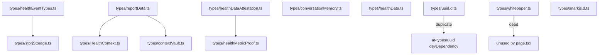

| File                               | Lines | Role                                                                                  | Verdict        | Issues                                                                                                                                                            |
| ---------------------------------- | ----- | ------------------------------------------------------------------------------------- | -------------- | ----------------------------------------------------------------------------------------------------------------------------------------------------------------- |
| src/types/healthEventTypes.ts      | 687   | HealthEventType enum, per-type field definitions, timeline helper functions           | acceptable     | Mixes pure types with a ~500-line embedded data table and business-logic functions in one file                                                                    |
| src/types/healthDataAttestation.ts | 436   | Apple Health metric catalog, completeness scoring, attestation tier thresholds        | acceptable     | Business-logic scoring functions live in a "types" file; `APPLE_HEALTH_METRICS` has duplicate entries across categories, double-counting completeness percentages |
| src/types/reportData.ts            | 268   | Parsed-report data model (DEXA, bloodwork, medical-record, gut-health)                | good           | None                                                                                                                                                              |
| src/types/conversationMemory.ts    | 128   | AI conversation memory model (facts, summaries, preferences, blockchain entries)      | good           | None                                                                                                                                                              |
| src/types/storjStorage.ts          | 118   | Storj-persisted shapes for timeline events and conversation data                      | good           | `StorjTimelineEvent.data` is an untyped `Record<string, unknown>`, so payloads aren't checked against `healthEventTypes.ts`                                       |
| src/types/HealthContext.ts         | 99    | Aggregated HealthContext object passed to the AI/Luma system                          | acceptable     | Several near-identical metric-shape interfaces (summary vs. with-range, sleep variants) duplicate the same fields rather than sharing a generic                   |
| src/types/healthData.ts            | 93    | Legacy/raw health-data types (Metric, HealthDataPoint, HealthDataByType)              | needs-work     | `HealthData` and `HealthDataPoint` are near-duplicate interfaces; despite being labeled "legacy", this file is imported by 30+ files and is actually load-bearing |
| src/types/healthMetricProof.ts     | 60    | ZK/attestation proof document model (claim, prover, evidence, signature)              | good           | None                                                                                                                                                              |
| src/types/contextVault.ts          | 50    | WalletContextVault snapshot format for cross-session AI context                       | good           | `metadata?: Record<string, unknown>` is an untyped escape hatch                                                                                                   |
| src/types/snarkjs.d.ts             | 14    | Ambient module declaration for the untyped `snarkjs` package                          | good           | Uses `unknown` for all params (acceptable given snarkjs ships no types)                                                                                           |
| src/types/uuid.d.ts                | 11    | Ambient module declaration for the `uuid` package                                     | duplicate      | `@types/uuid` is already a devDependency — this local shim duplicates/shadows official types and can drift                                                        |
| src/types/whitepaper.ts            | 8     | Section/WhitepaperContent types apparently intended for a data-driven whitepaper page | dead-or-orphan | `src/app/whitepaper/page.tsx` renders inline JSX/HTML without importing these types — unused                                                                      |

---

## ZK (`src/zk/`)

Client/server helpers for the Groth16 Merkle coverage-proof pipeline (health-data coverage attestations), designed to mirror the iOS zk toolchain's leaf serialization and Poseidon tree layout. One file is the real, live implementation behind three API routes despite its "dev" name; the other is an uncommitted, unreferenced work-in-progress for an on-chain Merkle commitment contract.

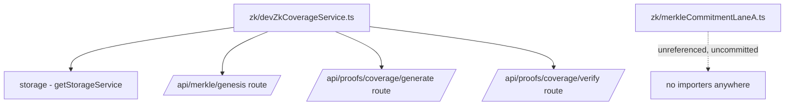

| File                            | Lines | Role                                                                                                                              | Verdict        | Issues                                                                                                                                                                                                                                                                                                                                    |
| ------------------------------- | ----- | --------------------------------------------------------------------------------------------------------------------------------- | -------------- | ----------------------------------------------------------------------------------------------------------------------------------------------------------------------------------------------------------------------------------------------------------------------------------------------------------------------------------------- |
| src/zk/devZkCoverageService.ts  | 413   | Server-side Groth16 coverage-proof service: Poseidon Merkle tree, Storj-backed genesis persistence, snarkjs proof generate/verify | acceptable     | Named "dev" but is the real implementation behind 3 live API routes — misleading naming; hardcoded developer-machine fallback path baked into production artifact resolution; leaf serialization/tree layout duplicates the iOS toolchain with no shared spec or cross-platform test; recomputes the same Merkle path walk twice per leaf |
| src/zk/merkleCommitmentLaneA.ts | 267   | Client helper for a Lane A MerkleCommitment contract: fold-digest computation, calldata encoding, on-chain state reads            | dead-or-orphan | Zero importers anywhere and the file itself is untracked in git (never committed); inline ABI instead of `contractConfig.ts`; hardcoded RPC URL; chain-read errors silently collapse to a "skip" result                                                                                                                                   |

---

## Hotspots

Files needing attention, grouped by verdict. "Needs-work" and "refactor-candidate" files are live and load-bearing but carry real bugs or maintenance risk; "dead-or-orphan" and "duplicate" files are candidates for deletion or consolidation.

### needs-work (live, load-bearing, has real bugs/risk)

- **src/agents/ActivityEnergyAgent.ts** — `findValueForDay` silently undercounts raw daily data despite a comment claiming it sums; quadratic scan; two incompatible windowing strategies mixed.
- **src/agents/CoordinatorAgent.ts** — two of its cross-agent signals are permanently dead because no agent writes the metadata keys it checks for.
- **src/agents/BaseHealthAgent.ts** — logs full prompts (containing user health data) to console unconditionally in production; a thinking-tag stripping regex can never match due to mismatched tags.
- **src/agents/SleepAgent.ts** — dead `|| allSleepSamples` fallback; UTC vs. local-timezone day-key inconsistency within the same file.
- **src/api/venice/VeniceApiService.ts** — mobile fetch path has weaker response parsing than desktop axios path, causing real user-facing errors; logs full model responses unconditionally.
- **src/config/featureFlags.ts** — most of the flag surface (5+ flags, a documented dev panel) is entirely dead/aspirational.
- **src/core/metricDefinitions.ts** — one of several uncoordinated HealthKit metric registries that can silently drift from each other.
- **src/data/store/healthDataStore.ts** — silently truncates raw samples to a 180-day window with no signal to callers expecting full history.
- **src/data/processors/HealthDataProcessor.ts** — third parallel implementation of day-bucketing/dedup logic (alongside `tieredDataAggregation.ts` and `dataDeduplicator.ts`).
- **src/data/parsers/XMLStreamParser.ts** — three empty catch blocks silently swallow malformed-record parse errors with zero logging.
- **src/data/sources/IndexedDBDataSource.ts** — bypassed the intended `HybridDataSource` abstraction, making that router dead weight.
- **src/data/hooks/useVeniceAI.ts** — an entirely separate Venice API client competing with `VeniceApiService`.
- **src/data/sources/StorjDataSource.ts** — every method is an unimplemented stub, silently contributing zero data.
- **src/hooks/usePrivyWalletService.ts** — 1673-line hook mixing 6+ concerns; inline ABIs; duplicated gas-fee math; race-prone `connect()`.
- **src/lib/contractConfig.ts** — contract addresses duplicated against `networkConfig.ts` for all but one contract; a mainnet switch could silently use testnet addresses.
- **src/lib/sharedDatabase.ts** — misleadingly named; whitelist-check logic duplicated 3x across the codebase; logs raw email PII.
- **src/services/LumaAiService.ts** — confirmed bug: tool definitions can be appended twice to the system prompt; 1683-line file mixing 5 concerns.
- **src/services/HealthEventService.ts** — N+1 network trap: up to 3 sequential RPC calls plus a Storj fetch per timeline event.
- **src/services/ConversationMemoryService.ts** — cloud-sync scheduling is a stub that silently never syncs despite being enabled by default.
- **src/services/QuarterlyAggregationService.ts** — trend math produces NaN/wrong defaults for small sample counts; O(n) full-decrypt scans for simple metadata lookups.
- **src/services/attestations.ts** — the one dead export it contains, if ever wired up, writes fabricated attestation data under the wrong (server) address.
- **src/storage/AttestationService.ts** — duplicate ~140-line attestation ABI vs. `contractConfig.ts`, risking drift on contract upgrades.
- **src/storage/**tests**/storageService.test.ts** — tests import nothing from production code; cannot catch real regressions.
- **src/store/aiStore.tsx** — un-gated logging of raw AI responses/user chat content; race conditions in service construction and Storj sync throttling.
- **src/store/selectionStore/provider.tsx** — write-only localStorage persistence (selections silently reset on reload); provider double-mounted app-wide.
- **src/types/healthData.ts** — "legacy"-labeled file is actually load-bearing across 30+ importers; near-duplicate `HealthData`/`HealthDataPoint` interfaces.

### dead-or-orphan / duplicate (candidates for deletion or consolidation)

- **Entire `src/ai/memory/` subsystem** (`LocalStorageAdapter.ts`, `HybridSearchIndex.ts`, `DailyLogService.ts`, `types.ts`, `MemoryEncryption.ts`, `HealthProfileStore.ts`, `bm25.ts`, `index.ts`) — ~1,500 lines, zero reachable call sites from any live entry point; `initMemorySystem` is never invoked anywhere.
- **src/ai/ContextPreprocessor.ts** and **src/ai/index.ts** — superseded by LumaAiService's own context assembly; the barrel has no importers.
- **src/agents/utils/dataAggregation.ts** — duplicates the fuller, cumulative-aware `src/utils/tieredDataAggregation.ts`; only one consumer.
- **src/data/sources/HybridDataSource.ts** — the intended IndexedDB/Storj routing layer, never wired in; its 90-day hybrid strategy is unenforced.
- **Entire `src/interfaces/` module** (`IStorageService.ts`, `IHealthDataStore.ts`, `IAuthService.ts`, `IAiService.ts`, `index.ts`) — zero implementers or consumers anywhere; only exercised by its own test mocks.
- **src/lib/test-config.ts** and **src/lib/zkSyncChain.ts** — zero importers; safe to delete outright.
- **src/rules/applicationRules.ts** — zero importers, and its color palette would actively conflict with the real Amach brand system if ever wired in.
- **src/services/PrivyWalletService.ts** — architecturally invalid (React hooks on a class instance) and fully superseded by `hooks/usePrivyWalletService.ts`.
- **src/services/SecureHealthProfileService.ts** — zero importers; every write path would fail at runtime even if invoked (unconnected signer).
- **src/storage/StorjSyncService.ts** — zero consumers; inherits a broken hash-comparison bug from `StorjConversationService`.
- **src/store/healthDataStore/index.ts** — empty placeholder file that shadows the real store and invites wrong-path imports.
- **src/types/uuid.d.ts** — duplicates the official `@types/uuid` devDependency already installed.
- **src/types/whitepaper.ts** — unused by the whitepaper page it was presumably built for.
- **src/zk/merkleCommitmentLaneA.ts** — zero importers and never committed to git; abandoned in-progress work.
- **src/hooks/useWalletConnection.ts** and **src/hooks/useContextPersistence.ts** — dead legacy/stubbed hooks with zero importers.

---

_Cross-references: for the UI layer that consumes these services/hooks, see `02-website-ui.md`. For deep dives on the Storj, Privy, Venice AI, and ZK/contract integrations referenced throughout, see `05` through `08`. For end-to-end request/data flows through this layer, see `09-data-flows-website.md`._
