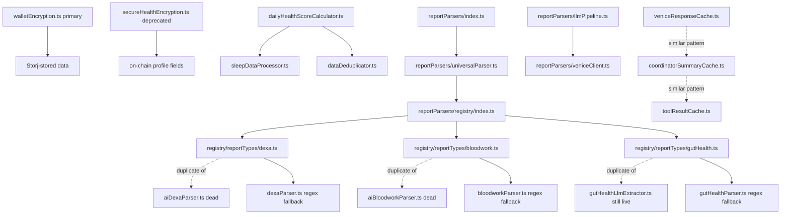
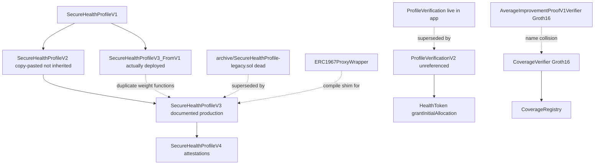

# 02 — Website UI and App Routes

Part of the Amach Health architecture map. See also: [00-master-map.md](./00-master-map.md), [01-website-core.md](./01-website-core.md), [03-ios-app.md](./03-ios-app.md), [04-breathe-app.md](./04-breathe-app.md), [05-integration-storj.md](./05-integration-storj.md), [06-integration-privy.md](./06-integration-privy.md), [07-integration-venice-ai.md](./07-integration-venice-ai.md), [08-integration-zk-contracts.md](./08-integration-zk-contracts.md), [09-data-flows-website.md](./09-data-flows-website.md), [10-data-flows-ios.md](./10-data-flows-ios.md), [11-consolidation-plan.md](./11-consolidation-plan.md).

## Overview

This chapter covers everything a browser actually renders or calls in the Next.js 16 App Router website repo: the `src/app` route tree (marketing pages, the authenticated wallet/dashboard experience, and ~35 API routes), the `src/components` tree (the Luma/Cosaint AI chat UI, onboarding wizard, storage management, dashboard charts, and the shadcn/ui primitive library), the `src/utils` layer that backs those components (health scoring, sleep processing, report parsing, encryption, caching), the Solidity contracts in `contracts/` that the UI reads from and writes to, and the deployment/diagnostic scripts in `scripts/`. Together these are the surface area a user or another Amach client (iOS, Breathe) actually touches — as distinct from the lower-level storage/service/state layers documented elsewhere in this map.

The dominant theme across this audit is **duplication and file-size sprawl at the integration seams**: on-chain client boilerplate (viem vs ethers, RPC-fallback URLs), report-parsing pipelines (a legacy hand-rolled path living alongside a newer `ReportParserRegistry` path for gut-health/DEXA/bloodwork), chart zoom/theming code, and nav/footer marketing chrome are each implemented 2-8 times across different files instead of once. Several multi-thousand-line "god components" (`CosaintChatUI.tsx`, `StorageManagementSection.tsx`, `WalletSetupWizard.tsx`) mix data-fetching, on-chain writes, and rendering in a single file. The smart contract layer has two parallel V3 lineages (`SecureHealthProfileV3` vs `SecureHealthProfileV3_FromV1`) that must be kept slot-identical by hand, and the production proxy actually runs the less-documented one.

---

## 1. App Routes and Pages (`src/app/`)

**Summary:** The App Router tree splits into two halves: static/marketing pages (landing, whitepaper, how-it-works, mission, blog, privacy) that are almost entirely hand-rolled with inline `style={{}}` objects and duplicated nav/footer JSX, and the authenticated experience (`/wallet`, `/dashboard`) plus ~35 API routes under `src/app/api/` that proxy Storj, Venice AI, and ZKsync Era reads/writes. The API surface is inconsistent in blockchain client choice (viem in newer routes, ethers v5 in older ones) and carries a long tail of dev/diagnostic/dead routes (`test-rpc`, `fund-new-wallet-test`, `icon-preview`) that shipped to production. Root-level files (`layout.tsx`, `error.tsx`, `not-found.tsx`, `metadata.ts`) wire up providers, global error handling, and metadata, with one confirmed orphan (`metadata.ts` is never imported).

```mermaid
flowchart TD
    Layout["layout.tsx root layout"] --> Page["page.tsx landing page"]
    Layout --> Wallet["wallet/page.tsx"]
    Layout --> Dashboard["dashboard/page.tsx"]
    Page --> OnboardingModal["OnboardingModal"]
    Page --> WalletWizard["WalletSetupWizard"]
    Wallet --> HealthProfileManager["HealthProfileManager"]
    Wallet --> CryptoWallet["CryptoWallet"]
    Wallet --> StorageSection["StorageManagementSection"]
    Wallet --> AiModal["AiCompanionModal"]
    Page --> HowItWorks["how-it-works/page.tsx"]
    Page --> Whitepaper["whitepaper/page.tsx"]
    Page --> Mission["mission/page.tsx"]
    Page --> Blog["blog/page.tsx and blog slug page.tsx"]
    ApiVenice["api/venice/route.ts"] --> VeniceExternal["Venice AI"]
    ApiAiChat["api/ai/chat/route.ts"] --> VeniceExternal
    ApiStorj["api/storj/route.ts"] --> StorjExternal["Storj S3"]
    ApiProfileRead["api/profile/read/route.ts"] --> ZksyncExternal["ZKsync Era"]
    ApiAllocation["api/verification/allocation-info/route.ts"] --> ZksyncExternal
    ApiFundWallet["api/fund-new-wallet/route.ts"] --> ZksyncExternal
    ApiHealthSummary["api/health/summary/route.ts"] --> ApiHealthSync["api/health/sync/route.ts"]
    ApiAppleHealth["api/apple-health/upload/route.ts"] --> StorjExternal
```

| File                                                | Lines | Role                                                                                                    | Verdict            | Issues                                                                                                                                                                                   |
| --------------------------------------------------- | ----- | ------------------------------------------------------------------------------------------------------- | ------------------ | ---------------------------------------------------------------------------------------------------------------------------------------------------------------------------------------- |
| `src/app/page.tsx`                                  | 1238  | Marketing landing page (root route) — hero, feature sections, data-source cards, Luma intro, footer CTA | needs-work         | Inline `style={{}}` throughout instead of Tailwind; duplicated `IconLock`/nav markup across ~7 pages; fragile synthetic `mousedown` dispatch hack; inconsistent hardcoded copyright year |
| `src/app/whitepaper/page.tsx`                       | 983   | Static whitepaper page with sticky TOC sidebar and scroll-spy                                           | needs-work         | ~380-line CSS string injected via `dangerouslySetInnerHTML`; duplicated nav; hardcoded prose requires code change to edit; untracked sibling `page.html` risks confusion                 |
| `src/app/how-it-works/page.tsx`                     | 733   | Marketing page explaining 5-step data flow, architecture stack, privacy comparison, FAQ                 | needs-work         | Duplicated `IconLock` and nav markup; unnecessary `dangerouslySetInnerHTML` on literal strings; inline styles; duplicated mailto/email constant                                          |
| `src/app/api/fund-new-wallet/route.ts`              | 681   | Funds new Privy embedded wallets with testnet ETH via raw JSON-RPC                                      | needs-work         | 75+ emoji log calls; deployer private key with no reentrancy/double-spend protection; duplicated `rpcCall()` helper; copy-pasted retry/backoff logic x3                                  |
| `src/app/api/storj/route.ts`                        | 658   | Server-side proxy/dispatcher for all Storj operations (timeline, conversation, storage, FHIR reports)   | acceptable         | Single 600+ line switch handles ~15 actions (god-route); legacy bucket probing is O(prefixes×fragments) per request; inconsistent error-handling contract                                |
| `src/app/api/ai/chat/route.ts`                      | 564   | Public AI chat endpoint assembling Luma system prompt + health context for Venice                       | acceptable         | `any` casts at a public boundary; permissive CORS (`*`); logs up to 500 chars of raw lab data; possible duplicate system-prompt source of truth                                          |
| `src/app/api/apple-health/upload/route.ts`          | 424   | Merges new Apple Health daily summaries into existing Storj payload, prunes duplicates, computes scores | good               | 45s score-computation deadline races 120s `maxDuration`; silent drop with only a console.warn                                                                                            |
| `src/app/mission/page.tsx`                          | 418   | Static "Our Mission" marketing page                                                                     | acceptable         | Inline styles instead of Tailwind; duplicated nav/footer chrome                                                                                                                          |
| `src/app/wallet/page.tsx`                           | 397   | Main authenticated wallet/dashboard page; gates on wallet setup completion                              | acceptable         | Ref-based dedupe + nested `setTimeout` chains instead of a state machine; vestigial unused localStorage read; suppressed `exhaustive-deps` warning                                       |
| `src/app/api/__tests__/endpoints.test.ts`           | 397   | Jest tests for trend/context/sync-metadata logic                                                        | needs-work         | Copy-pastes `METRIC_CONFIGS`/`calculateTrend` instead of importing — tests can pass against stale logic while route itself is unverified                                                 |
| `src/app/api/health/summary/route.ts`               | 319   | Aggregates raw HealthKit samples into per-metric daily stats (avg/min/max/trend)                        | acceptable         | Duplicated (not imported) by its own test file; no direct test coverage; permissive CORS                                                                                                 |
| `src/app/api/venice/route.ts`                       | 313   | Server-side proxy for Venice AI chat completions                                                        | needs-work         | Routine events logged via `console.error` (pollutes error monitoring); no try/catch around malformed JSON body; implicit-any body access                                                 |
| `src/app/blog/[slug]/page.tsx`                      | 292   | Dynamic blog post page (SSG)                                                                            | acceptable         | Header/nav/footer duplicated with `blog/page.tsx`; `dangerouslySetInnerHTML` with no render-site sanitization                                                                            |
| `src/app/blog/page.tsx`                             | 285   | Blog index page listing posts as cards                                                                  | acceptable         | Duplicates sticky header/nav/footer from `blog/[slug]/page.tsx` verbatim                                                                                                                 |
| `src/app/wallet-benefits/page.tsx`                  | 281   | Standalone marketing page on wallet benefits                                                            | refactor-candidate | No internal links found anywhere — orphaned route; different visual language than rest of site; dynamic Tailwind class construction won't survive JIT purge                              |
| `src/app/api/health/sync/route.ts`                  | 270   | Pushes/pulls/status-checks health data between IndexedDB and Storj                                      | acceptable         | Record-count/date-range logic duplicated in test helper, not shared; brittle string-matching for error detection                                                                         |
| `src/app/whitepaper/content.ts`                     | 230   | Static content module holding whitepaper section HTML                                                   | needs-work         | Repeatedly says "IPFS" though the platform uses Storj — stale/incorrect content; content and Tailwind classes intermixed                                                                 |
| `src/app/api/profile/read/route.ts`                 | 222   | Resolves on-chain `SecureHealthProfileV3` data, decrypts server-side via PBKDF2                         | good               | Tries both checksummed and lowercase address variants, masking an underlying client inconsistency                                                                                        |
| `src/app/api/verification/allocation-info/route.ts` | 217   | Returns HEALTH token allocation config/status via raw eth_call                                          | needs-work         | Uses ethers.js v5 style instead of viem (used elsewhere); heavy emoji console.log noise; manual eth_call encode/decode duplicates viem functionality                                     |
| `src/app/api/gut-health/upload/route.ts`            | 195   | Parses Tiny Health gut microbiome PDF, stores 3 layers to Storj                                         | good               | Species-layer storage failure only warned/swallowed; response still reports overall success                                                                                              |
| `src/app/api/test-rpc/route.ts`                     | 193   | Diagnostic GET trying multiple ZKsync RPC URLs via ethers.js                                            | dead-or-orphan     | No callers anywhere in src; pure manual-debugging endpoint left deployed publicly                                                                                                        |
| `src/app/api/verification/verify-profile/route.ts`  | 179   | Verifies whitelisted email/wallet pair, signs on-chain tx with admin key                                | needs-work         | Holds/uses server-side admin private key with no visible rate limit/auth; defaults `ADMIN_DASHBOARD_URL` to localhost in prod                                                            |
| `src/app/privacy/page.tsx`                          | 163   | Static privacy policy page                                                                              | good               | Hardcoded contact email/date rather than shared legal-content config                                                                                                                     |
| `src/app/api/attestations/route.ts`                 | 162   | Reads on-chain attestations via viem; stubs out attestation creation                                    | acceptable         | Create-attestation branch returns fake success payload without validating or doing anything                                                                                              |
| `src/app/api/proofs/generate/route.ts`              | 147   | Builds a `HealthMetricProofDocument` for a health metric                                                | acceptable         | Hardcoded default chainId 280 (legacy mainnet) instead of networkConfig's 300 (Sepolia)                                                                                                  |
| `src/app/api/proofs/verify/route.ts`                | 133   | Verifies a `HealthMetricProofDocument` against on-chain attestation                                     | acceptable         | Three sequential attestation lookups awaited serially instead of in parallel                                                                                                             |
| `src/app/learn/page.tsx`                            | 131   | Static "Learn More" marketing page                                                                      | acceptable         | No in-repo link found pointing to `/learn` — possibly orphaned from nav                                                                                                                  |
| `src/app/dashboard/page.tsx`                        | 113   | Legacy/alternate dashboard combining CSV upload, on-chain profile, JSON backup                          | needs-work         | Hardcoded wallet address passed to `OnChainProfileDisplay` instead of authenticated user's address; raw unstyled buttons; `alert()` for errors                                           |
| `src/app/api/verification/check-status/route.ts`    | 106   | Checks on-chain email verification status via ethers v5                                                 | needs-work         | Inline ABI duplicated instead of sourced from `contractConfig.ts`; ethers v5 vs viem split; no in-repo caller found                                                                      |
| `src/app/layout.tsx`                                | 99    | Root layout: fonts, metadata, pre-paint theme script, provider tree                                     | good               | Defines its own inline `metadata` object, making sibling `metadata.ts` dead code                                                                                                         |
| `src/app/whitepaper/print/page.tsx`                 | 77    | Print-optimized whitepaper rendering with browser print trigger                                         | acceptable         | `dangerouslySetInnerHTML` with no sanitization (safe only while content is static)                                                                                                       |
| `src/app/api/verification/check-email/route.ts`     | 72    | Checks whether an email is whitelisted via shared DB helper                                             | needs-work         | Verbose emoji console.log noise; `isInUse` permanently hardcoded false; overlaps with `test-email/route.ts`                                                                              |
| `src/app/api/merkle/genesis/route.ts`               | 59    | Dev-only route generating a ZK Merkle genesis root, gated off in production                             | acceptable         | No in-repo caller found; likely invoked from dev/test script or iOS                                                                                                                      |
| `src/app/api/tracking/route.ts`                     | 57    | Proxies frontend analytics events to a separate admin app                                               | needs-work         | Hardcoded localhost fallback for `ADMIN_API_URL`; logs full request body (possible PII leak)                                                                                             |
| `src/app/api/proofs/coverage/generate/route.ts`     | 56    | Generates a ZK coverage proof (Groth16) for a date range                                                | acceptable         | "dev" naming used for what looks like a production path, no prod-readiness gate                                                                                                          |
| `src/app/api/verification/test-email/route.ts`      | 50    | Test/mock endpoint checking hardcoded email whitelist                                                   | needs-work         | Hardcodes a real personal email in source; duplicate of `check-email/route.ts`; no `NODE_ENV` guard                                                                                      |
| `src/app/api/health/parse-report/route.ts`          | 47    | Parses raw health report text into structured objects via AI                                            | good               | No in-repo caller found in `src/`; likely called from iOS                                                                                                                                |
| `src/app/api/wallet/check-balance/route.ts`         | 47    | Returns wallet's ZKsync balance and minimum-threshold check via ethers v5                               | needs-work         | ethers v5 vs viem inconsistency; hardcoded minimum-balance threshold                                                                                                                     |
| `src/app/api/health/query/route.ts`                 | 45    | Executes health data queries through `ToolExecutor` against IndexedDB                                   | acceptable         | Comment notes "will add Storj later"; no in-repo caller found                                                                                                                            |
| `src/app/error.tsx`                                 | 44    | Global error boundary UI with reset button                                                              | acceptable         | Inline styles; displays raw `error.message` to end users                                                                                                                                 |
| `src/app/api/proofs/coverage/verify/route.ts`       | 34    | Verifies a Groth16 ZK coverage proof and public signals                                                 | acceptable         | No in-repo caller found                                                                                                                                                                  |
| `src/app/api/fund-new-wallet-status/route.ts`       | 33    | Placeholder diagnostic returning static troubleshooting instructions                                    | refactor-candidate | Does not actually query status despite its name; no in-repo caller found                                                                                                                 |
| `src/app/icon-preview/page.tsx`                     | 32    | Internal dev-only icon/favicon preview page                                                             | dead-or-orphan     | No in-repo links found; reachable only by direct URL                                                                                                                                     |
| `src/app/api/fund-new-wallet-test/route.ts`         | 31    | Diagnostic endpoint logging to verify Vercel log visibility                                             | dead-or-orphan     | Purely a one-time logging smoke-test with no functional purpose                                                                                                                          |
| `src/app/not-found.tsx`                             | 13    | Next.js 404 page                                                                                        | good               | None                                                                                                                                                                                     |
| `src/app/api/health/tools/route.ts`                 | 12    | Exposes AI health-query tool definitions to clients                                                     | acceptable         | No in-repo caller found; tool definitions may be consumed directly instead                                                                                                               |
| `src/app/metadata.ts`                               | 6     | Standalone Metadata object for old "Apple Health Data Analyzer" branding                                | dead-or-orphan     | Confirmed orphaned — zero imports anywhere; superseded by `layout.tsx`'s inline metadata                                                                                                 |

---

## 2. Components (`src/components/`)

**Summary:** This is the largest and highest-risk module by file size: `CosaintChatUI.tsx` (3045 lines), `StorageManagementSection.tsx` (2413 lines), and `WalletSetupWizard.tsx` (2007 lines) each mix data-fetching, on-chain writes, and rendering for a single top-level feature. The dashboard chart family (`components/dashboard/charts/*`) has a well-designed shared `useChartZoom`/`ChartContainer` pattern that only some charts actually adopt, plus a `DS` design-token object duplicated verbatim across 8 files. The `components/ui/*` shadcn primitives are generally clean, with one confirmed dead component (`sheet.tsx`) and one confirmed dead example component (`StorjPruningButton.tsx`).

```mermaid
flowchart TD
    AiCompanionModal["AiCompanionModal"] --> CosaintChatUI["ai/CosaintChatUI"]
    AiCompanionModal --> HealthTimelineTab["ai/HealthTimelineTab"]
    AiCompanionModal --> GoalsTab["ai/GoalsTab"]
    AiCompanionModal --> HealthReport["ai/HealthReport"]
    AiCompanionModal --> HealthStatCards["ai/HealthStatCards"]
    CosaintChatUI --> ReportParserViewer["ai/ReportParserViewer"]
    CosaintChatUI --> MemoryInspector["ai/MemoryInspector"]
    HealthTimelineTab --> VisualTimeline["ai/VisualTimeline"]
    WalletPage["app/wallet/page.tsx"] --> HealthProfileManager["HealthProfileManager"]
    WalletPage --> CryptoWallet["CryptoWallet"]
    WalletPage --> StorageManagementSection["storage/StorageManagementSection"]
    WalletPage --> WalletSetupWizard["WalletSetupWizard"]
    WalletPage --> WalletSummaryWidget["WalletSummaryWidget"]
    HealthDashboardModal["HealthDashboardModal"] --> HealthDataSelector["HealthDataSelector"]
    HealthDashboardModal --> HealthDashboard["dashboard/HealthDashboard"]
    HealthDashboard --> Charts["dashboard/charts/*"]
    Charts --> useChartZoom["dashboard/charts/useChartZoom"]
    Charts --> ChartContainer["dashboard/charts/ChartContainer"]
    HealthDataContextWrapper["HealthDataContextWrapper"] --> HealthDashboard
    HealthDataContextWrapper --> AiCompanionModal
    RootLayout["app/layout.tsx"] --> PrivyProvider["PrivyProvider"]
    RootLayout --> PrivyErrorBoundary["PrivyErrorBoundary"]
    RootLayout --> QueryProvider["QueryProvider"]
```

| File                                                      | Lines | Role                                                                                                                               | Verdict        | Issues                                                                                                                                                                                  |
| --------------------------------------------------------- | ----- | ---------------------------------------------------------------------------------------------------------------------------------- | -------------- | --------------------------------------------------------------------------------------------------------------------------------------------------------------------------------------- |
| `src/components/ai/CosaintChatUI.tsx`                     | 3045  | Main Luma/Cosaint chat interface: message thread, file upload/Storj import-export, on-chain attestation, dev debug panel           | needs-work     | Mixes 6+ concerns in one file; `recordReportUploadOnChain` duplicated in 3 other files; 30+ `useState` hooks; dev debug panel ships in production bundle                                |
| `src/components/storage/StorageManagementSection.tsx`     | 2413  | Storj storage-management UI: tabbed Chats/Health Data/Context/Tests with list/refresh/preview/delete/attest/prune                  | needs-work     | 2413 lines, 5+ concerns; on-chain event lookup/deactivation duplicated in 3 files; RPC fallback URL hardcoded 4x; uses `confirm()`/`alert()`                                            |
| `src/components/WalletSetupWizard.tsx`                    | 2007  | Multi-step onboarding wizard: email verification, wallet creation, gas funding, profile creation, ZKsync verification, token claim | needs-work     | DOM-polling for Privy modal state; 3s background polling indefinitely; hardcoded explorer URL; reimplements tx-confirmation polling that viem already provides                          |
| `src/components/ai/HealthTimelineTab.tsx`                 | 1490  | Tab for viewing/adding/editing/deleting encrypted health timeline events                                                           | needs-work     | Mixes data-fetch, parsing, form state, blockchain writes, rendering; parallel category-inference logic; `window.confirm()` instead of app's Dialog; tombstone list is localStorage-only |
| `src/components/ai/ReportParserViewer.tsx`                | 1295  | Modal for viewing parsed reports (DEXA/bloodwork/gut-health/medical-record) with Save-to-Storj + attestation                       | needs-work     | On-chain client boilerplate duplicated across 5+ files; O(n) sequential on-chain read loop; two near-identical "Save to Storj" handlers                                                 |
| `src/components/HealthDataSelector.tsx`                   | 1157  | Primary Apple Health import UI: time-frame/metric selection, XML/CSV parsing, IndexedDB save, Storj backup + attestation           | needs-work     | Duplicates on-chain client boilerplate; heavy debug console.log; 260-line `handleProcess` mixes too many responsibilities                                                               |
| `src/components/HealthDataContextWrapper.tsx`             | 988   | Top-level Context provider merging IndexedDB/Storj data, deriving stat-card aggregates, sleep/health scores                        | acceptable     | `addMetricData`/`clearData` are dead/partial placeholders; magic-number doubled-data heuristic; 3 near-duplicate daily-aggregation helpers                                              |
| `src/components/AiCompanionModal.tsx`                     | 826   | Full-screen Luma companion modal: chat/goals/timeline tabs, stat overview, wallet-connect banner                                   | needs-work     | 2 duplicated popup-sequencing state machines; heavy console.log in profile decrypt path; inline styles throughout                                                                       |
| `src/components/HealthProfileManager.tsx`                 | 797   | Card UI for viewing/creating/updating on-chain encrypted health profile                                                            | needs-work     | Near-identical duplicated create/update form JSX; 3 nested try/catch fallback paths with fake placeholder value; dead commented-out interface                                           |
| `src/components/ai/GoalsTab.tsx`                          | 583   | Goals tab: add/edit/delete health goals, AI-generated suggestions                                                                  | needs-work     | Redundant duplicate `setAiGoalTimeframeOptions` call; inline edit logic duplicated 3x; AI errors only console.error'd                                                                   |
| `src/components/CryptoWallet.tsx`                         | 565   | Wallet-page card: ETH/$AHP balances, allocation/claim status, send-ETH form                                                        | needs-work     | Hardcodes HealthToken address/ABI instead of importing from `contractConfig.ts`; fragile string-matched success/error state                                                             |
| `src/components/dashboard/HealthDashboard.tsx`            | 520   | Main tabbed health dashboard (Heart/Activity/Sleep/Overview)                                                                       | needs-work     | "Download Summary" button has empty onClick (dead feature); same fallback pattern repeated 6x                                                                                           |
| `src/components/dashboard/charts/SleepAnalysisChart.tsx`  | 495   | Stacked bar chart of nightly sleep stages with session detail panel                                                                | acceptable     | Duplicated `DS` design-token object (6+ files); inline styles; missing zero-guard in one efficiency calc                                                                                |
| `src/components/dashboard/charts/HRDistributionChart.tsx` | 406   | Heart-rate training zone pie chart + BPM histogram                                                                                 | acceptable     | Duplicated `DS` token object; parse failures silently drop data points                                                                                                                  |
| `src/components/ui/GuidePopup.tsx`                        | 365   | Generic floating tooltip/popup for onboarding callouts                                                                             | good           | Positioning logic could be extracted into a reusable `usePopoverPosition` hook                                                                                                          |
| `src/components/ai/MemoryInspector.tsx`                   | 361   | Dev-only debug panel for inspecting/manipulating conversation memory                                                               | acceptable     | Uses `window.confirm` instead of app's dialog primitives                                                                                                                                |
| `src/components/ai/VisualTimeline.tsx`                    | 338   | Renders health event timeline grouped by date with icons and edit/delete                                                           | acceptable     | Silently swallows JSON parse errors; O(n) `findIndex` per event row; icon-selection logic duplicated                                                                                    |
| `src/components/OnboardingModal.tsx`                      | 328   | Multi-step onboarding tour dialog on first landing-page visit                                                                      | good           | Step content hardcoded inline rather than in a config file; hardcoded hex colors                                                                                                        |
| `src/components/ai/HealthScoreCards.tsx`                  | 327   | Overall + per-category health score cards with trend indicators                                                                    | acceptable     | Formula display strings hardcoded, can drift from actual calculator weights; duplicated tooltip JSX                                                                                     |
| `src/components/ai/HealthStatCards.tsx`                   | 319   | Grid of per-metric stat cards (avg/high/low + windowed averages)                                                                   | good           | Day-key bucketing logic duplicated with `HealthDataContextWrapper`'s `processCumulativeData`                                                                                            |
| `src/components/ai/ProfileInputModal.tsx`                 | 317   | Modal form for entering/confirming biometric profile                                                                               | acceptable     | console.log of full PII-adjacent profile data; duplicated sex-normalization logic; 2 near-identical population effects                                                                  |
| `src/components/ai/HealthReport.tsx`                      | 304   | AI-generated multi-section health analysis display                                                                                 | acceptable     | Verbose debug logging including prompt previews; duplicated array literal; hand-rolled concurrency scheduler                                                                            |
| `src/components/dashboard/charts/DistanceChart.tsx`       | 299   | Bar chart of daily distance totals with zoom/pan                                                                                   | duplicate      | Near line-for-line duplicate of shared `useChartZoom` hook instead of consuming it; own Zoom Out button/empty state instead of `ChartContainer`                                         |
| `src/components/HealthDashboardModal.tsx`                 | 225   | Modal wrapping data selector + dashboard tabs                                                                                      | acceptable     | Fake `ErrorBoundary` via window error listener (won't catch render errors); synthetic mousedown to close Radix dropdowns                                                                |
| `src/components/OnChainProfileDisplay.tsx`                | 222   | Displays on-chain `SecureHealthProfile` data                                                                                       | needs-work     | Called with hardcoded wallet address from `dashboard/page.tsx`; blocking `alert()` debug button; "Weight" label renders `profile.nonce`                                                 |
| `src/components/dashboard/charts/HeartRateChart.tsx`      | 220   | Heart rate min/max/avg chart with shared zoom hook                                                                                 | good           | Custom shape renderer typed `any` (eslint-disabled)                                                                                                                                     |
| `src/components/health/QuarterlyAggregateGenerator.tsx`   | 207   | Generates/saves quarterly min/max/avg summaries to Storj                                                                           | acceptable     | Double `as unknown as` casts masking a real type contract mismatch                                                                                                                      |
| `src/components/WalletSummaryWidget.tsx`                  | 185   | Sidebar widget: connection state, balance, attestation badges                                                                      | good           | None significant; could share `shortAddress` helper with `WalletConnectButton`                                                                                                          |
| `src/components/ai/luma.ts`                               | 169   | Static persona definition data for Luma AI companion                                                                               | good           | Canned responses include fabricated-sounding uncited statistics                                                                                                                         |
| `src/components/storage/StorjPruningButton.tsx`           | 164   | Example UI wiring `useStorjPruning` hook                                                                                           | dead-or-orphan | Verified — not imported anywhere; file's own header calls it an "Example component"                                                                                                     |
| `src/components/ui/select.tsx`                            | 160   | shadcn/ui Select primitive wrappers                                                                                                | acceptable     | Only a single consumer in the entire codebase                                                                                                                                           |
| `src/components/ai/HealthScoreTrends.tsx`                 | 150   | 7/30/90-day trend arrows for health scores                                                                                         | good           | "3 months" column always renders flat icon (minor)                                                                                                                                      |
| `src/components/dashboard/charts/HRVChart.tsx`            | 149   | Line chart of daily average HRV                                                                                                    | needs-work     | Does not use shared `useChartZoom`/`ChartContainer`; debug console.log in render-path useMemo; no empty-state handling                                                                  |
| `src/components/WalletConnectButton.tsx`                  | 148   | Header wallet-connect button + "Chat with Luma" CTA                                                                                | acceptable     | Duplicated `shortAddress` helper; full page reload via `window.location.href`; inline style mutation on hover                                                                           |
| `src/components/ui/dialog.tsx`                            | 148   | shadcn/ui Dialog primitives with `preventOutsideClose`                                                                             | good           | None                                                                                                                                                                                    |
| `src/components/PrivyProvider.tsx`                        | 143   | App-wide Privy provider configuring login/chains/embedded wallet                                                                   | needs-work     | Monkey-patches global `console.error` to filter a warning string; falls back to placeholder app ID instead of failing fast                                                              |
| `src/components/dashboard/charts/useChartZoom.ts`         | 141   | Shared zoom/pan hook for recharts bar/line charts                                                                                  | good           | Not consumed by `DistanceChart`/`HRVChart`, undermining its purpose as the shared implementation                                                                                        |
| `src/components/ai/characteristicsLoader.ts`              | 141   | Extends Luma persona with metric-specific canned response templates                                                                | acceptable     | Only "steps" has canned responses defined; type-assertion escape hatches                                                                                                                |
| `src/components/ui/sheet.tsx`                             | 140   | shadcn/ui Sheet (slide-in drawer) primitives                                                                                       | dead-or-orphan | Verified — zero consumers anywhere in codebase                                                                                                                                          |
| `src/components/dashboard/charts/ExerciseTimeChart.tsx`   | 138   | Bar chart of daily exercise minutes with shared zoom                                                                               | good           | Reference implementation other charts should match                                                                                                                                      |
| `src/components/dashboard/charts/ActiveEnergyChart.tsx`   | 133   | Zoomable bar chart of daily active energy                                                                                          | needs-work     | Duplicated `DS` token object (1 of 8 files); duplicated date tickFormatter logic                                                                                                        |
| `src/components/dashboard/charts/StepCountChart.tsx`      | 129   | Composed bar+line chart of daily steps with trailing average                                                                       | needs-work     | Duplicated `DS` token; does not use `ChartContainer`/`useChartZoom` unlike siblings                                                                                                     |
| `src/components/metricDisplayUtils.tsx`                   | 124   | Shared display-formatting utilities for health metric keys                                                                         | good           | None                                                                                                                                                                                    |
| `src/components/dashboard/MetricSummary.tsx`              | 121   | Grid of summary cards (avg/high/low, sleep efficiency)                                                                             | acceptable     | Local `cardClass` with hardcoded hex colors instead of shared `Card`; sleep/non-sleep branches near-duplicate                                                                           |
| `src/components/ui/MessageLimitPopup.tsx`                 | 99    | Popup for anonymous message-limit warning                                                                                          | acceptable     | Hardcoded support email; magic-number threshold                                                                                                                                         |
| `src/components/ThemeToggle.tsx`                          | 87    | Light/dark theme toggle used across marketing/static pages                                                                         | good           | Silently swallows localStorage write failure                                                                                                                                            |
| `src/components/ui/card.tsx`                              | 87    | shadcn/ui Card primitive family                                                                                                    | good           | Only used in 5 files despite being canonical                                                                                                                                            |
| `src/components/PrivyErrorBoundary.tsx`                   | 83    | Error boundary swallowing known-benign Privy internal errors                                                                       | acceptable     | Brittle substring matching duplicated across 2 lifecycle methods                                                                                                                        |
| `src/components/ui/dropdown-menu.tsx`                     | 81    | shadcn/ui dropdown menu primitives                                                                                                 | good           | None                                                                                                                                                                                    |
| `src/components/BetaNotification.tsx`                     | 78    | Modal informing users only Apple Health is supported during Beta                                                                   | good           | None                                                                                                                                                                                    |
| `src/components/ErudaLoader.tsx`                          | 78    | Conditionally loads Eruda mobile debug console via CDN                                                                             | acceptable     | No subresource-integrity hash on injected script                                                                                                                                        |
| `src/components/ui/button.tsx`                            | 56    | shadcn/ui Button primitive                                                                                                         | good           | None                                                                                                                                                                                    |
| `src/components/ui/tabs.tsx`                              | 55    | shadcn/ui Tabs primitives                                                                                                          | good           | None                                                                                                                                                                                    |
| `src/components/dashboard/charts/ChartContainer.tsx`      | 54    | Shared wrapper providing Zoom Out button + empty-state fallback                                                                    | acceptable     | Inline hardcoded-hex hover styling; not adopted by `StepCountChart`                                                                                                                     |
| `src/components/ui/alert.tsx`                             | 49    | shadcn/ui Alert primitive family                                                                                                   | good           | None                                                                                                                                                                                    |
| `src/components/ai/types.ts`                              | 47    | Shared TS interfaces for Luma agent persona/config schema                                                                          | good           | None                                                                                                                                                                                    |
| `src/components/ui/radio-group.tsx`                       | 43    | shadcn/ui RadioGroup primitives                                                                                                    | good           | None                                                                                                                                                                                    |
| `src/components/ui/badge.tsx`                             | 42    | shadcn/ui Badge primitive with CVA variants                                                                                        | good           | Manually strips a non-standard `isActive` prop, suggesting an untyped caller                                                                                                            |
| `src/components/ui/input.tsx`                             | 26    | shadcn/ui Input primitive                                                                                                          | good           | None                                                                                                                                                                                    |
| `src/components/ui/label.tsx`                             | 22    | shadcn/ui Label primitive                                                                                                          | good           | None                                                                                                                                                                                    |
| `src/components/QueryProvider.tsx`                        | 15    | Wraps app in TanStack React Query provider                                                                                         | acceptable     | `QueryClient` instantiated as module-level singleton rather than per-mount `useState`                                                                                                   |

---

## 3. Utils (`src/utils/`)

**Summary:** This layer holds the heaviest domain logic in the website: health scoring (`dailyHealthScoreCalculator.ts`), sleep session processing (`sleepDataProcessor.ts`), the dual encryption systems (`walletEncryption.ts` primary, `secureHealthEncryption.ts` deprecated-but-live), and an extensive report-parsing subsystem for DEXA/bloodwork/gut-health PDFs. The report-parsing subsystem is the site's biggest duplication hotspot: a legacy hand-rolled AI parser exists side-by-side with a newer `ReportParserRegistry` plugin pattern for all three report types (DEXA, bloodwork, gut-health), and in gut-health's case both pipelines are simultaneously live and have already drifted in extraction quality. Three separate bespoke localStorage/window TTL-cache implementations (`veniceResponseCache.ts`, `coordinatorSummaryCache.ts`, `toolResultCache.ts`) duplicate the same hash/TTL/eviction pattern, and two of the three have dead get/set exports.

| File                                                            | Lines | Role                                                                                   | Verdict        | Issues                                                                                                                                                               |
| --------------------------------------------------------------- | ----- | -------------------------------------------------------------------------------------- | -------------- | -------------------------------------------------------------------------------------------------------------------------------------------------------------------- |
| `src/utils/reportParsers/dexaParser.ts`                         | 1087  | Regex/heuristic DEXA scan report parser                                                | needs-work     | 870-line monolithic function; duplicated BMD-extraction regex chains 4x; silent best-effort parsing; magic-number unit conversions                                   |
| `src/utils/reportParsers/registry/reportTypes/gutHealth.ts`     | 963   | Registry-pattern gut-health report definition (4-pass LLM+vision strategy)             | duplicate      | Near-total duplicate of `gutHealthLlmExtractor.ts`; both actively imported by different live call sites; already drifted (vision passes only here)                   |
| `src/utils/reportParsers/gutHealthLlmExtractor.ts`              | 941   | Legacy standalone LLM gut-health extractor, still wired into upload route              | duplicate      | Duplicate of `registry/reportTypes/gutHealth.ts`; missing vision passes → systematically worse extraction on this live path                                          |
| `src/utils/dailyHealthScoreCalculator.ts`                       | 937   | Computes per-day health scores + rolling trend averages                                | needs-work     | 3 near-identical entry points rebuild the same normalization block; 325-line `calculateScoresForDay` monolith; stale/misleading comments; verbose debug logs left in |
| `src/utils/sleepDataProcessor.ts`                               | 915   | Core sleep-session grouping/merging/collision-detection/aggregation pipeline           | needs-work     | `calculateAverageSleepMetrics` has a real bug (core/awake computed from total) and is unused/dead; duplicated logic in `AppleHealthStorjService.aggregateSleepData`  |
| `src/utils/reportParsers/aiBloodworkParser.ts`                  | 887   | Standalone Venice-based bloodwork PDF parser                                           | dead-or-orphan | Only imported by its own test; live pipeline uses `registry/reportTypes/bloodwork.ts` which duplicates ~150 lines of its sanitizer logic                             |
| `src/utils/fhir/dexaToFhir.ts`                                  | 775   | Bidirectional DexaReportData ↔ FHIR R4 converter                                       | acceptable     | Repetitive per-metric observation blocks; fragile string-matching in reverse conversion; confidence recomputed heuristically                                         |
| `src/utils/reportParsers/registry/reportTypes/dexa.ts`          | 589   | Registry-pattern DEXA report definition merging LLM + regex parser                     | duplicate      | `mapDexaLlmResult` near line-for-line duplicate of `aiDexaParser.ts`'s mapping logic                                                                                 |
| `src/utils/reportParsers/aiDexaParser.ts`                       | 574   | Standalone AI-based DEXA parser                                                        | dead-or-orphan | No callers anywhere in the repo outside itself; superseded by registry's `dexa.ts` which reimplements independently                                                  |
| `src/utils/reportFormatters.ts`                                 | 567   | Formats structured report data into text for AI context injection                      | acceptable     | Overly broad `isRawPDFText()` heuristic could drop legitimate long notes; mixes 3 unrelated formatter families in one file                                           |
| `src/utils/reportParsers/gutHealthParser.ts`                    | 516   | Regex-based gut-microbiome PDF extractor (no LLM)                                      | good           | Coarse confidence heuristic; tokenizer could cross-contaminate adjacent metrics with no validation guard                                                             |
| `src/utils/secureHealthEncryption.ts`                           | 484   | Deprecated-but-live AES-256-GCM encryption for on-chain profile fields                 | needs-work     | Self-documented `@deprecated` yet still the live path for 4+ consumers; ~50 lines of historical-bug nonce-repair logic; verbose logging of internal crypto state     |
| `src/utils/gutHealthGlossary.ts`                                | 476   | Static glossary mapping ~60 gut microbiome metric keys to labels/descriptions          | good           | None                                                                                                                                                                 |
| `src/utils/pdfParser.ts`                                        | 452   | Client-side PDF text extraction wrapper around pdfjs-dist                              | needs-work     | 22 console logs including full environment dumps; `getDetailedPDFAnalysis` re-parses the PDF redundantly; duplicated FileReader boilerplate 3x                       |
| `src/utils/contextExtractor.ts`                                 | 427   | Regex-based extractor mining chat history for goals/interventions/concerns             | acceptable     | Deprecated `substr` used 3x; regex-only extraction has low recall with no LLM fallback                                                                               |
| `src/utils/reportParsers/bloodworkParser.ts`                    | 414   | Regex/heuristic fallback bloodwork PDF parser                                          | acceptable     | 4 large overlapping regexes hard to maintain; two parsing strategies duplicate similar normalization logic                                                           |
| `src/utils/walletEncryption.ts`                                 | 405   | Primary signature-based encryption for all Storj-stored data                           | good           | 19 console logs including partial signature previews; unbounded in-memory key cache Map                                                                              |
| `src/utils/tieredDataAggregation.ts`                            | 400   | Tiered-resolution (daily/weekly/monthly) metric aggregation for AI context             | good           | Dead ternary branch in `aggregatePeriod` — both arms compute identically                                                                                             |
| `src/utils/reportParsers/registry/reportTypes/bloodwork.ts`     | 388   | Registry-pattern bloodwork definition with LLM + regex fallback                        | duplicate      | Own comment admits sanitizers "copied from `aiBloodworkParser`"; the orphaned source of that copy still exists separately                                            |
| `src/utils/dataDeduplicator.ts`                                 | 338   | Dedupes Apple Health data points preferring watch over phone source                    | needs-work     | Sleep branch computes sessions then always returns raw data regardless (dead computation); dead `debugStepCountDeviceDetection`/`isStepCountData` exports            |
| `src/utils/searchableEncryption.ts`                             | 300   | Generates privacy-preserving search tags for on-chain event filtering                  | needs-work     | ~5 of its exports are dead/unused outside the file; `initEventCache` is a stub that only logs "to be implemented"                                                    |
| `src/utils/coordinatorAnalysisCache.ts`                         | 276   | 3-tier cache for multi-agent `CoordinatorResult`                                       | acceptable     | Heavy verbose dev logging; hardcoded dated `CACHE_BUILD_STAMP` debug artifact                                                                                        |
| `src/utils/chartDataProcessor.ts`                               | 273   | Groups raw HealthData by day into chart-ready daily aggregates                         | acceptable     | 4 near-identical group-by-day/reduce/sort functions could be one generic helper                                                                                      |
| `src/utils/fhir/bloodworkToFhir.ts`                             | 251   | Converts BloodworkReportData ↔ FHIR R4 resources                                       | good           | Panel grouping lost on FHIR roundtrip (always falls into "general" bucket)                                                                                           |
| `src/utils/analysisDiagnostics.ts`                              | 247   | Builds structured per-agent diagnostics report from a `CoordinatorResult`              | acceptable     | `estimatedDuration` hardcoded to 0; agent-name map must be manually kept in sync with actual agent roster                                                            |
| `src/utils/historicalStats.ts`                                  | 247   | Baseline percentile/trend/milestone stats from metric samples                          | good           | Only `ActivityEnergyAgent` uses it; under-adopted by other agents                                                                                                    |
| `src/utils/reportParsers/registry/index.ts`                     | 234   | Central pluggable pipeline running/merging/validating extraction passes                | good           | Always-on console logging not gated by `NODE_ENV`, unlike other caching utils                                                                                        |
| `src/utils/storjAppleHealthConverter.ts`                        | 233   | Converts Storj-stored Apple Health/breathing-session payloads into web dashboard shape | good           | Hardcodes 7am UTC wake-time assumption regardless of actual timezone                                                                                                 |
| `src/utils/agentResultCache.ts`                                 | 225   | Per-agent localStorage cache keyed by fingerprint of dataset shape                     | acceptable     | `agentMetricMap` manually duplicated knowledge that must stay in sync with each agent's `assessRelevance()`                                                          |
| `src/utils/reportParsers/llmPipeline.ts`                        | 225   | Shared Venice LLM extraction pipeline (JSON-mode, retry, brace extraction)             | good           | JSON-recovery logic duplicated almost verbatim in `aiMedicalRecordParser.ts` instead of reused                                                                       |
| `src/utils/reportParsers/aiMedicalRecordParser.ts`              | 206   | Last-resort AI parser for unrecognized health PDFs                                     | needs-work     | Duplicates JSON-extraction logic from `llmPipeline.ts`; hardcoded fallback model bypasses shared constant; lacks anti-hallucination rules                            |
| `src/utils/trackingService.ts`                                  | 193   | Client-side singleton posting user-journey analytics events                            | acceptable     | Passes `Date.now()` as a placeholder for `blockNumber`; synthetic `tx_${Date.now()}` transaction hash; detailed device fingerprinting with no visible consent gate   |
| `src/utils/storjAccessControl.ts`                               | 189   | Derives/validates Storj bucket names from wallet address + signature key               | good           | 3 legacy bucket-name variants retained purely for migration/recovery                                                                                                 |
| `src/utils/analysisState.ts`                                    | 187   | Tracks when last full AI health analysis ran (localStorage)                            | acceptable     | Stale comment about moving state to "Storej" (typo) with no migration path; magic-number day thresholds                                                              |
| `src/utils/userProfileUtils.ts`                                 | 182   | Normalizes raw user profile input into consistent shape with derived BMI               | acceptable     | Fragile heuristic thresholds to guess units (height>100→cm, weight>140→lbs)                                                                                          |
| `src/utils/__tests__/sleepDataProcessor.test.ts`                | 182   | Jest tests for sleep session edge cases                                                | good           | None                                                                                                                                                                 |
| `src/utils/promptLogger.ts`                                     | 161   | Dev-only utility writing Venice prompt/response logs                                   | acceptable     | Swallows mkdir errors with empty catch; `createSessionSummary` has no callers                                                                                        |
| `src/utils/veniceResponseCache.ts`                              | 155   | localStorage TTL cache for Venice API responses                                        | needs-work     | `get`/`setCachedVeniceResponse` have zero callers — dead caching logic; duplicates pattern in 2 other cache files                                                    |
| `src/utils/chatContextSelector.ts`                              | 152   | Keyword-based topic-shift detection for chat context window sizing                     | good           | None                                                                                                                                                                 |
| `src/utils/utils.ts`                                            | 148   | Grab-bag: Tailwind class merger, random choice, full backup/restore I/O                | needs-work     | Mixes unrelated concerns (cn/randomChoice vs backup/restore logic); `alert()` used for user-facing errors                                                            |
| `src/utils/reportParsers/registry/pdfRenderer.ts`               | 139   | Server-only PDF-to-PNG rasterizer for vision-pass extraction                           | good           | None                                                                                                                                                                 |
| `src/utils/reportParsers/hallucinationGuard.ts`                 | 137   | Post-extraction validator flagging out-of-range/suspicious LLM values                  | good           | None                                                                                                                                                                 |
| `src/utils/coordinatorSummaryCache.ts`                          | 136   | localStorage TTL cache for CoordinatorAgent summaries                                  | needs-work     | Duplicates hash/TTL/eviction pattern found in 2 other cache files                                                                                                    |
| `src/utils/reportParsers/registry/types.ts`                     | 126   | Core type definitions for the pluggable ReportParserRegistry                           | good           | None                                                                                                                                                                 |
| `src/utils/toolResultCache.ts`                                  | 120   | Window-scoped TTL cache for AI tool-call results                                       | needs-work     | `makeToolCacheKey`/get/set have zero callers — entirely dead logic; duplicates pattern in 2 other cache files                                                        |
| `src/utils/reportParsers/veniceClient.ts`                       | 117   | Isomorphic Venice AI client wrapper (server-direct or `/api/venice` proxy)             | acceptable     | Hardcoded fallback model duplicated with `parseConfig.ts`; returns untyped `Promise<unknown>`                                                                        |
| `src/utils/ai/useHealthDataForAi.ts`                            | 117   | Hook intended to summarize selected metrics for AI prompt consumption                  | dead-or-orphan | Verified — zero callers anywhere; hardcodes only 4 metric identifiers                                                                                                |
| `src/utils/temporalContext.ts`                                  | 112   | Builds temporal context block for date-aware Luma prompts                              | acceptable     | ~15-line commented-out `formatTrend` function and always-empty `recentTrends` dead weight                                                                            |
| `src/utils/__tests__/dailyHealthScoreCalculator.test.ts`        | 83    | Jest tests for missing-data day handling in score calculator                           | good           | None                                                                                                                                                                 |
| `src/utils/reportParsers/universalParser.ts`                    | 80    | Orchestration wrapper mapping legacy type strings to registry ids                      | good           | None                                                                                                                                                                 |
| `src/utils/__tests__/attestationTier.test.ts`                   | 75    | Jest tests verifying attestation tier thresholds match contract                        | good           | None                                                                                                                                                                 |
| `src/utils/aiPromptBuilders.ts`                                 | 72    | Builds section-specific Venice prompts for health report narrative                     | acceptable     | 5 nearly-identical template-literal prompt strings; relies on non-null assertions with no runtime unit validation                                                    |
| `src/utils/reportParsers/serverPdfExtractor.ts`                 | 72    | Server-side PDF text extraction for API routes receiving raw buffers                   | good           | Per-page extraction errors swallowed into placeholder string with no logging                                                                                         |
| `src/utils/__tests__/chatContextSelector.test.ts`               | 66    | Jest tests for topic-shift detection and prompt-window sizing                          | good           | None                                                                                                                                                                 |
| `src/utils/veniceThinking.ts`                                   | 62    | Resolves whether Venice "thinking" output is suppressed per scope                      | good           | None                                                                                                                                                                 |
| `src/utils/reportParsers/__tests__/aiBloodworkParser.test.ts`   | 59    | Jest tests for AI bloodwork parser JSON extraction/sanitization                        | acceptable     | Mocks `fetch` with explicit `any` + eslint-disable                                                                                                                   |
| `src/utils/reportParsers/veniceModels.ts`                       | 56    | Queries Venice `/models` endpoint to discover vision-capable models                    | good           | Module-level cache never expires for process lifetime                                                                                                                |
| `src/utils/reportParsers/index.ts`                              | 51    | Public entry point re-exporting report-parsing submodules                              | needs-work     | Lines 33-41 and 43-51 are a literal duplicate block of the same 9 `export *` statements                                                                              |
| `src/utils/storjChainMarkerRegistry.ts`                         | 48    | Maps Storj artifact dataType strings to on-chain chain-event-type markers              | good           | None                                                                                                                                                                 |
| `src/utils/contextVault.ts`                                     | 44    | Builds a `WalletContextVault` snapshot from HealthContext                              | good           | None                                                                                                                                                                 |
| `src/utils/logger.ts`                                           | 41    | Minimal console-wrapping logger with prod/debug gating                                 | acceptable     | Inconsistently adopted — most of codebase uses raw `console.*` instead                                                                                               |
| `src/utils/attestationTier.ts`                                  | 34    | Pure functions deriving attestation tier from completeness score                       | good           | Thresholds hand-duplicated from Solidity contract with only a comment as sync mechanism                                                                              |
| `src/utils/reportParsers/__tests__/bloodworkParserBlob.test.ts` | 30    | Jest test for bloodwork blob-fallback parsing path                                     | good           | None                                                                                                                                                                 |
| `src/utils/reportParsers/parseConfig.ts`                        | 21    | Centralized Venice model name configuration                                            | good           | Fallback model string duplicated in `veniceClient.ts`'s `getModelName()` instead of importing from here                                                              |
| `src/utils/reportParsers/registry/reportTypes/index.ts`         | 17    | Registers all built-in report type definitions with the registry                       | good           | None                                                                                                                                                                 |
| `src/utils/attestationEvents.ts`                                | 13    | Tiny event-bus helper for on-chain attestation-created events                          | good           | None                                                                                                                                                                 |

---

## 4. Solidity Contracts (`contracts/`)

**Summary:** The contract layer has two parallel lineages descending from `SecureHealthProfileV1`: a "clean" chain (`V1 → V2 → V3 → V4`) documented in CLAUDE.md as production, and a second `V3_FromV1` implementation that inherits `V1` directly and is what the deployed production proxy actually runs — the two V3 contracts duplicate the same weight-related functions and must be kept storage-slot-identical by hand. `ProfileVerification` (the version actually wired into the app) has serious security gaps: a `delegatecall`-based migration path callable by anyone, plaintext emails stored on-chain despite a "privacy" whitelist design, and a `verifyProfileZKsync` function that skips both whitelist and signature checks entirely. The ZK verifier contracts are snarkJS-generated and share a colliding contract name (`Groth16Verifier`) across circuits.

| File                                               | Lines | Role                                                                                                 | Verdict        | Issues                                                                                                                                                                       |
| -------------------------------------------------- | ----- | ---------------------------------------------------------------------------------------------------- | -------------- | ---------------------------------------------------------------------------------------------------------------------------------------------------------------------------- |
| `contracts/SecureHealthProfileV2.sol`              | 629   | UUPS-upgradeable V2: adds Storj off-chain event references on top of V1                              | acceptable     | Entire V1 body copy-pasted rather than inherited; unbounded-gas timeline iteration; `submitZKProof` is attestation-by-assertion, not verified                                |
| `contracts/SecureHealthProfileV1.sol`              | 588   | Original UUPS profile contract; still the inheritance base of the deployed `V3_FromV1`               | acceptable     | Duplicated wholesale into V2; unused `EventType` enum; misleading event `profileId` (uses global counter)                                                                    |
| `contracts/SecureHealthProfileV4.sol`              | 446   | V4: on-chain attestations for health data uploads (hash, coverage, tiers)                            | acceptable     | `AttestationRevoked` event declared but no revoke function exists; storage-slot alignment with deployed proxy is unenforced; cryptic custom errors                           |
| `contracts/ProfileVerification.sol`                | 431   | Non-upgradeable email-whitelist + AHP allocation contract; version actually wired into the app       | needs-work     | `delegatecall`-based migration callable by anyone; plaintext emails stored/emitted on-chain; `verifyProfileZKsync` skips whitelist AND signature checks entirely             |
| `contracts/ProfileVerificationV2.sol`              | 325   | Intended mainnet successor using token-mint-based allocation                                         | dead-or-orphan | No deploy script/API route/frontend reference anywhere; inherits V1's whitelist-bypass flaw                                                                                  |
| `contracts/SecureHealthProfileV3_FromV1.sol`       | 242   | Direct V1→V3 upgrade actually live behind the production proxy                                       | acceptable     | Weight functions verbatim-duplicate `SecureHealthProfileV3.sol`; different `addHealthEvent` semantics than V2's requiring client-side special-casing; hardcodes `version: 1` |
| `contracts/AverageImprovementProofV1Verifier.sol`  | 196   | snarkJS Groth16 verifier for "average improvement" ZK circuit (in-progress feature)                  | needs-work     | Contract name `Groth16Verifier` collides with `CoverageVerifier.sol`, breaking name-based factory lookups; untracked in git; only exists to support a worktree branch        |
| `contracts/CoverageVerifier.sol`                   | 189   | snarkJS Groth16 verifier for the coverage.circom circuit                                             | acceptable     | Contract name collides with `AverageImprovementProofV1Verifier.sol`; no version/provenance marker                                                                            |
| `contracts/SecureHealthProfileV3.sol`              | 169   | V3 of the V2-based lineage; documented as production but the deployed proxy runs `V3_FromV1` instead | acceptable     | All weight functions line-for-line duplicate `V3_FromV1`; hardcodes `version: 1`; skips `profileExists` guard                                                                |
| `contracts/HealthToken.sol`                        | 108   | AHP ERC20 token with owner-gated minting/pause and first-5000-user initial allocation                | good           | `hasUserReceivedInitialAllocation()` duplicates auto-generated getter; `grantInitialAllocation` forces `ProfileVerificationV2` to own the whole token                        |
| `contracts/CoverageRegistry.sol`                   | 104   | Thin registry wrapping the coverage Groth16Verifier, storing one record per wallet                   | needs-work     | Proof not bound to `msg.sender` — anyone can replay a valid proof to register someone else's coverage; Merkle root neither validated nor stored                              |
| `contracts/archive/SecureHealthProfile-legacy.sol` | 360   | Archived V2-era contract storing full AES-encrypted profile fields directly on-chain                 | dead-or-orphan | Confirmed orphan yet still inside hardhat's compile path; `submitZKProof` not actually ZK; `getEncryptedProfile` lets anyone read PII blobs publicly                         |
| `contracts/ERC1967ProxyWrapper.sol`                | 13    | One-line re-export of OpenZeppelin's ERC1967Proxy for local artifact compilation                     | acceptable     | No active script references it by name; survives only as a compile shim                                                                                                      |

---

## 5. Scripts (`scripts/`)

**Summary:** The scripts directory is a mix of parser-reliability test harnesses (gut health/DEXA/bloodwork, run 20x for consistency), contract deployment scripts for the ZK verifier/registry and V4 attestation upgrade, and small diagnostic CLIs. Quality here is generally good — most scripts are single-purpose and self-contained — with the main recurring issue being duplicated field-flattening/analysis logic between `reliability-test.ts` and `bloodwork-test.ts`, and a few hardcoded addresses/paths that should be pulled from `networkConfig.ts`.

```mermaid
flowchart TD
    ReliabilityTest["reliability-test.ts"] -.duplicates flattenBloodwork.-> BloodworkTest["bloodwork-test.ts"]
    ReliabilityTest --> ReportParsers["@/utils/reportParsers"]
    TestV4Deployment["test-v4-deployment.ts"] --> V4Contract["SecureHealthProfileV4"]
    DeployV4["deploy-v4-attestation.js"] --> V4Contract
    DeployCoverageVerifier["deploy-coverage-verifier.js"] --> CoverageVerifierContract["CoverageVerifier"]
    DeployCoverageRegistry["deploy-coverage-registry.js"] --> CoverageVerifierContract
    DeployCoverageRegistry --> CoverageRegistryContract["CoverageRegistry"]
    TestSingleAgent["test-single-agent.ts"] --> Agents["@/agents/*"]
    TestSleepDedup["test-sleep-dedup.ts"] --> SleepDataProcessor["@/utils/sleepDataProcessor"]
    TestFhirRoundtrip["test-fhir-roundtrip.ts"] --> DexaToFhir["@/utils/fhir/dexaToFhir"]
    TestBmdFix["test-bmd-fix.ts"] -.should merge into.-> TestDexaParser["test-dexa-parser.ts"]
```

| File                                  | Lines | Role                                                                                          | Verdict    | Issues                                                                                                                      |
| ------------------------------------- | ----- | --------------------------------------------------------------------------------------------- | ---------- | --------------------------------------------------------------------------------------------------------------------------- |
| `scripts/reliability-test.ts`         | 736   | Runs LLM parsers (gut/DEXA/bloodwork) repeatedly to verify consistency/null discipline        | good       | None significant                                                                                                            |
| `scripts/test-v4-deployment.ts`       | 559   | Post-deployment test verifying V3→V4 upgrade state preservation and new attestation functions | good       | None significant                                                                                                            |
| `scripts/test-single-agent.ts`        | 451   | Dev script to test health agents in isolation with timing diagnostics                         | good       | None significant                                                                                                            |
| `scripts/test-fhir-roundtrip.ts`      | 328   | Integration test verifying DEXA↔FHIR round-trip preserves precision/completeness              | good       | None significant                                                                                                            |
| `scripts/bloodwork-test.ts`           | 249   | Reliability test for bloodwork parser: 20 runs, field consistency/null rates                  | acceptable | `flattenBloodwork` overlaps significantly with `reliability-test.ts`'s identical function                                   |
| `scripts/validate-docs.ts`            | 225   | Doc validation/auto-cleanup script removing stale debug/migration markdown                    | good       | None significant                                                                                                            |
| `scripts/test-attestation.ts`         | 215   | Tests attestation completeness/tier calculations and content hashing                          | good       | None significant                                                                                                            |
| `scripts/test-dexa-parser.ts`         | 190   | Verifies DEXA regex parser extracts required fields from sample text                          | good       | None significant                                                                                                            |
| `scripts/deploy-v4-attestation.js`    | 122   | Hardhat deployment script for `SecureHealthProfileV4` UUPS upgrade                            | good       | None significant                                                                                                            |
| `scripts/test-sleep-dedup.ts`         | 104   | CLI verifying sleep dedup catches >12-hour anomalies and duplicate dates                      | good       | None significant                                                                                                            |
| `scripts/test-bmd-fix.ts`             | 88    | Quick test verifying BMD value promotion in DEXA parsing                                      | good       | None significant                                                                                                            |
| `scripts/deploy-coverage-registry.js` | 49    | Hardhat script wrapping deployed `CoverageVerifier` with `CoverageRegistry`                   | acceptable | `COVERAGE_VERIFIER_ADDRESS` hardcoded rather than sourced from `networkConfig`                                              |
| `scripts/check-has-profile.ts`        | 44    | CLI utility checking if an address has a profile on `SecureHealthProfile`                     | good       | None significant                                                                                                            |
| `scripts/deploy-coverage-verifier.js` | 44    | Hardhat deployment script for immutable Groth16Verifier (coverage circuit)                    | good       | None significant                                                                                                            |
| `scripts/test-vision-pipeline.ts`     | 39    | Diagnostic script testing PDF.js worker init and memory handling                              | acceptable | Hardcoded paths to `.env` and PDF file will fail on other machines; doesn't actually verify memory cleanup despite the name |

---

## Hotspots

Files needing the most attention, grouped by verdict:

**needs-work / refactor-candidate (largest files, biggest risk):**

- `src/components/ai/CosaintChatUI.tsx` (3045 lines) — 6+ concerns in one file; on-chain attestation logic duplicated in 3 other components.
- `src/components/storage/StorageManagementSection.tsx` (2413 lines) — same on-chain event lookup/deactivation reimplemented 3x across the codebase.
- `src/components/WalletSetupWizard.tsx` (2007 lines) — fragile DOM-polling for Privy modal state; indefinite 3s background polling.
- `src/components/ai/HealthTimelineTab.tsx` (1490 lines) and `src/components/ai/ReportParserViewer.tsx` (1295 lines) — both duplicate on-chain client boilerplate and mix data/UI concerns.
- `src/utils/reportParsers/dexaParser.ts` (1087 lines) — one 870-line function with 4x duplicated BMD regex chains.
- `src/utils/dailyHealthScoreCalculator.ts` (937 lines) and `src/utils/sleepDataProcessor.ts` (915 lines) — the latter has a confirmed dead function with a real averaging bug (`calculateAverageSleepMetrics`).
- `src/app/page.tsx`, `whitepaper/page.tsx`, `how-it-works/page.tsx` — inline-style marketing pages with duplicated nav/icon/footer chrome across ~7 files.
- `src/app/dashboard/page.tsx` and `src/components/OnChainProfileDisplay.tsx` — hardcoded wallet address `0x1177...` shown to every user instead of the connected wallet.
- `contracts/ProfileVerification.sol` — live contract with a `delegatecall` migration path exploitable by anyone and a whitelist/signature bypass in `verifyProfileZKsync`.
- `contracts/CoverageRegistry.sol` — proofs aren't bound to `msg.sender`, allowing replay/impersonation.
- `src/app/wallet-benefits/page.tsx` — orphaned route with a Tailwind JIT-breaking dynamic-class bug.

**dead-or-orphan (confirmed via grep, safe to delete or resolve):**

- `src/app/metadata.ts`, `src/app/icon-preview/page.tsx`, `src/app/api/test-rpc/route.ts`, `src/app/api/fund-new-wallet-test/route.ts`, `src/app/api/fund-new-wallet-status/route.ts` (misnamed placeholder).
- `src/components/storage/StorjPruningButton.tsx`, `src/components/ui/sheet.tsx`.
- `src/utils/reportParsers/aiDexaParser.ts`, `src/utils/reportParsers/aiBloodworkParser.ts`, `src/utils/ai/useHealthDataForAi.ts`.
- `contracts/archive/SecureHealthProfile-legacy.sol` (still inside hardhat's compile path), `contracts/ProfileVerificationV2.sol`.

**duplicate (parallel implementations that have already drifted):**

- Gut-health pipeline: `src/utils/reportParsers/registry/reportTypes/gutHealth.ts` vs `src/utils/reportParsers/gutHealthLlmExtractor.ts` — both live, only the registry version has vision passes.
- DEXA pipeline: `src/utils/reportParsers/registry/reportTypes/dexa.ts` vs the dead `aiDexaParser.ts`.
- Bloodwork pipeline: `src/utils/reportParsers/registry/reportTypes/bloodwork.ts` vs the dead `aiBloodworkParser.ts` (sanitizers "copied," per its own comment).
- Contracts: `SecureHealthProfileV3.sol` vs `SecureHealthProfileV3_FromV1.sol` — two parallel V3 lineages with hand-synced storage layouts; the documented one (`V3`) is not the one actually deployed.
- `src/components/dashboard/charts/DistanceChart.tsx` reimplements `useChartZoom` instead of consuming the shared hook that `HeartRateChart`/`ExerciseTimeChart` already use.
- Three parallel localStorage/window TTL-cache implementations: `veniceResponseCache.ts`, `coordinatorSummaryCache.ts`, `toolResultCache.ts` — two have entirely dead get/set logic.
