# Chapter 03 — iOS App (AmachHealth)

Repo: `/Users/dave/amach-workspace/AmachHealth-iOS` (Swift Package target `AmachHealth`, SwiftUI, iOS 17+)
Cross-links: see [00-master-map.md](00-master-map.md) for the full doc set, [10-data-flows-ios.md](10-data-flows-ios.md) for sequence-level request flows, [04-breathe-app.md](04-breathe-app.md) for the companion app, and [06-integration-privy.md](06-integration-privy.md) / [05-integration-storj.md](05-integration-storj.md) / [07-integration-venice-ai.md](07-integration-venice-ai.md) / [08-integration-zk-contracts.md](08-integration-zk-contracts.md) for the backend integrations this app talks to.

## Overview

AmachHealth-iOS is a native SwiftUI client over the Next.js website's `/api/*` routes — it holds no direct Storj, Venice, or database credentials. The app shell is a 5-tab `MainTabView` (Dashboard, Trends, Timeline, Health Sync, Profile) composed in `AmachHealthApp.swift`, with a persistent floating "Luma" chat button (`LumaFABButton`) overlaid on every tab that opens a half-sheet/full-screen AI chat (`LumaSheetView`/`ChatView`). Nine service singletons (`HealthKitService`, `WalletService`, `DashboardService`, `ChatService`, `TimelineService`, `HealthDataSyncService`, `HealthMetricProofService`, `SpringPushLeavesService`, `LumaProactiveService`) are constructed once at the app root and injected as `@EnvironmentObject`s.

HealthKit is the only true on-device data source: `HealthKitService` and `DashboardService` independently query it (raw-sample aggregation vs. live dashboard trends, respectively). `WalletService` wraps the Privy SDK for embedded-wallet auth and derives a PBKDF2 encryption key from a wallet signature — parameter-identical to the web's `walletEncryption.ts` — but the derived key is sent to the backend with every Storj request rather than used for on-device encryption, so "encrypted health storage" is server-side, not end-to-end. Luma chat is request/response with client-simulated word-by-word streaming. A parallel ZK proving lane (`HealthMetricProofService`, `MerkleGenesisService`, `SpringPushLeavesService`, `ZKSyncAttestationService`) builds proof documents and Merkle leaves server-side, then signs and submits on-chain transactions directly from the device via the Privy embedded wallet using hand-rolled ABI encoding (no web3 library). See [10-data-flows-ios.md](10-data-flows-ios.md) for full sequence diagrams of the sync, chat, PDF-upload, and proof-generation flows.

**Module map**: API (4 files) · Package config (1) · App (2) · Components (10) · DesignSystem (1) · Helpers/test doubles (3) · Models (8) · Previews (10) · Services (28) · Tests (19) · Views (16) — **102 audited files total**.

---

## API

Four files form the app's entire HTTP surface to `www.amachhealth.com`. `AmachAPIClient.swift` is a 1,698-line singleton wrapping every backend route (Storj CRUD, timeline, labs/FHIR, health summary, Luma chat, attestations, profile, ZK proofs, Merkle genesis/v2 upload) plus ~40 DTO structs. `AmachAPIClientProtocol.swift` abstracts a subset of that surface for test mocking. Two extensions split off AI report parsing and FHIR report storage.

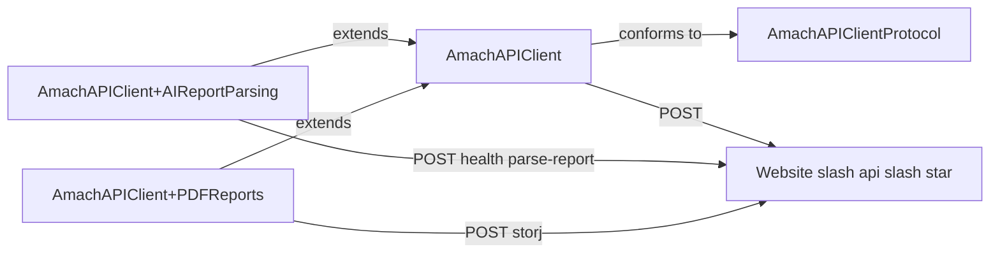

| File                                                           | Lines | Role                                                    | Verdict            | Issues                                                                                                                                                                                                                                                                                                                                                            |
| -------------------------------------------------------------- | ----- | ------------------------------------------------------- | ------------------ | ----------------------------------------------------------------------------------------------------------------------------------------------------------------------------------------------------------------------------------------------------------------------------------------------------------------------------------------------------------------- |
| `AmachHealth/Sources/API/AmachAPIClient.swift`                 | 1698  | Single HTTP client for all backend routes + ~40 DTOs    | refactor-candidate | 1698-line god-file mixing HTTP, business logic, and DTOs; dead `TimelineRequest`; orphaned `VeniceChatRequest`/`SSEChunk`; dead `APIError` cases; `streamLumaChat` drops `screen`/`metric` params; N+1 serial timeline fetch; swallowed per-item decode failures; fire-and-forget attestation errors; hardcoded prod URL fallback; simulated (not real) streaming |
| `AmachHealth/Sources/API/AmachAPIClient+AIReportParsing.swift` | 144   | Calls `/api/health/parse-report` (Venice + regex merge) | acceptable         | Wasteful `AnyCodableValue` double encode/decode round-trip; only first report of multi-report PDFs used; integers re-encoded as doubles                                                                                                                                                                                                                           |
| `AmachHealth/Sources/API/AmachAPIClientProtocol.swift`         | 106   | Protocol seam for mock injection in tests               | good               | Stale header comment about conformance location; covers only a fraction of the client surface                                                                                                                                                                                                                                                                     |
| `AmachHealth/Sources/API/AmachAPIClient+PDFReports.swift`      | 89    | FHIR report store/retrieve via `/api/storj`             | good               | None                                                                                                                                                                                                                                                                                                                                                              |

---

## Package

Single SwiftPM manifest declaring the `AmachHealth` library and its test target, but the shipping app is actually built from `AmachHealth.xcodeproj`, which references the same source files directly and independently declares the Privy dependency.

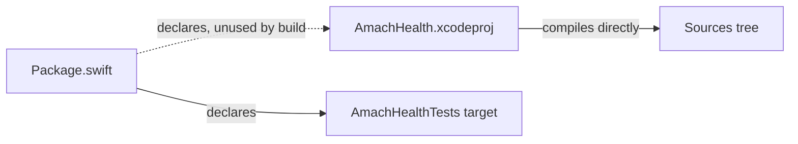

| File                        | Lines | Role                                         | Verdict    | Issues                                                                                                                                                                                      |
| --------------------------- | ----- | -------------------------------------------- | ---------- | ------------------------------------------------------------------------------------------------------------------------------------------------------------------------------------------- |
| `AmachHealth/Package.swift` | 36    | SwiftPM manifest (not the real build driver) | acceptable | Privy dependency declared twice (here and in project.pbxproj) and not linked; xcodebuild never reads this manifest; iOS-only platform means `swift test` can't run the declared test target |

---

## App

The composition root: two files wiring every service singleton, the 5-tab shell, and an (largely unused) observable app-state object.

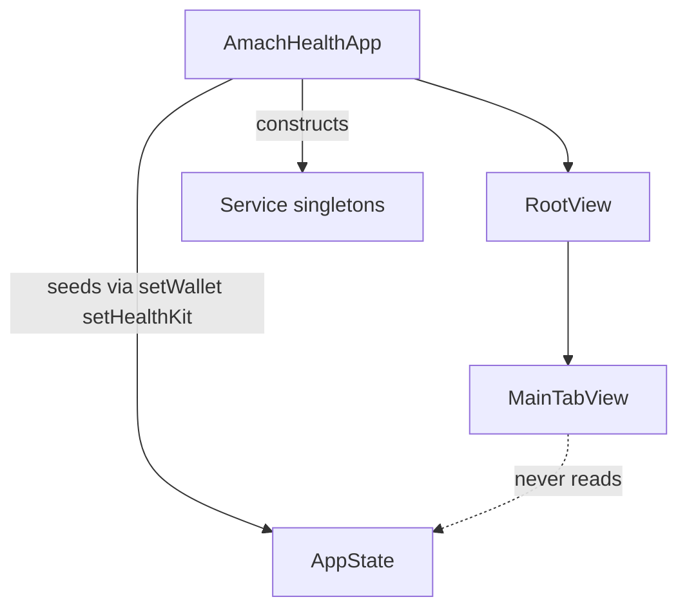

| File                                           | Lines | Role                                               | Verdict    | Issues                                                                                                                                                                                                     |
| ---------------------------------------------- | ----- | -------------------------------------------------- | ---------- | ---------------------------------------------------------------------------------------------------------------------------------------------------------------------------------------------------------- |
| `AmachHealth/Sources/App/AmachHealthApp.swift` | 267   | App entry, 5-tab shell + Luma FAB, lifecycle hooks | acceptable | Stale "4-tab" comment; swallowed HealthKit auth error; seeds dead `AppState`; duplicate onboarding-flag sources of truth; over-broad environment-object injection                                          |
| `AmachHealth/Sources/App/AppState.swift`       | 191   | Intended global `@Observable` app state            | needs-work | Mostly dead in production (no view reads it); many unused members; duplicate onboarding source of truth; duplicated tier-color logic vs. other files; redundant `isAuthenticated`/`isWalletConnected` pair |

---

## Components

Ten files of reusable SwiftUI building blocks: the Luma chat UI system, generic feedback/form kits, health-domain primitives (score ring, stat rows), charts (sleep stages, HR zones, sparklines), brand identity, and custom navigation chrome.

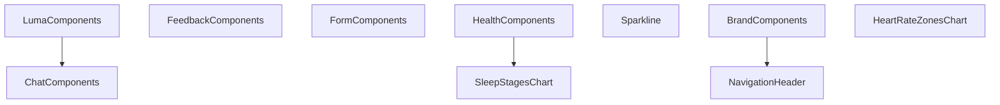

| File                                                       | Lines | Role                                                                    | Verdict        | Issues                                                                                                                          |
| ---------------------------------------------------------- | ----- | ----------------------------------------------------------------------- | -------------- | ------------------------------------------------------------------------------------------------------------------------------- |
| `AmachHealth/Sources/Components/LumaComponents.swift`      | 888   | Luma FAB, chat drawer, message bubbles, insight card                    | acceptable     | Hardcoded indigo hex duplicated 3x instead of a design token; 5 concerns in one file; unmemoized message-list closures          |
| `AmachHealth/Sources/Components/FeedbackComponents.swift`  | 796   | Toasts, progress bar, empty state, banner, confirmation sheet           | good           | ~15% of file is #Preview blocks; possible duplicate `AnyButtonStyle` eraser                                                     |
| `AmachHealth/Sources/Components/FormComponents.swift`      | 625   | Text/secure fields, toggle, checkbox, segmented control                 | good           | `AmachTextField`/`AmachSecureField` duplicate border/focus styling logic                                                        |
| `AmachHealth/Sources/Components/HealthComponents.swift`    | 512   | Source badges, health score ring, stat rows, connection cards           | good           | `DataSource.tint` hardcodes one raw hex instead of a token                                                                      |
| `AmachHealth/Sources/Components/SleepStagesChart.swift`    | 418   | Sleep-stage bar chart + recovery score card/popover                     | acceptable     | Hardcoded indigo hexes duplicate Luma AI palette; duplicated `scoreColor` logic; misnamed file (also hosts `RecoveryScoreCard`) |
| `AmachHealth/Sources/Components/Sparkline.swift`           | 347   | Compact trend charts (`SparklineChart`, `MiniTrendChart`, `TrendArrow`) | dead-or-orphan | Zero call sites outside its own previews anywhere in the app                                                                    |
| `AmachHealth/Sources/Components/ChatComponents.swift`      | 346   | Prompt chips, metric reference chips, date separator                    | good           | None                                                                                                                            |
| `AmachHealth/Sources/Components/NavigationHeader.swift`    | 305   | Custom nav header / modal header components                             | dead-or-orphan | Zero usages outside its own previews; all real screens use native `.navigationTitle`/`.toolbar`                                 |
| `AmachHealth/Sources/Components/BrandComponents.swift`     | 305   | Triskelion mark, shimmer modifier, brand lockup                         | acceptable     | Modifier named `GoldShimmerModifier` implements silver shimmer (naming drift); one hardcoded hex bypasses tokens                |
| `AmachHealth/Sources/Components/HeartRateZonesChart.swift` | 152   | HR zone donut chart                                                     | good           | Zone colors hardcoded locally instead of shared semantic tokens                                                                 |

---

## DesignSystem

Single 1,162-line file holding every design token (color, type, spacing, radius, elevation, animation, haptics, icons, accessibility) plus several canonical shared components (buttons, pills, badges, range bar, typing indicator). Mirrors the web's `design-system.html` CSS custom properties 1:1.

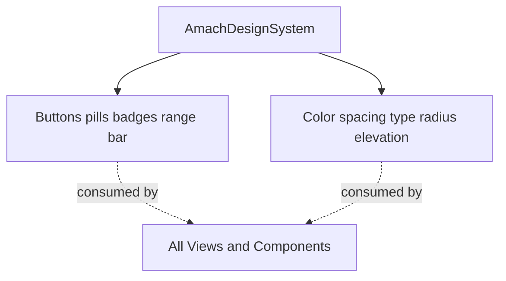

| File                                                       | Lines | Role                                                     | Verdict | Issues                                                                                                                                                                                                                                                     |
| ---------------------------------------------------------- | ----- | -------------------------------------------------------- | ------- | ---------------------------------------------------------------------------------------------------------------------------------------------------------------------------------------------------------------------------------------------------------- |
| `AmachHealth/Sources/DesignSystem/AmachDesignSystem.swift` | 1162  | Single source of truth for tokens + shared UI primitives | good    | Near-dead `.critical` pill case with 4 unused tokens; two parallel tier-color systems duplicated in 3 consumer files; doc-comment color drift; `LumaTypingIndicator` hardcodes dark-mode color regardless of scheme; mixes tokens with concrete components |

---

## Helpers (Tests/Helpers)

Three test-double files supporting unit/integration tests: a configurable API client mock, a `URLProtocol`-based network stub, and a minimal wallet-service mock.

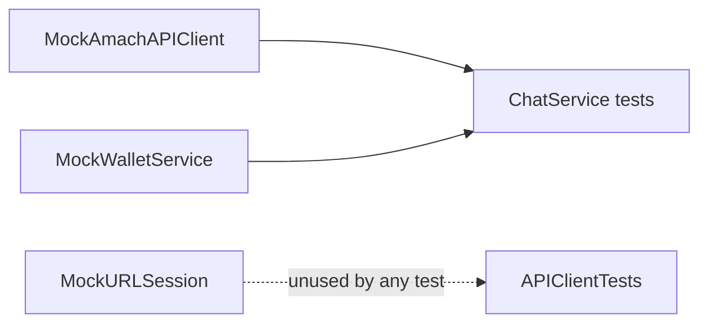

| File                                                 | Lines | Role                                                                  | Verdict        | Issues                                                                                                                                              |
| ---------------------------------------------------- | ----- | --------------------------------------------------------------------- | -------------- | --------------------------------------------------------------------------------------------------------------------------------------------------- |
| `AmachHealth/Tests/Helpers/MockAmachAPIClient.swift` | 205   | Configurable mock of `AmachAPIClientProtocol` for `ChatService` tests | good           | `HealthSummary.fixture()` force-tries JSON decode; streaming mock ignores several args                                                              |
| `AmachHealth/Tests/Helpers/MockURLSession.swift`     | 177   | `URLProtocol`-based network interception + `AmachTestCase` base class | dead-or-orphan | No test actually uses any export; documented usage pattern is impossible (`AmachAPIClient` has a private init); unsynchronized static mutable state |
| `AmachHealth/Tests/Helpers/MockWalletService.swift`  | 42    | Minimal `WalletServiceProtocol` stub                                  | good           | None                                                                                                                                                |

---

## Models

Eight files defining the app's Codable data contracts: chat/memory, timeline events, health-memory/anomaly detection, Merkle leaf schemas (v1 and v2), HealthKit data types, PDF/FHIR report models, and proof documents.

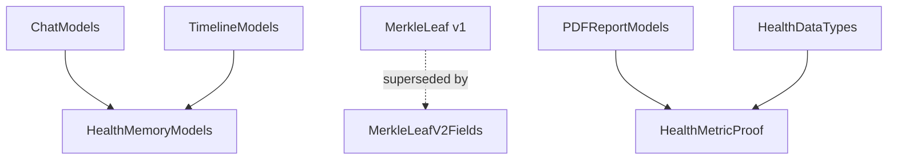

| File                                                  | Lines | Role                                                                    | Verdict    | Issues                                                                                                                               |
| ----------------------------------------------------- | ----- | ----------------------------------------------------------------------- | ---------- | ------------------------------------------------------------------------------------------------------------------------------------ |
| `AmachHealth/Sources/Models/ChatModels.swift`         | 619   | Chat/session/Venice-contract models + `ConversationMemoryStore` service | needs-work | Mixes pure models with a stateful singleton service; swallowed Storj sync errors; two independent fact-dedup strategies side by side |
| `AmachHealth/Sources/Models/TimelineModels.swift`     | 596   | Cross-platform timeline event model + `LabRecord`                       | acceptable | 29-case switch for per-type fields instead of a declarative table; silent decode-failure defaults                                    |
| `AmachHealth/Sources/Models/HealthMemoryModels.swift` | 432   | Anomaly/baseline/sensitivity models for Luma's memory subsystem         | good       | None                                                                                                                                 |
| `AmachHealth/Sources/Models/MerkleLeaf.swift`         | 294   | Canonical v1 90-byte Merkle leaf schema                                 | needs-work | Stale "keep out of app target" comment (it is compiled in); v1/v2 schema coexistence risk                                            |
| `AmachHealth/Sources/Models/HealthDataTypes.swift`    | 238   | HealthKit metric enums + `DailySummary`/`AppleHealthManifest`           | good       | None                                                                                                                                 |
| `AmachHealth/Sources/Models/PDFReportModels.swift`    | 179   | Mirror of website's `reportData.ts` types + FHIR representation         | good       | None                                                                                                                                 |
| `AmachHealth/Sources/Models/HealthMetricProof.swift`  | 170   | Proof document schema + `ProofableMetric` registry descriptor           | good       | None                                                                                                                                 |
| `AmachHealth/Sources/Models/MerkleLeafV2Fields.swift` | 124   | Wire-format struct mirroring web's `AmachLeafV2Fields`                  | good       | Several v2-only fields (vo2max, weight, body comp) are always-zero placeholders pending HealthKit pipeline support                   |

---

## Previews

Ten files (`#Preview` scaffolding only) providing mock data and canvas-preview coverage for every major screen: shared mock generators plus per-screen preview files for chat, metric detail, onboarding, dashboard, sync, trends, profile, and app-root.

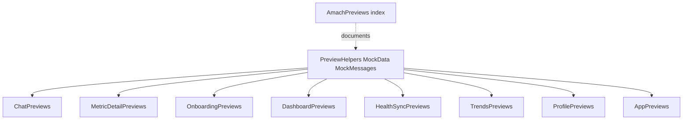

| File                                                      | Lines | Role                                                 | Verdict | Issues |
| --------------------------------------------------------- | ----- | ---------------------------------------------------- | ------- | ------ |
| `AmachHealth/Sources/Previews/PreviewHelpers.swift`       | 360   | Central mock data/environment setup for all previews | good    | None   |
| `AmachHealth/Sources/Previews/ChatPreviews.swift`         | 83    | Chat/Luma sheet preview states                       | good    | None   |
| `AmachHealth/Sources/Previews/MetricDetailPreviews.swift` | 76    | Metric detail previews across 12 metric types        | good    | None   |
| `AmachHealth/Sources/Previews/OnboardingPreviews.swift`   | 70    | Onboarding step previews                             | good    | None   |
| `AmachHealth/Sources/Previews/DashboardPreviews.swift`    | 52    | Dashboard previews across 6 personas                 | good    | None   |
| `AmachHealth/Sources/Previews/HealthSyncPreviews.swift`   | 43    | Health sync state previews                           | good    | None   |
| `AmachHealth/Sources/Previews/TrendsPreviews.swift`       | 28    | Trends view previews                                 | good    | None   |
| `AmachHealth/Sources/Previews/ProfilePreviews.swift`      | 28    | Profile view previews                                | good    | None   |
| `AmachHealth/Sources/Previews/AppPreviews.swift`          | 20    | App-root navigation previews                         | good    | None   |
| `AmachHealth/Sources/Previews/AmachPreviews.swift`        | 16    | Index/documentation file for preview organization    | good    | None   |

---

## Services

Twenty-eight files — the largest module — covering proof generation, PDF parsing/upload, AI chat context, HealthKit sync, wallet/Privy, the ZK Merkle pipeline, timeline persistence, and proactive anomaly detection.

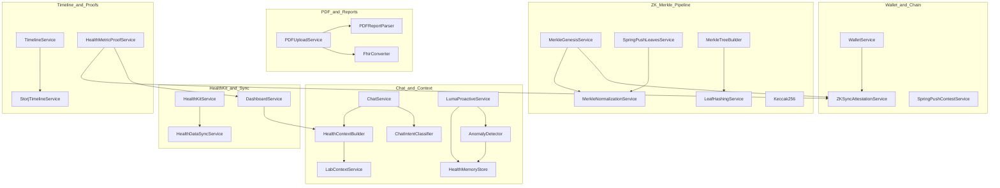

| File                                                            | Lines | Role                                                                  | Verdict        | Issues                                                                                                                                                                                        |
| --------------------------------------------------------------- | ----- | --------------------------------------------------------------------- | -------------- | --------------------------------------------------------------------------------------------------------------------------------------------------------------------------------------------- |
| `AmachHealth/Sources/Services/HealthMetricProofService.swift`   | 1112  | Builds/submits shareable metric-proof documents                       | needs-work     | 3 dead legacy proof methods; averaging logic not reconciled with web's stat-card averaging fix; silent week-dropping; stray `print()`s; hardcoded placeholder completeness metadata           |
| `AmachHealth/Sources/Services/PDFReportParser.swift`            | 995   | PDFKit text extraction + regex report parsing                         | acceptable     | Large hand-rolled regex surface with force-`try!` static patterns; hand-maintained heuristics with no drift telemetry                                                                         |
| `AmachHealth/Sources/Services/HealthContextBuilder.swift`       | 979   | Builds Luma's `AIChatContext`/`ContextBlock`s                         | needs-work     | Duplicate/conflicting `today_partial` block sent twice; 4 near-duplicate lab-summary overloads; inconsistent debug logging; ~60 lines of dead code (`fetchLatestBloodwork`/`fetchLatestDexa`) |
| `AmachHealth/Sources/Services/ChatService.swift`                | 855   | Central Luma chat singleton (streaming, persistence, memory)          | acceptable     | Duplicated stream-consume loop (primary vs. retry); several silently-swallowed background errors; many responsibilities in one class                                                          |
| `AmachHealth/Sources/Services/DashboardService.swift`           | 772   | Live dashboard data (today + trends)                                  | needs-work     | HR-zone classification logic duplicated twice; hardcoded `maxHR = 185`; recovery-score formula inline instead of shared utility                                                               |
| `AmachHealth/Sources/Services/FhirConverter.swift`              | 740   | Bidirectional FHIR conversion + fingerprints                          | acceptable     | Heavily repetitive per-field observation construction; fragile LOINC-code region mapping; magic-number confidence heuristic                                                                   |
| `AmachHealth/Sources/Services/WalletService.swift`              | 600   | Privy auth, signing, PBKDF2 key derivation, Keychain                  | needs-work     | Hardcoded Privy IDs; `connectDevMock()` guarded only by `canImport(PrivySDK)`, not `#if DEBUG`; swallowed Keychain load failures; no automated cross-platform key-derivation test             |
| `AmachHealth/Sources/Services/MerkleNormalizationService.swift` | 575   | HealthKit → deterministic per-day leaf normalization                  | good           | Stale "keep out of app target" header; `dominantTimezone(from:)` ignores its parameter                                                                                                        |
| `AmachHealth/Sources/Services/ZKSyncAttestationService.swift`   | 509   | On-chain writes via Privy wallet, hand-rolled ABI encoding            | needs-work     | Hardcoded contract addresses/selectors with no shared config; unused `improvementVerifierAddress`; manual bignum hex math; unstructured emoji-prefixed logging                                |
| `AmachHealth/Sources/Services/HealthKitService.swift`           | 463   | Core HealthKit read integration + daily aggregation                   | acceptable     | Sleep-stage mapping duplicated in 3 places; sequential per-metric fetch with silent per-metric error swallowing; no typed workout samples                                                     |
| `AmachHealth/Sources/Services/SpringPushLeavesService.swift`    | 440   | Spring Push contest baseline/finish leaf capture                      | acceptable     | Wallet-address hex parsing duplicated 3x across the module; workouts always uploaded as empty                                                                                                 |
| `AmachHealth/Sources/Services/MerkleGenesisService.swift`       | 400   | Genesis Merkle root pipeline orchestrator                             | needs-work     | Stale header describing a superseded on-device tree-build design; duplicated wallet-address parsing; force-unwrapped date arithmetic; dead unused `padLeft` helper                            |
| `AmachHealth/Sources/Services/HealthDataSyncService.swift`      | 378   | Legacy full/background HealthKit → Storj → chain sync                 | needs-work     | Duplicated `normalizeMetricKey`; near-copy-paste `performFullSync`/`retrySync`; swallowed attestation errors; force-unwraps; 3 overlapping sync pipelines coexist in the app                  |
| `AmachHealth/Sources/Services/MerkleTreeBuilder.swift`          | 340   | Node.js shell-out tree builder (intended macOS/CLI-only)              | dead-or-orphan | Zero call sites anywhere; non-functional on iOS target (unconditional throw); unused `api` property; duplicate `padLeft` helper                                                               |
| `AmachHealth/Sources/Services/LabContextService.swift`          | 293   | Session-caches bloodwork/DEXA from Storj for Luma context             | good           | Heavy repeated debug-print pattern; hardcoded clinical reference ranges inline                                                                                                                |
| `AmachHealth/Sources/Services/StorjTimelineService.swift`       | 277   | Storj transport + on-chain registration for timeline events           | needs-work     | Hardcoded contract address/chainId inline; hand-rolled ABI helpers duplicated elsewhere; swallowed registration errors                                                                        |
| `AmachHealth/Sources/Services/PDFUploadService.swift`           | 264   | PDF → FHIR → Storj pipeline orchestrator                              | acceptable     | Swallowed dedup-check and attestation errors; unused `doneResult` helper                                                                                                                      |
| `AmachHealth/Sources/Services/TimelineService.swift`            | 257   | Timeline business logic (merge, cache, optimistic CRUD)               | good           | Brittle string-matching retry heuristic for signature errors                                                                                                                                  |
| `AmachHealth/Sources/Services/LeafHashingService.swift`         | 257   | macOS/CI-only Node.js Poseidon-hash bridge (excluded from app target) | needs-work     | Hardcoded developer-machine path; embedded duplicate Node script string; untyped JSON IPC                                                                                                     |
| `AmachHealth/Sources/Services/HealthMemoryStore.swift`          | 229   | Persists Luma's longitudinal memory (JSON files)                      | good           | Silent `try?` on all load/save paths                                                                                                                                                          |
| `AmachHealth/Sources/Services/LumaProactiveService.swift`       | 224   | Proactive anomaly-to-notification pipeline                            | good           | `humanReadableLabel` likely duplicates a display-label mapping elsewhere                                                                                                                      |
| `AmachHealth/Sources/Services/LumaConversationReplay.swift`     | 208   | DEBUG fixture loader for chat/memory QA replay                        | good           | ~100 lines of inline JSON string literal instead of a bundled resource                                                                                                                        |
| `AmachHealth/Sources/Services/SpringPushContestService.swift`   | 171   | Read-only eth_call client for Spring Push escrow state                | needs-work     | Hardcoded RPC URL/contract address duplicating web's `networkConfig.ts` with no shared source                                                                                                 |
| `AmachHealth/Sources/Services/AnomalyDetector.swift`            | 162   | Evaluates daily summaries against personal baselines                  | good           | Sleep-derivation logic duplicated with `HealthMemoryStore`                                                                                                                                    |
| `AmachHealth/Sources/Services/ChatIntentClassifier.swift`       | 157   | Stateless keyword-based chat intent classifier                        | good           | Simple substring matching has no stemming/multi-language support                                                                                                                              |
| `AmachHealth/Sources/Services/Keccak256.swift`                  | 134   | Pure-Swift Ethereum-style Keccak-256                                  | good           | None                                                                                                                                                                                          |
| `AmachHealth/Sources/Services/ChatService+Testing.swift`        | 40    | DEBUG-only `ChatService` test factory                                 | dead-or-orphan | `makeForTesting` never called anywhere; tests construct `ChatService` directly instead                                                                                                        |
| `AmachHealth/Sources/Services/WalletServiceProtocol.swift`      | 19    | Protocol seam for wallet-dependent test injection                     | good           | None                                                                                                                                                                                          |

---

## Tests

Nineteen files under `Tests/` (excluding the three `Tests/Helpers` mocks documented above) covering PDF pipeline stress tests, Merkle/ZK normalization gates, chat integration, timeline, design tokens, and simulator HealthKit seeding.

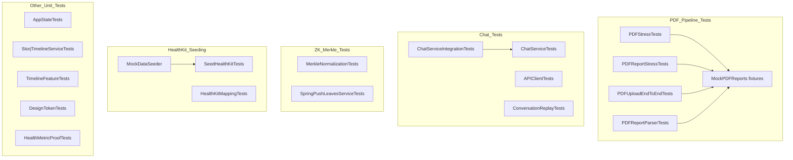

| File                                                   | Lines | Role                                                          | Verdict    | Issues                                                              |
| ------------------------------------------------------ | ----- | ------------------------------------------------------------- | ---------- | ------------------------------------------------------------------- |
| `AmachHealth/Tests/PDFStressTests.swift`               | 1307  | PDF pipeline parser/dedup/FHIR/concurrency/error stress suite | good       | None                                                                |
| `AmachHealth/Tests/PDFReportStressTests.swift`         | 1153  | PDF pipeline stress/robustness suite incl. Lunar Prodigy DEXA | good       | None                                                                |
| `AmachHealth/Tests/SpringPushLeavesServiceTests.swift` | 727   | Merkle V2 leaf/wallet/state-machine/ABI unit tests            | good       | None                                                                |
| `AmachHealth/Tests/PDFUploadEndToEndTests.swift`       | 614   | End-to-end PDF upload pipeline suite                          | good       | None                                                                |
| `AmachHealth/Tests/MerkleNormalizationTests.swift`     | 522   | Phase 1 gate tests for Merkle leaf serialization              | good       | None                                                                |
| `AmachHealth/Tests/PDFReportParserTests.swift`         | 493   | PDF report parsing/FHIR/fingerprint suite                     | good       | None                                                                |
| `AmachHealth/Tests/HealthKitMappingTests.swift`        | 388   | Pure-logic HealthKitService tests (no live queries)           | acceptable | Incomplete TODO stubs for Xcode-only integration tests              |
| `AmachHealth/Tests/StorjTimelineServiceTests.swift`    | 353   | `StorjTimelineService` unit tests via mock API                | good       | None                                                                |
| `AmachHealth/Tests/APIClientTests.swift`               | 332   | SSE/Venice/Storj decoding tests                               | acceptable | TODO stubs for network error/streaming tests lack actionable detail |
| `AmachHealth/Tests/ChatServiceIntegrationTests.swift`  | 315   | `ChatService` integration tests via mocks                     | good       | None                                                                |
| `AmachHealth/Tests/MockDataSeeder.swift`               | 303   | Simulator HealthKit seeder (60 days, anomaly windows)         | good       | None                                                                |
| `AmachHealth/Tests/AppStateTests.swift`                | 287   | `AppState` unit tests                                         | good       | None                                                                |
| `AmachHealth/Tests/ChatServiceTests.swift`             | 254   | Chat model/business-logic unit tests                          | good       | None                                                                |
| `AmachHealth/Tests/TimelineFeatureTests.swift`         | 238   | Timeline model cross-platform decoding tests                  | good       | None                                                                |
| `AmachHealth/Tests/DesignTokenTests.swift`             | 227   | Design-system token snapshot tests                            | good       | None                                                                |
| `AmachHealth/Tests/MockPDFReports.swift`               | 213   | Shared PDF test fixtures                                      | good       | None                                                                |
| `AmachHealth/Tests/HealthMetricProofTests.swift`       | 168   | Proof-document model unit tests                               | good       | None                                                                |
| `AmachHealth/Tests/SeedHealthKitTests.swift`           | 97    | Manual simulator HealthKit seeding harness                    | good       | None                                                                |
| `AmachHealth/Tests/ConversationReplayTests.swift`      | 32    | `LumaConversationReplay` fixture decoding tests               | good       | None                                                                |

---

## Views

Sixteen files — the UI layer for all 5 tabs plus modal sheets: dashboard, trends, timeline, health sync, profile, onboarding, chat, PDF/lab upload, proof generation, and wallet connection.

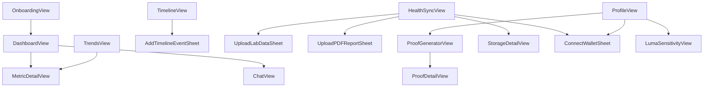

| File                                                    | Lines | Role                                                                        | Verdict    | Issues                                                                                                                                                                                           |
| ------------------------------------------------------- | ----- | --------------------------------------------------------------------------- | ---------- | ------------------------------------------------------------------------------------------------------------------------------------------------------------------------------------------------ |
| `AmachHealth/Sources/Views/HealthSyncView.swift`        | 1089  | Health Sync tab: sync controls, ZK genesis/coverage workflow, Storj browser | needs-work | Mixes 3 concerns + 3 extra top-level structs in one file; duplicated `truncate(_:)` helper; hardcoded fallback day-window; unstructured errors; inconsistent `TierBadge`/`AmachTierBadge` naming |
| `AmachHealth/Sources/Views/ProfileView.swift`           | 933   | Profile tab: identity, sources, tier, attestations, Luma settings           | needs-work | "Delete Account" is a non-functional placeholder; 8+ concerns in one file; duplicated `truncate(_:)`; silently swallowed attestation-load errors; hardcoded legal URLs/version string            |
| `AmachHealth/Sources/Views/MetricDetailView.swift`      | 784   | Per-biomarker deep-dive screen + `MetricInfo` model                         | needs-work | "1Y" range silently shows 90 days; dead/unreachable status branch; `MetricInfo` model lives in a view file                                                                                       |
| `AmachHealth/Sources/Views/OnboardingView.swift`        | 699   | Multi-step onboarding flow                                                  | good       | None                                                                                                                                                                                             |
| `AmachHealth/Sources/Views/ChatView.swift`              | 690   | Full-screen Luma chat interface                                             | good       | None                                                                                                                                                                                             |
| `AmachHealth/Sources/Views/UploadLabDataSheet.swift`    | 681   | Lab upload form + lab record detail view                                    | acceptable | Mixes upload form with detail view in one file                                                                                                                                                   |
| `AmachHealth/Sources/Views/DashboardView.swift`         | 600   | Dashboard tab: metric grid, score ring, insight card                        | good       | None                                                                                                                                                                                             |
| `AmachHealth/Sources/Views/TrendsView.swift`            | 540   | Trends tab: category/period selectors, charts                               | acceptable | `TrendChartCard` mixes rendering, interaction, and formatting                                                                                                                                    |
| `AmachHealth/Sources/Views/TimelineView.swift`          | 485   | Timeline tab: events + anomalies list                                       | acceptable | `shortHash`/camelCase-title helpers duplicated across 6 files                                                                                                                                    |
| `AmachHealth/Sources/Views/ProofGeneratorView.swift`    | 417   | Proof-generation entry screen                                               | needs-work | Dead legacy `ProofOption` struct; duplicated `shortHash` helper                                                                                                                                  |
| `AmachHealth/Sources/Views/UploadPDFReportSheet.swift`  | 314   | PDF picker/preview/upload sheet                                             | good       | None                                                                                                                                                                                             |
| `AmachHealth/Sources/Views/LumaSensitivityView.swift`   | 303   | Anomaly-sensitivity settings screen                                         | acceptable | Hardcoded clinical thresholds duplicated from detection logic                                                                                                                                    |
| `AmachHealth/Sources/Views/StorageDetailView.swift`     | 280   | Single Storj payload detail view                                            | needs-work | `shortHash`/camelCase-title helpers duplicated (see TimelineView); per-render string formatting redundancy                                                                                       |
| `AmachHealth/Sources/Views/AddTimelineEventSheet.swift` | 275   | Timeline event create/edit sheet                                            | good       | Near-identical create/update do-catch blocks                                                                                                                                                     |
| `AmachHealth/Sources/Views/ConnectWalletSheet.swift`    | 239   | Email-OTP wallet connection sheet                                           | good       | Loose `isValidEmail` pre-check                                                                                                                                                                   |
| `AmachHealth/Sources/Views/ProofDetailView.swift`       | 235   | Read-only generated-proof detail screen                                     | needs-work | Duplicated `shortHash`; ungated debug fields could leak to production UI; brittle hardcoded method-label switch                                                                                  |

---

## Hotspots

Files flagged `needs-work`, `refactor-candidate`, `dead-or-orphan`, or `duplicate`, one line each:

- **`API/AmachAPIClient.swift`** (refactor-candidate) — 1698-line god-file mixing HTTP client, business logic, and ~40 DTOs; dead/orphaned code (`TimelineRequest`, `VeniceChatRequest`, `SSEChunk`); N+1 timeline fetch; simulated streaming.
- **`App/AppState.swift`** (needs-work) — mostly dead observable state; no view reads it; duplicate onboarding flag; duplicated tier-color logic.
- **`Components/Sparkline.swift`** (dead-or-orphan) — `SparklineChart`/`MiniTrendChart`/`TrendArrow` have zero call sites outside their own previews.
- **`Components/NavigationHeader.swift`** (dead-or-orphan) — custom nav/modal headers unused anywhere; all screens use native toolbar chrome.
- **`Models/ChatModels.swift`** (needs-work) — mixes pure models with the stateful `ConversationMemoryStore` service; two independent fact-dedup strategies.
- **`Models/MerkleLeaf.swift`** (needs-work) — stale "keep out of app target" comment; v1/v2 Merkle schema coexistence risk.
- **`Services/HealthMetricProofService.swift`** (needs-work) — 3 dead legacy proof methods; averaging logic not reconciled with the web's recent stat-card averaging fix; hardcoded placeholder completeness metadata.
- **`Services/HealthContextBuilder.swift`** (needs-work) — sends a duplicate/conflicting `today_partial` context block to Luma; 4 near-duplicate lab-summary overloads; ~60 lines of dead code.
- **`Services/DashboardService.swift`** (needs-work) — HR-zone classification logic duplicated twice; hardcoded `maxHR = 185` with no user-profile sourcing.
- **`Services/WalletService.swift`** (needs-work) — hardcoded Privy IDs; dev-mock wallet guarded only by SDK availability, not `#if DEBUG`; no cross-platform key-derivation test vector.
- **`Services/ZKSyncAttestationService.swift`** (needs-work) — hardcoded contract addresses/selectors with no shared config; unused `improvementVerifierAddress` constant.
- **`Services/MerkleGenesisService.swift`** (needs-work) — stale header describing a superseded on-device design; duplicated wallet-address parsing; dead `padLeft` helper.
- **`Services/HealthDataSyncService.swift`** (needs-work) — near-duplicate `performFullSync`/`retrySync` logic; 3 overlapping HealthKit-to-chain sync pipelines coexist app-wide.
- **`Services/MerkleTreeBuilder.swift`** (dead-or-orphan) — zero call sites; non-functional on iOS target; live genesis pipeline moved tree-building server-side.
- **`Services/StorjTimelineService.swift`** (needs-work) — hardcoded contract address/chainId inline; hand-rolled ABI helpers duplicated elsewhere in the module.
- **`Services/LeafHashingService.swift`** (needs-work) — hardcoded developer-machine path (`~/Projects/AmachHealth-iOS/zk`) that fails on any other machine/CI runner.
- **`Services/SpringPushContestService.swift`** (needs-work) — hardcoded RPC URL/contract address duplicating the web's `networkConfig.ts` with no shared source.
- **`Services/ChatService+Testing.swift`** (dead-or-orphan) — `makeForTesting` factory never called anywhere; tests construct `ChatService` directly.
- **`Views/HealthSyncView.swift`** (needs-work) — 1089-line file mixing sync controls, ZK workflow, and Storj browsing; duplicated `truncate(_:)`.
- **`Views/ProfileView.swift`** (needs-work) — non-functional "Delete Account" placeholder shipped as if live; duplicated `truncate(_:)`; hardcoded legal URLs/version.
- **`Views/MetricDetailView.swift`** (needs-work) — "1Y" range silently renders 90 days of data; dead unreachable status branch.
- **`Views/ProofGeneratorView.swift`** (needs-work) — dead legacy `ProofOption` struct.
- **`Views/StorageDetailView.swift`** (needs-work) — `shortHash`/camelCase-title helpers duplicated across 6 files app-wide (also present in `TimelineView`, `ProofDetailView`, `ProofGeneratorView`, `HealthSyncView`, `UploadLabDataSheet`).
- **`Views/ProofDetailView.swift`** (needs-work) — ungated debug fields (`debugBaselineBuckets`/`debugComparisonBuckets`) can render directly to end users.
