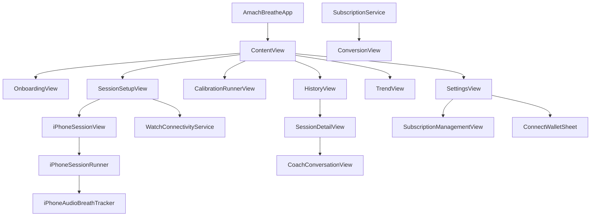
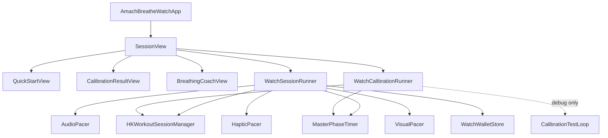
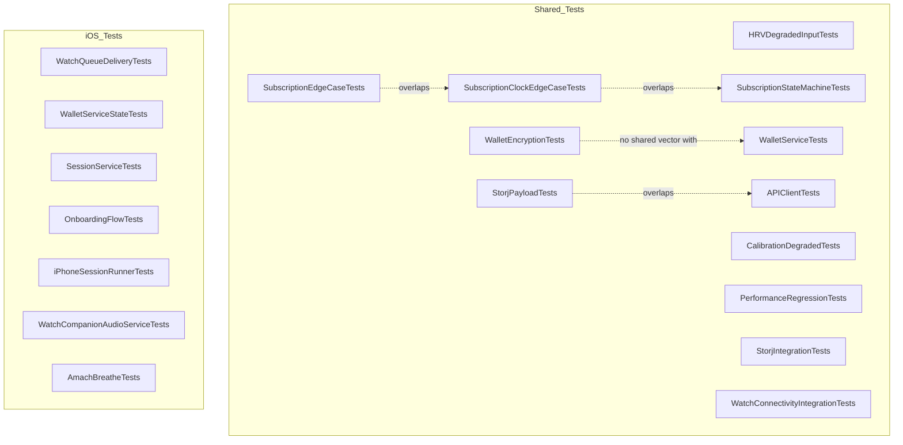

# Chapter 04 — Breathe App (Amach Breathe)

Repo: `/Users/dave/AmachHealthBreathe` (early TestFlight beta, iPhone + Apple Watch)
Cross-links: see [00-master-map.md](00-master-map.md) for the full doc set and [03-ios-app.md](03-ios-app.md) for the main AmachHealth-iOS app this one shadows architecturally.

## Overview

Amach Breathe is a resonance-breathing trainer: paced breathing sessions with live HRV, on-device coherence scoring (Goertzel filter), a 4.5–7.0 BPM resonance-frequency calibration protocol, session history/trends, and a post-session Venice-backed AI coach. It's a `Shared/` SwiftPM package (`AmachBreatheShared`) consumed by two thin platform targets — `iOS/` (iPhone-only sessions, calibration, settings, subscriptions) and `watchOS/` (the primary session/calibration runner, since HealthKit/HRV sensing lives on the wrist) — connected by WatchConnectivity. Optional Privy wallet + Storj sync mirror the main AmachHealth-iOS app's pattern, but the app fully works wallet-less (StoreKit subscription is the primary monetization path). **93 audited files total**: 60 Sources (26 Shared, 18 iOS, 16 watchOS) + 1 Package manifest + 38 Tests (31 Shared, 7 iOS).

**Known duplication with the main iOS app** (by pattern, not by shared code): the entire design system (`AmachDesignSystem.swift`, `AmachBrandMark.swift`) is a copy-pasted fork of AmachHealth-iOS's; `WalletService.swift`/`WalletCrypto.swift` is a third independent implementation of the same PBKDF2 key-derivation algorithm as the web's `walletEncryption.ts` and AmachHealth-iOS's `WalletService.swift`; and `BreathingSessionEvent` hand-copies the web's `BREATHING_SESSION` timeline-event schema (`src/types/healthEventTypes.ts`) with no shared source of truth. See the Hotspots section below and [03-ios-app.md](03-ios-app.md)'s Fragmentation Notes for the cross-repo picture.

---

## Shared

The `AmachBreatheShared` SwiftPM package: design tokens, wire models, wallet/crypto, the API client, and all platform-agnostic signal-processing/session-state services consumed by both iOS and watchOS targets. 26 source files plus the package manifest.

```mermaid
flowchart TB
    subgraph Models
        SM[SharedModels]
        WM[WatchMessages]
        SUBM[SubscriptionModels]
        APPS[AppSettings]
        CALREC[CalibrationRecord]
        COMPLOGIC[ComplicationDisplayLogic]
        SESSHIST[SessionHistoryModel]
        SESSPHASE[SessionPhase]
        PACERSTATE[PacerState]
        BREATHRATIO[BreathRatio]
    end
    subgraph DesignSystem
        DS[AmachDesignSystem]
        BRAND[AmachBrandMark]
        SHIMMER[AmachShimmerModifier]
    end
    subgraph Services
        WCRYPTO[WalletCrypto]
        WSVC[WalletService]
        API[AmachAPIClient]
        AUDIOAN[AudioBreathEnvelopeAnalyzer]
        CALENGINE[CalibrationEngine]
        COHERENCE[CoherenceCalculator]
        HRV[HRVProcessor]
        PHASECTL[SessionPhaseController]
        SUBSM[SubscriptionStateMachine]
        TRENDENG[TrendEngine]
        NOTIFSCHED[NotificationScheduler]
        DIAG[DiagnosticLog]
    end

    WSVC --> WCRYPTO
    API --> SM
    CALENGINE --> COHERENCE
    BRAND --> DS
    SHIMMER --> DS
    SUBSM --> SUBM
```

| File                                                                                   | Lines | Role                                                                          | Verdict            | Issues                                                                                                                                                                               |
| -------------------------------------------------------------------------------------- | ----- | ----------------------------------------------------------------------------- | ------------------ | ------------------------------------------------------------------------------------------------------------------------------------------------------------------------------------ |
| `Shared/Package.swift`                                                                 | 32    | SwiftPM manifest, Privy-ios dependency                                        | good               | None                                                                                                                                                                                 |
| `Shared/Sources/AmachBreatheShared/Models/SharedModels.swift`                          | 655   | Wallet key wire format, Storj types, session models, coaching prompt builders | refactor-candidate | Mixes 5 concerns in one file; prompt-engineering text embedded in a model file; `BreathingSessionEvent` hardcodes `"BREATHING_SESSION"` matching web's `healthEventTypes.ts` by hand |
| `Shared/Sources/AmachBreatheShared/DesignSystem/AmachDesignSystem.swift`               | 598   | Design tokens + shared UI primitives, lifted from AmachHealth-iOS             | acceptable         | Full copy-paste duplicate of the iOS app's design system; inline hex literals bypass tokens; Health/Tier tokens are unused carried baggage                                           |
| `Shared/Sources/AmachBreatheShared/Services/WalletService.swift`                       | 376   | Privy auth, PBKDF2 key derivation, Keychain (iOS-only)                        | needs-work         | Duplicated wallet/PBKDF2 logic vs. AmachHealth-iOS; hardcoded Privy IDs; dev-mock auto-connects if PrivySDK unlinked; swallowed Keychain errors                                      |
| `Shared/Sources/AmachBreatheShared/DesignSystem/AmachBrandMark.swift`                  | 302   | Brand wordmark, `BreatheGlyph`, nav header, empty state                       | acceptable         | Mixes 3 unrelated components in one file; mirrors AmachHealth-iOS's `AmachBrandMark` by hand; pulse animation ignores Reduce Motion                                                  |
| `Shared/Sources/AmachBreatheShared/Networking/AmachAPIClient.swift`                    | 262   | HTTP client: Storj, subscription state, telemetry, timeline, AI coaching      | good               | `submitTelemetry` takes an unused `encryptionKey` param; decode failures swallow underlying error/body; force-unwrapped `URL(string:)!`                                              |
| `Shared/Sources/AmachBreatheShared/Services/AudioBreathEnvelopeAnalyzer.swift`         | 242   | Amplitude-envelope breath-peak/rate/quality analyzer                          | good               | 5 near-identical fallback-metrics constructions could collapse into one helper                                                                                                       |
| `Shared/Sources/AmachBreatheShared/Models/WatchMessages.swift`                         | 181   | WCSession message envelope types + codec                                      | good               | None                                                                                                                                                                                 |
| `Shared/Sources/AmachBreatheShared/Services/SessionPhaseController.swift`              | 156   | Pure timer-free phase lifecycle (baseline→warmup→main→recovery→reflection)    | good               | None                                                                                                                                                                                 |
| `Shared/Sources/AmachBreatheShared/Services/TrendEngine.swift`                         | 152   | Pure trend computations (coherence, HRV, streaks)                             | good               | None                                                                                                                                                                                 |
| `Shared/Sources/AmachBreatheShared/Services/CoherenceCalculator.swift`                 | 139   | Goertzel-based cardiac coherence scoring                                      | good               | Dead unused `NSLock` under `@unchecked Sendable`; duplicates `CalibrationEngine`'s candidate-BPM list                                                                                |
| `Shared/Sources/AmachBreatheShared/Services/SubscriptionStateMachine.swift`            | 109   | Pure trial/subscribed/connected/expired state machine                         | good               | Force-unwrapped calendar date arithmetic                                                                                                                                             |
| `Shared/Sources/AmachBreatheShared/Services/CalibrationEngine.swift`                   | 105   | Resonance-BPM detection across 6 candidate rates                              | good               | None                                                                                                                                                                                 |
| `Shared/Sources/AmachBreatheShared/Services/DiagnosticLog.swift`                       | 102   | Thread-safe 150-event diagnostic ring buffer                                  | acceptable         | Re-encodes/writes the full array to UserDefaults on every append — perf trap on hot paths                                                                                            |
| `Shared/Sources/AmachBreatheShared/Services/WalletCrypto.swift`                        | 85    | Platform-independent PBKDF2-SHA256 derivation                                 | good               | Cross-repo contract with web's `walletEncryption.ts` has no shared test vector                                                                                                       |
| `Shared/Sources/AmachBreatheShared/Models/SubscriptionModels.swift`                    | 84    | Subscription record, telemetry event, product IDs                             | acceptable         | `monthlyPriceUSD` hardcoded, will drift from actual StoreKit price                                                                                                                   |
| `Shared/Sources/AmachBreatheShared/Models/ComplicationDisplayLogic.swift`              | 79    | Pure watch-complication display-state logic                                   | acceptable         | Hardcoded hex colors duplicate design-system tokens; two idle branches are collapsible                                                                                               |
| `Shared/Sources/AmachBreatheShared/Models/SessionHistoryModel.swift`                   | 58    | Pure transform of session records to display rows                             | acceptable         | `dateLabel` allocates a new `DateFormatter` per access                                                                                                                               |
| `Shared/Sources/AmachBreatheShared/Services/HRVProcessor.swift`                        | 58    | Rolling-window RMSSD computation                                              | good               | None                                                                                                                                                                                 |
| `Shared/Sources/AmachBreatheShared/DesignSystem/AmachShimmerModifier.swift`            | 56    | Wordmark shimmer sweep modifier                                               | acceptable         | Duplicate of AmachHealth-iOS's `GoldShimmerModifier`; runs continuously off-screen                                                                                                   |
| `Shared/Sources/AmachBreatheShared/Models/AppSettings.swift`                           | 52    | Codable user settings (ratio, reminders, volume, pacer)                       | good               | None                                                                                                                                                                                 |
| `Shared/Sources/AmachBreatheShared/Services/NotificationScheduler.swift`               | 46    | Seconds-from-midnight → calendar-trigger scheduling                           | good               | `displayTime` allocates a `DateFormatter` per call                                                                                                                                   |
| `Shared/Sources/AmachBreatheShared/Models/PacerState.swift`                            | 42    | Immutable 60 Hz pacer snapshot                                                | good               | None                                                                                                                                                                                 |
| `Shared/Sources/AmachBreatheShared/Models/SessionPhase.swift`                          | 32    | Session lifecycle phase + `BreathPhase` enums                                 | good               | None                                                                                                                                                                                 |
| `Shared/Sources/AmachBreatheShared/Models/CalibrationRecord.swift`                     | 25    | Stored resonance result with 30-day retest window                             | good               | `needsRetest` reads `Date()` directly, not test-injectable                                                                                                                           |
| `Shared/Sources/AmachBreatheShared/Models/BreathingSessionRecord+CompanionAudio.swift` | 24    | Merges phone-captured audio metrics into a session record                     | good               | Field-by-field re-copy silently drops any future record field                                                                                                                        |
| `Shared/Sources/AmachBreatheShared/Models/BreathRatio.swift`                           | 18    | Inhale:exhale ratio enum                                                      | good               | None                                                                                                                                                                                 |

---

## iOS

The iPhone target: app entry, tab shell, onboarding, calibration/session UI (no HRV — iPhone sessions are audio/haptic-paced only), settings, subscription management, and the AI coach conversation UI. 18 source files.

| File                                                              | Lines | Role                                                                  | Verdict    | Issues                                                                                                                  |
| ----------------------------------------------------------------- | ----- | --------------------------------------------------------------------- | ---------- | ----------------------------------------------------------------------------------------------------------------------- |
| `iOS/Sources/Views/Session/iPhoneSessionView.swift`               | 428   | Full-screen iPhone session UI (ring, reflection, completion)          | good       | Breathing-ring rendering near-duplicates the watchOS ring                                                               |
| `iOS/Sources/Views/Session/SessionSetupView.swift`                | 428   | Breathe-tab setup: BPM/duration/ratio, tutorial sheet                 | good       | Embedded tutorial sheet could be its own file; hand-rolled button chrome instead of shared styles                       |
| `iOS/Sources/Views/Settings/SettingsView.swift`                   | 426   | Subscription, reminders, ratio, volume, pacer, issue export           | good       | None                                                                                                                    |
| `iOS/Sources/Views/Onboarding/OnboardingView.swift`               | 353   | 4-page first-launch onboarding                                        | good       | Final-page calibration start doesn't check watch reachability first                                                     |
| `iOS/Sources/Views/Calibration/CalibrationRunnerView.swift`       | 342   | iOS calibration flow UI with per-rate progress                        | good       | Progress-done heuristic assumes strictly ascending BPM sweep order                                                      |
| `iOS/Sources/Views/History/CoachConversationView.swift`           | 339   | Reusable Venice-backed AI coach chat thread                           | good       | Errors collapsed to generic strings with nothing logged                                                                 |
| `iOS/Sources/Services/SubscriptionService.swift`                  | 323   | StoreKit 2 trial/subscribed/connected/expired manager                 | acceptable | Swallowed product-load/telemetry errors; observer task never cancelled                                                  |
| `iOS/Sources/Views/History/SessionDetailView.swift`               | 286   | Session detail: metrics, HRV chart, coherence ring, coach thread      | good       | Coherence threshold bands hardcoded, not shared with watch                                                              |
| `iOS/Sources/Services/WatchConnectivityService.swift`             | 274   | iPhone-side WCSession broker                                          | good       | `sendStartSession` can't distinguish sent vs. dropped when watch unreachable                                            |
| `iOS/Sources/Views/Connection/ConnectWalletSheet.swift`           | 264   | Email-OTP Privy wallet connection sheet                               | good       | None                                                                                                                    |
| `iOS/Sources/Views/History/TrendView.swift`                       | 254   | Practice-consistency dashboard: streaks, HRV trend, coherence scatter | good       | None                                                                                                                    |
| `iOS/Sources/App/AmachBreatheApp.swift`                           | 202   | Root app entry, service wiring                                        | acceptable | Throwaway default `SessionService()` immediately replaced; dead `cancellables`; fragile last-writer-wins closure wiring |
| `iOS/Sources/Services/iPhoneAudioBreathTracker.swift`             | 200   | Microphone RMS-amplitude companion breath tracking                    | good       | None                                                                                                                    |
| `iOS/Sources/Views/Subscription/SubscriptionManagementView.swift` | 192   | Subscription status/management UI (4 states)                          | good       | None                                                                                                                    |
| `iOS/Sources/Views/Subscription/ConversionView.swift`             | 177   | Trial-end conversion modal (free vs. paid cards)                      | good       | None                                                                                                                    |
| `iOS/Sources/Services/iPhoneSessionRunner.swift`                  | 175   | Orchestrates iPhone-only sessions (no HRV)                            | good       | Mirrors `WatchSessionRunner` pattern per-platform                                                                       |
| `iOS/Sources/Views/History/HistoryView.swift`                     | 167   | Session history list with delete/detail navigation                    | good       | None                                                                                                                    |
| `iOS/Sources/App/ContentView.swift`                               | 68    | Root tab view + onboarding/session covers                             | acceptable | `fullScreenCover` uses a constant binding; empty setter drops swipe-dismiss state; duplicate `.tag(0)`                  |

---

## watchOS

The Apple Watch target: the primary session/calibration runners (own HealthKit access), session UI, and quick-start/complication support. 16 source files.

| File                                                            | Lines | Role                                                        | Verdict        | Issues                                                                                                                                                                                                            |
| --------------------------------------------------------------- | ----- | ----------------------------------------------------------- | -------------- | ----------------------------------------------------------------------------------------------------------------------------------------------------------------------------------------------------------------- |
| `watchOS/Sources/Services/WatchCalibrationRunner.swift`         | 569   | 6-rate resonance calibration orchestrator                   | acceptable     | Largest watch file, mixing orchestration/diagnostics/transport/wake-management; WCSession delivery pattern triplicated (and again in `WatchSessionRunner`); DEBUG builds silently use weaker 10s-per-rate windows |
| `watchOS/Sources/Services/WatchSessionRunner.swift`             | 489   | Full breathing session orchestrator + WCSession delegate    | acceptable     | `buildRecord` always stores full main-duration even on early end; duplicated WCSession send pattern; `updateComplicationState` marks "calibrated" unconditionally on every session start                          |
| `watchOS/Sources/Views/SessionView/SessionView.swift`           | 397   | Root routing view (quickstart/active/reflection/completion) | good           | 5 private subviews mixed into one file                                                                                                                                                                            |
| `watchOS/Sources/Services/HKWorkoutSessionManager.swift`        | 289   | HealthKit workout session + dual-source HR streaming        | good           | `stopWorkout` swallows end-collection errors silently; dual sample sources intentionally duplicate (documented)                                                                                                   |
| `watchOS/Sources/Views/QuickStartView/QuickStartView.swift`     | 184   | BPM/duration/ratio pickers + start button                   | good           | Default BPM 5.5 ignores any stored calibration result                                                                                                                                                             |
| `watchOS/Sources/Services/MasterPhaseTimer.swift`               | 180   | 60 Hz phase timer wrapping `SessionPhaseController`         | acceptable     | Near-duplicate of iOS's `iPhoneMasterPhaseTimer`; `advanceToReflection()` actually just calls `stop()`                                                                                                            |
| `watchOS/Sources/Views/SessionView/CalibrationResultView.swift` | 176   | Post-calibration result: BPM, per-rate coherence bars       | good           | None                                                                                                                                                                                                              |
| `watchOS/Sources/Services/AudioPacer.swift`                     | 165   | AVAudioEngine soft-thump pacer                              | good           | Duplicated concept with iOS's `iPhoneAudioPacer`; silent audio-session failure                                                                                                                                    |
| `watchOS/Sources/Views/SessionView/BreathingCoachView.swift`    | 144   | Animated breathing ring driven by `PacerState`              | good           | Candidate to share with iPhone's session ring                                                                                                                                                                     |
| `watchOS/Sources/Services/CalibrationTestLoop.swift`            | 140   | Env-var-activated simulator stress-test driver              | acceptable     | Compiled into release builds, gated only by runtime env var, not `#if DEBUG`                                                                                                                                      |
| `watchOS/Sources/Services/HapticPacer.swift`                    | 55    | Directional haptics on breath-phase transitions             | good           | None                                                                                                                                                                                                              |
| `watchOS/Sources/App/AmachBreatheWatchApp.swift`                | 40    | watchOS app entry, runner wiring, complication deep link    | good           | Deep link hardcodes BPM 5.5 instead of stored resonance                                                                                                                                                           |
| `watchOS/Sources/Services/WatchWalletStore.swift`               | 40    | Persists wallet state pushed from iPhone                    | good           | Key-string literals duplicated instead of using stored constants                                                                                                                                                  |
| `watchOS/Sources/Views/CompactWatchEnvironment.swift`           | 39    | Screen-size layout helpers (40mm detection, insets)         | good           | None                                                                                                                                                                                                              |
| `watchOS/Sources/Services/VisualPacer.swift`                    | 26    | Thin republishing seam over `MasterPhaseTimer`              | acceptable     | Published values appear unread by any view; near-dead                                                                                                                                                             |
| `watchOS/Sources/App/WatchContentView.swift`                    | 22    | Branded placeholder view                                    | dead-or-orphan | Not referenced anywhere; `SessionView` is the actual root view                                                                                                                                                    |

---

## Tests

38 test files: 31 in `Shared/Tests/AmachBreatheSharedTests` (signal processing, calibration, subscription state machine, wallet crypto, Storj/API contracts, watch messaging) and 7 in `iOS/Tests/Unit` (session/onboarding/wallet-state/watch-queue integration).

| File                                                                           | Lines | Role                                                               | Verdict    | Issues                                                                                  |
| ------------------------------------------------------------------------------ | ----- | ------------------------------------------------------------------ | ---------- | --------------------------------------------------------------------------------------- |
| `Shared/Tests/AmachBreatheSharedTests/StorjPayloadTests.swift`                 | 352   | Storj payload shape/field-naming contract tests                    | good       | None                                                                                    |
| `Shared/Tests/AmachBreatheSharedTests/TrendEngineTests.swift`                  | 260   | Trend computation tests                                            | good       | None                                                                                    |
| `Shared/Tests/AmachBreatheSharedTests/WatchConnectivityIntegrationTests.swift` | 252   | WatchConnectivity message serialization under realistic conditions | good       | None                                                                                    |
| `Shared/Tests/AmachBreatheSharedTests/HRVDegradedInputTests.swift`             | 250   | HRV/coherence stress tests under degraded sensor input             | good       | None                                                                                    |
| `Shared/Tests/AmachBreatheSharedTests/CalibrationDegradedTests.swift`          | 244   | Calibration engine under degraded conditions                       | good       | None                                                                                    |
| `Shared/Tests/AmachBreatheSharedTests/SubscriptionClockEdgeCaseTests.swift`    | 244   | Subscription clock edge cases                                      | good       | Overlapping coverage with the other two subscription test files                         |
| `Shared/Tests/AmachBreatheSharedTests/SubscriptionEdgeCaseTests.swift`         | 243   | Subscription state-transition matrix                               | good       | Overlapping coverage with `SubscriptionStateMachineTests`                               |
| `Shared/Tests/AmachBreatheSharedTests/WalletServiceTests.swift`                | 214   | PBKDF2/hex/Privy-init/email-code tests (phase 0)                   | good       | None                                                                                    |
| `iOS/Tests/Unit/WatchQueueDeliveryTests.swift`                                 | 214   | WatchConnectivity store-and-forward/dedup/reconnect tests          | good       | None                                                                                    |
| `Shared/Tests/AmachBreatheSharedTests/SubscriptionStateMachineTests.swift`     | 187   | Core subscription state-machine transition tests                   | acceptable | Duplication with the two other subscription test files                                  |
| `Shared/Tests/AmachBreatheSharedTests/PerformanceRegressionTests.swift`        | 179   | HRV/coherence pipeline benchmarks (Watch Series 4 budget)          | good       | None                                                                                    |
| `Shared/Tests/AmachBreatheSharedTests/StorjIntegrationTests.swift`             | 175   | Storj round-trip encoding + optional real-server tests             | good       | None                                                                                    |
| `Shared/Tests/AmachBreatheSharedTests/SessionPhaseControllerTests.swift`       | 163   | 5-phase session state-machine tests                                | good       | None                                                                                    |
| `Shared/Tests/AmachBreatheSharedTests/SessionHistoryModelTests.swift`          | 163   | Session history model mapping tests                                | good       | None                                                                                    |
| `Shared/Tests/AmachBreatheSharedTests/DesignSystemTests.swift`                 | 154   | Design token snapshot tests                                        | good       | None                                                                                    |
| `Shared/Tests/AmachBreatheSharedTests/APIClientTests.swift`                    | 148   | API client encoding/decoding tests                                 | acceptable | Duplication with `StorjPayloadTests` on `WalletEncryptionKey` coverage                  |
| `Shared/Tests/AmachBreatheSharedTests/ComplicationStateTests.swift`            | 141   | Watch complication display-state tests                             | good       | None                                                                                    |
| `Shared/Tests/AmachBreatheSharedTests/SubscriptionTelemetryTests.swift`        | 139   | Subscription/telemetry serialization tests                         | good       | None                                                                                    |
| `iOS/Tests/Unit/WalletServiceStateTests.swift`                                 | 131   | Privy wallet email/OTP/config tests                                | acceptable | Doesn't verify Privy IDs match AmachHealth-iOS                                          |
| `Shared/Tests/AmachBreatheSharedTests/NotificationSchedulingTests.swift`       | 128   | Notification scheduling helper tests                               | good       | None                                                                                    |
| `Shared/Tests/AmachBreatheSharedTests/CalibrationConsistencyTests.swift`       | 126   | Calibration engine consistency invariant tests                     | good       | None                                                                                    |
| `Shared/Tests/AmachBreatheSharedTests/WatchMessagesTests.swift`                | 120   | WCSession message encode/decode tests                              | good       | None                                                                                    |
| `Shared/Tests/AmachBreatheSharedTests/WalletEncryptionTests.swift`             | 112   | PBKDF2 determinism/hex-format/Codable tests                        | acceptable | No cross-platform test vectors verifying compatibility with web's `walletEncryption.ts` |
| `Shared/Tests/AmachBreatheSharedTests/WatchConnectivityWalletTests.swift`      | 104   | WCSession wallet-state propagation tests                           | good       | None                                                                                    |
| `Shared/Tests/AmachBreatheSharedTests/CalibrationEngineTests.swift`            | 99    | Calibration engine resonance-detection tests                       | good       | None                                                                                    |
| `Shared/Tests/AmachBreatheSharedTests/CoachingInsightTests.swift`              | 90    | AI coaching prompt-engineering tests                               | acceptable | Only checks substring presence; no full-prompt snapshot                                 |
| `Shared/Tests/AmachBreatheSharedTests/AudioBreathEnvelopeAnalyzerTests.swift`  | 90    | Audio breath tracking quality/BPM tests                            | good       | None                                                                                    |
| `Shared/Tests/AmachBreatheSharedTests/AppSettingsTests.swift`                  | 86    | App settings persistence/Codable tests                             | good       | None                                                                                    |
| `iOS/Tests/Unit/SessionServiceTests.swift`                                     | 84    | Session service deletion/coaching-state tests                      | good       | None                                                                                    |
| `Shared/Tests/AmachBreatheSharedTests/CoherenceCalculatorTests.swift`          | 75    | Goertzel coherence scorer tests                                    | good       | None                                                                                    |
| `Shared/Tests/AmachBreatheSharedTests/CompanionAudioMergeTests.swift`          | 69    | Companion audio metrics merge tests                                | good       | None                                                                                    |
| `iOS/Tests/Unit/OnboardingFlowTests.swift`                                     | 65    | Onboarding state-machine tests                                     | good       | None                                                                                    |
| `Shared/Tests/AmachBreatheSharedTests/ReflectionRatingTests.swift`             | 63    | Reflection rating persistence/Codable tests                        | good       | None                                                                                    |
| `Shared/Tests/AmachBreatheSharedTests/HRVProcessorTests.swift`                 | 59    | HRV RMSSD calculation tests                                        | good       | None                                                                                    |
| `iOS/Tests/Unit/WatchCompanionAudioServiceTests.swift`                         | 48    | Watch-companion audio service tests                                | good       | None                                                                                    |
| `Shared/Tests/AmachBreatheSharedTests/XCTestOptionalAccuracy.swift`            | 44    | `XCTAssertEqual` helper for `Optional<Double>`                     | good       | None                                                                                    |
| `iOS/Tests/Unit/iPhoneSessionRunnerTests.swift`                                | 43    | iPhone session runner smoke tests                                  | good       | None                                                                                    |
| `iOS/Tests/Unit/AmachBreatheTests.swift`                                       | 10    | Minimal app-bundle-ID smoke test                                   | acceptable | Trivial coverage; filename/class name mismatch                                          |

---

## Hotspots

Files flagged `needs-work`, `refactor-candidate`, `dead-or-orphan`, or `duplicate`, one line each:

- **`Shared/.../Models/SharedModels.swift`** (refactor-candidate) — 655-line grab-bag of wallet wire format, Storj types, session models, and embedded AI-coaching prompt text; `BreathingSessionEvent` hand-copies the web's `healthEventTypes.ts` schema with no shared source.
- **`Shared/.../Services/WalletService.swift`** (needs-work) — third independent copy of the PBKDF2/Privy wallet logic (web `walletEncryption.ts`, AmachHealth-iOS `WalletService`, this file); dev-mock wallet auto-connects whenever PrivySDK isn't linked; swallowed Keychain errors.
- **`Shared/.../DesignSystem/AmachDesignSystem.swift`** (acceptable, flagged for drift risk) — full copy-paste duplicate of AmachHealth-iOS's design system; three-way token drift risk (web/iOS/Breathe).
- **`Shared/.../DesignSystem/AmachBrandMark.swift`** (acceptable, flagged for drift risk) — deliberately mirrors AmachHealth-iOS's brand mark by hand; must be kept visually in sync manually.
- **`watchOS/Sources/App/WatchContentView.swift`** (dead-or-orphan) — unreferenced branded placeholder; `SessionView` is the actual watch root view.
- **`watchOS/Sources/Services/VisualPacer.swift`** (acceptable, near-dead) — published values appear unread by any consuming view.
- **`watchOS/Sources/Services/WatchCalibrationRunner.swift` / `WatchSessionRunner.swift`** (acceptable, flagged) — WCSession send/queue/diagnostics logic triplicated across both files; belongs in one shared `WatchMessenger` helper.
- **`iOS/Sources/App/AmachBreatheApp.swift`** (acceptable, flagged) — throwaway default `SessionService()` discarded in `init`; dead `cancellables` property.
- **Cross-platform wallet/crypto**: three independent PBKDF2 implementations of the same algorithm (web canonical `walletEncryption.ts`, AmachHealth-iOS `WalletService.swift`, Breathe `WalletCrypto.swift`/`WalletService.swift`) with no shared cross-repo test vector — `WalletEncryptionTests.swift` here tests determinism in isolation only.
- **Timer/pacer duplication**: `watchOS/Sources/Services/MasterPhaseTimer.swift` and `AudioPacer.swift` are near-duplicates of iOS-side `iPhoneMasterPhaseTimer`/`iPhoneAudioPacer` (not separately audited as they weren't part of the sampled file set, but referenced repeatedly as duplication risk in this file set's issues).
- **Subscription test overlap**: `SubscriptionEdgeCaseTests`, `SubscriptionClockEdgeCaseTests`, and `SubscriptionStateMachineTests` all cover overlapping (state, event) transition matrices and are candidates for consolidation into one parametrized suite.
