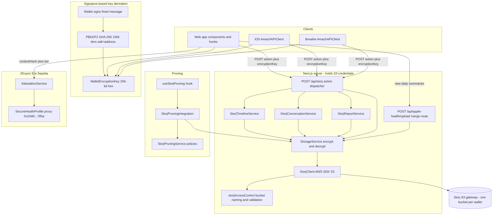
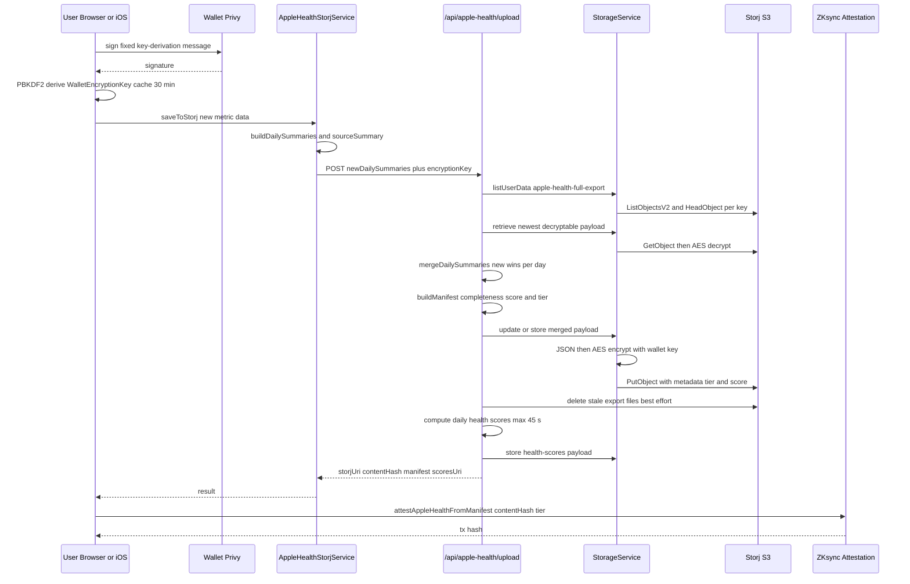
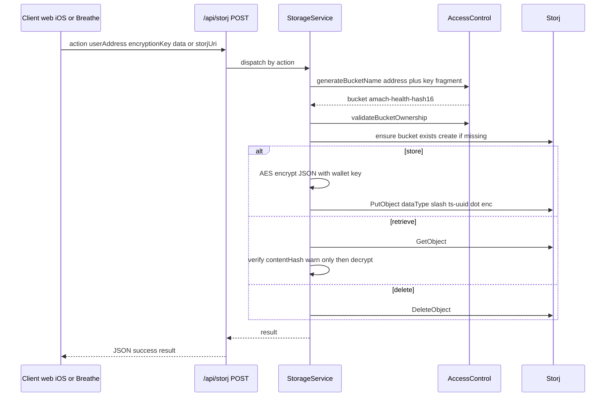

# Chapter 05 — Storj Encrypted Storage Integration

## Executive Summary

All durable user health data in Amach Health (Apple Health daily summaries, timeline events, FHIR-style lab/DEXA/gut-health reports, AI conversation memory, computed health scores, Merkle-genesis artifacts, and Breathe sessions) is stored as AES-encrypted blobs in Storj, an S3-compatible decentralized object store. Every wallet gets its own deterministic bucket named `{prefix}-{sha256(address + first32HexOfKey)[0:16]}`, where the key is a 256-bit PBKDF2 derivative of a wallet signature over a fixed message — so generating the bucket name (and decrypting anything in it) requires both the public address and an active wallet connection. Crucially, the S3 credentials live only on the Next.js server: browsers, the iOS app, and the Breathe app never talk to Storj directly. Instead they POST an action envelope (including the derived encryption key) to `/api/storj` (or `/api/apple-health/upload`), and the server performs the AES encrypt/decrypt plus the S3 call. This means data is end-to-end encrypted _with respect to Storj_, but the Amach server sees plaintext and the key at request time — the derived key functions as a bearer token. Deletion is supported per-URI (GDPR), a policy-driven pruning subsystem deduplicates and expires old objects, and every Apple Health upload is quality-scored (completeness 0–100 → bronze/silver/gold tier) with the score recorded in Storj metadata and optionally attested on ZKsync Era Sepolia.

---

## Participating Files

| File                                                              | Role                                                   | Notes                                                                                                                                                                                                                                                                                                                                                                                                          |
| ----------------------------------------------------------------- | ------------------------------------------------------ | -------------------------------------------------------------------------------------------------------------------------------------------------------------------------------------------------------------------------------------------------------------------------------------------------------------------------------------------------------------------------------------------------------------- | ------------------------------ | -------- | ---- | ------------------------ | -------- | ------ | ---- | ---------------------------------------------------------------------------------------------------------------------------------------------------------------------------------- | ------------------------------------- |
| `src/storage/StorjClient.ts`                                      | Sole S3 touchpoint (server-only)                       | `createClient()` L122, `generateBucketName()` L203, `ensureBucketExists()` L216, `generateKey()` L364 (`{dataType}/{ts}-{8hex}.enc`), `uploadEncryptedData()` L389, `overwriteEncryptedData()` L437 (in-place update, same URI), `downloadEncryptedData()` L497, `deleteEncryptedData()` L538, `listUserData()` L566 (HeadObject per key), `listBucketByName()` L625 (legacy probing, no ownership validation) |
| `src/utils/storjAccessControl.ts`                                 | Bucket naming + ownership validation                   | `generateBucketName()` L36 (address + key[0:32] → sha256[0:16]), legacy variants L61/L77/L95, `validateBucketOwnership()` L140, `validateStorjUri()` L163                                                                                                                                                                                                                                                      |
| `src/utils/walletEncryption.ts`                                   | Signature-based key derivation + AES                   | Fixed message `"Amach Health - Derive Encryption Key…Nonce: <address>"` L29–38; PBKDF2-SHA256 100k iterations, salt = address bytes, via WebCrypto L170 or CryptoJS fallback L131; `encryptWithWalletKey()` L289 (CryptoJS AES, passphrase mode, `0x` prefix), `decryptWithWalletKey()` L304; in-memory 30-min `EncryptionKeyCache` L325                                                                       |
| `src/storage/StorageService.ts`                                   | Encrypt→upload / download→verify→decrypt orchestration | `storeHealthData()` L64 (JSON → AES → UTF-8 bytes → upload), `retrieveHealthData()` L123 (hash check is warn-only, `verified` flag), `updateHealthData()` L194, `deleteHealthData()` L252, `batchRetrieve()` L319; singleton `getStorageService()` L352                                                                                                                                                        |
| `src/app/api/storj/route.ts`                                      | Server proxy for all clients (web/iOS/Breathe)         | POST-only dispatcher L40; actions: `timeline/store                                                                                                                                                                                                                                                                                                                                                             | retrieve`, `conversation/store | retrieve | sync | restore`, `storage/store | retrieve | update | list | delete`, `storage/list-legacy`L345 +`storage/retrieve-legacy`L428 (both require a viem-verified wallet signature; retrieve-legacy skips bucket ownership validation),`report/store | retrieve`L485/L587;`maxDuration = 60` |
| `src/app/api/apple-health/upload/route.ts`                        | Server-side incremental merge upload                   | POST L163: list existing `apple-health-full-export` refs, iterate newest-first to find a decryptable payload L211–262, `mergeDailySummaries`, build manifest, store/update, prune stale files L336–356, compute+store `health-scores` with 45 s deadline L369; `maxDuration = 120`, CORS `*`                                                                                                                   |
| `src/storage/appleHealth/AppleHealthStorjService.ts`              | Client-side aggregation + upload driver                | `saveToStorj()` L123 (POST new summaries only), `mergeDailySummaries()` L229 (new wins per day+metric), `buildManifestFromSummaries()` L258 (completeness scoring), `buildDailySummaries()` L345, sleep interval-merging `aggregateSleepData()` L457                                                                                                                                                           |
| `src/types/healthDataAttestation.ts`                              | Upload quality scoring                                 | `calculateAppleHealthCompleteness()` L190 (50% core / 30% recommended / 20% other, capped at 100), `getAttestationTier()` L320, tiers L288 (gold ≥80 + core + 90d; silver ≥60 + core + 60d; bronze ≥40 + 80% core + 30d)                                                                                                                                                                                       |
| `src/storage/AttestationService.ts`                               | On-chain attestation of Storj content hashes           | class L248, `createAttestation()` L436, `attestAppleHealthFromManifest()` L376, batch L520, verify L610; writes to `SECURE_HEALTH_PROFILE_CONTRACT` on ZKsync Era Sepolia                                                                                                                                                                                                                                      |
| `src/storage/StorjTimelineService.ts`                             | Timeline event CRUD (dataType `timeline-event`)        | `storeTimelineEvent()` L62, `retrieveTimelineEvent()` L114, batch L154/L206, `deleteTimelineEvent()` L259                                                                                                                                                                                                                                                                                                      |
| `src/storage/StorjConversationService.ts`                         | Luma/Cosaint chat persistence                          | `conversation-session` L75 and `conversation-history` L160 dataTypes; `syncMemoryToStorj()` L278, `retrieveConversationHistory()` L195                                                                                                                                                                                                                                                                         |
| `src/storage/StorjSyncService.ts`                                 | IndexedDB ↔ Storj conversation memory sync             | Client-oriented wrapper over StorjConversationService; SHA-256 change detection L57, `syncConversationMemory()` L78, `restoreConversationMemory()` L175                                                                                                                                                                                                                                                        |
| `src/storage/StorjReportService.ts`                               | FHIR-ish report storage                                | dataTypes `dexa-report-fhir` L233, `bloodwork-report-fhir` L335, `gut-health-report` L444, `gut-health-species` L494, `{type}-narrative` L569; content-hash duplicate detection before store (L197/L302/L417); `storeReport()` dispatcher L634                                                                                                                                                                 |
| `src/storage/StorjPruningService.ts`                              | Pruning policy engine (pure functions)                 | `DEFAULT_POLICIES` L53 (per-dataType age/count/size limits), `isGoldenSnapshot()` L123 (day-1-of-month protection), `selectItemsToPrune()` L191 (dedupe by hash keeping oldest+newest, then age, then size), `executePruning()` L320                                                                                                                                                                           |
| `src/storage/StorjPruningIntegration.ts`                          | Glue: fetch items, delete fn, stats                    | `fetchAllStorjItems()` L45, `createDeleteFunction()` L74, `performPruning()` L108, `getStorageStats()` L162                                                                                                                                                                                                                                                                                                    |
| `src/hooks/useStorjPruning.ts`                                    | React hook for pruning UI                              | `performCompletePruning()` L202 (fetch→analyze→execute), status/progress state; used by `src/components/storage/StorjPruningButton.tsx`                                                                                                                                                                                                                                                                        |
| `src/app/api/storj/route.ts` callers (web client)                 | —                                                      | `CosaintChatUI.tsx`, `aiStore.tsx`, `HealthEventService.ts`, `useStorjHealthSync.ts`, `useStorjHealthScores.ts`, `useStorjAppleHealthQuery.ts`, `StorageManagementSection.tsx`, `ReportParserViewer.tsx`, `HealthTimelineTab.tsx`                                                                                                                                                                              |
| `AmachHealth-iOS/.../Sources/API/AmachAPIClient.swift`            | iOS reaches Storj via the same web API                 | base URL `AMACH_API_URL` env or `https://www.amachhealth.com` L17–21; `storeHealthData()` L34 (dataType `apple-health-full-export`, metadata `platform: ios`), `storeRawData()` L70 (dataType `merkle-genesis`, base64 payload), list/retrieve/delete timeline + lab records; all POST `/api/storj`                                                                                                            |
| `AmachHealth-iOS/.../Sources/Services/WalletService.swift`        | iOS re-implementation of key derivation                | Same fixed message L57, PBKDF2-SHA256 100k iterations via CommonCrypto L401–447 ("must match walletEncryption.ts line 144 & 209"); key cached in Keychain L522                                                                                                                                                                                                                                                 |
| `AmachHealth-iOS/.../Sources/Services/StorjTimelineService.swift` | iOS timeline + on-chain registration                   | `saveEvent()` L72, `registerOnChain()` L169 (manually ABI-encodes `addHealthEventWithStorj`)                                                                                                                                                                                                                                                                                                                   |
| `AmachHealthBreathe/Shared/.../Networking/AmachAPIClient.swift`   | Breathe app Storj access                               | Same `/api/storj` envelope; dataTypes `breathing-session` L42, `subscription-state` L103, `timeline-event` L165                                                                                                                                                                                                                                                                                                |

---

## Configuration

### Environment variables (server, `.env.local` / Vercel)

| Var                          | Purpose                                                                                              | Default                          |
| ---------------------------- | ---------------------------------------------------------------------------------------------------- | -------------------------------- |
| `STORJ_ACCESS_KEY`           | S3 access key (server-only; StorjClient throws if constructed in browser, `StorjClient.ts` L172–182) | — required                       |
| `STORJ_SECRET_KEY`           | S3 secret key (values `.trim()`ed to survive Vercel whitespace issues, L90)                          | — required                       |
| `STORJ_ENDPOINT`             | S3 gateway                                                                                           | `https://gateway.storjshare.io`  |
| `STORJ_BUCKET_PREFIX`        | Bucket name prefix                                                                                   | `amach-health`                   |
| `NEXT_PUBLIC_ZKSYNC_RPC_URL` | RPC used when creating AttestationService clients                                                    | `https://sepolia.era.zksync.dev` |

### Client (iOS / Breathe)

| Var             | Purpose                           | Default                       |
| --------------- | --------------------------------- | ----------------------------- |
| `AMACH_API_URL` | Backend base URL for `/api/storj` | `https://www.amachhealth.com` |

### Hardcoded values

- Attestation contract: `SECURE_HEALTH_PROFILE_CONTRACT = 0x2A8015613623A6A8D369BcDC2bd6DD202230785a` (`src/lib/contractConfig.ts` L767, ZKsync Era Sepolia proxy, chain ID 300).
- Key-derivation message string (`walletEncryption.ts` L29): must never change or all data becomes unrecoverable.
- PBKDF2 parameters: SHA-256, 100,000 iterations, 256-bit output, salt = wallet address bytes — duplicated verbatim in iOS `WalletService.swift`.
- S3 client: `forcePathStyle: true`, region `us-east-1` (`StorjClient.ts` L103–111). AWS SDK is externalized in `next.config.js` webpack config so request signing works.

### Bucket / key layout

```
Bucket:  {STORJ_BUCKET_PREFIX}-{sha256(lowercase(address) + "-" + key[0:32])[0:16]}
Object:  {dataType}/{unixMillis}-{8-hex-random}.enc          (ContentType application/octet-stream)
URI:     storj://{bucket}/{dataType}/{ts}-{uuid}.enc
S3 metadata: contentHash (sha256 of ciphertext), dataType, userAddress, uploadedAt,
             plus per-type extras (completenessScore, tier, dateRange, platform, eventId, …)
```

Data types observed across the three repos: `apple-health-full-export`, `health-scores`, `timeline-event`, `conversation-session`, `conversation-history`, `dexa-report-fhir`, `bloodwork-report-fhir`, `gut-health-report`, `gut-health-species`, `{type}-narrative`, `merkle-genesis` (iOS ZK pipeline), `breathing-session`, `subscription-state` (Breathe), plus pruning-policy names `health-raw`, `context-vault`, `monthly-aggregate`, `quarterly-aggregate`.

Legacy bucket formulas (address-only, address-without-0x, and variable key-fragment lengths) are probed by `storage/list-legacy` after verifying a fresh wallet signature with `viem.verifyMessage` (`route.ts` L354–414).

---

## Component Architecture



## Primary Runtime Flow — Apple Health upload with quality scoring



## Secondary Flow — Generic store or retrieve via /api/storj



---

## Failure Modes and Weaknesses

1. **The derived AES key travels to the server on every request.** Every `/api/storj` and `/api/apple-health/upload` POST carries the full `WalletEncryptionKey` in the JSON body, and encryption/decryption happens server-side in `StorageService`. "Client-side encryption" (claimed in `StorjClient.ts` header docs and `STORJ.md`) is only true relative to Storj. A compromised server, request log, or Vercel function trace exposes both plaintext and keys. The key is also a non-expiring bearer credential: no signature verification is performed for regular actions (only the two `*-legacy` actions verify a wallet signature).
2. **Read-modify-write races with no locking.** `/api/apple-health/upload` performs list → retrieve → merge → overwrite with no ETag/If-Match or lock; simultaneous uploads from web and iOS (both first-class writers of `apple-health-full-export` and `health-scores`) can silently drop one side's days. The same pattern exists for `health-scores` merge (route L100–160).
3. **`storage/retrieve-legacy` fetches arbitrary URIs.** After verifying the caller controls _their own_ wallet, the route deliberately passes `userAddress: undefined` so bucket-ownership validation is skipped (route.ts L457–463). Any authenticated user can download ciphertext (and probe existence) of any bucket/key. Decryption should fail without the right key, but CBC ciphertext exposure plus object-size/metadata leakage is avoidable.
4. **Unauthenticated ciphertext-integrity: CryptoJS AES passphrase mode.** `encryptWithWalletKey` passes the hex key as a _passphrase_, so CryptoJS applies OpenSSL EVP_BytesToKey (MD5-based) and AES-256-CBC with no MAC. Ciphertext is malleable; integrity relies on the SHA-256 `contentHash`, but `retrieveHealthData` treats a hash mismatch as a warning (`verified: false`) and still returns the data (`StorageService.ts` L139–154).
5. **N+1 listing.** `listUserData` issues a sequential `HeadObjectCommand` per object (`StorjClient.ts` L583–612). Large buckets (many timeline events) risk the 60 s route budget; `storage/list-legacy` multiplies this across up to ~10 candidate buckets.
6. **Golden-snapshot logic is upload-date based and partially dead code.** `isGoldenSnapshot` returns true for day 1 of _any_ month before the quarterly check, so the quarterly branch (L132–139) is unreachable, and protection depends on when a file happened to be uploaded, not what period its content covers. An object uploaded on the 1st is immortal; a year of data uploaded on the 2nd is not protected.
7. **Key rotation is impossible by design.** The signing message is frozen (change = all data unrecoverable), and the bucket name embeds the key. A different wallet provider producing a different signature for the same address (e.g., smart-contract wallets / ERC-1271) yields a different bucket — the extensive legacy-bucket probing machinery is the symptom.
8. **Best-effort cleanup can leak objects.** Stale-export pruning and score storage failures are logged and swallowed (upload route L336–400); failed narrative stores likewise (storj route L563). There is no reconciliation job, only the manual pruning UI.
9. **CORS `Access-Control-Allow-Origin: *` on `/api/apple-health/upload`** combined with body-borne credentials means any origin can replay a captured key.
10. **Verbose logging.** Routes log event types, URIs, result payloads (`JSON.stringify(result)` in `timeline/store`), and access-key prefixes — sensitive metadata in serverless logs.

---

## Fragmentation Notes

| Concern               | Implementations                                                                                                                                                                                                                                                                                                                                                                                        | Canonical                                                                                                                                  |
| --------------------- | ------------------------------------------------------------------------------------------------------------------------------------------------------------------------------------------------------------------------------------------------------------------------------------------------------------------------------------------------------------------------------------------------------ | ------------------------------------------------------------------------------------------------------------------------------------------ |
| S3 access             | Exactly one: `src/storage/StorjClient.ts` (server-only)                                                                                                                                                                                                                                                                                                                                                | ✅ StorjClient — clean single touchpoint                                                                                                   |
| Key derivation        | `src/utils/walletEncryption.ts` (web) **and** `WalletService.swift` (iOS, CommonCrypto PBKDF2, comment pins it to "walletEncryption.ts line 144 & 209")                                                                                                                                                                                                                                                | Web version is canonical; iOS is a manual mirror that will silently fork if the TS constants move                                          |
| API client envelope   | Three hand-rolled clients: web fetch callers, iOS `AmachAPIClient.swift`, Breathe `AmachAPIClient.swift` — each re-declares `StorjRequest`/response shapes                                                                                                                                                                                                                                             | `/api/storj/route.ts` action contract is canonical; no shared schema/codegen                                                               |
| Timeline service      | `src/storage/StorjTimelineService.ts` (web/server) and `StorjTimelineService.swift` (iOS, adds manual ABI encoding for on-chain registration)                                                                                                                                                                                                                                                          | TS version; the Swift one duplicates flow and adds its own chain write path                                                                |
| Conversation sync     | `conversation/sync` + `conversation/restore` actions in the route **and** `src/storage/StorjSyncService.ts` (imports IndexedDB store, so effectively client-side) — two overlapping sync paths with separate change-detection logic                                                                                                                                                                    | Route actions appear canonical (route comments explicitly note the server cannot read IndexedDB, i.e., the split was retrofitted)          |
| Pruning               | Generic policy engine (`StorjPruningService` + `StorjPruningIntegration` + `useStorjPruning`, manual UI trigger) **and** inline hardcoded stale-file pruning inside `/api/apple-health/upload` (commit 73e7946 / #91 era)                                                                                                                                                                              | Both live; the inline route pruning is what actually runs automatically — the policy engine is only invoked from the storage-management UI |
| Encryption systems    | `walletEncryption.ts` (signature-based, Storj) vs `secureHealthEncryption.ts` (address-based, on-chain profile) — intentional split per CLAUDE.md, but both do PBKDF2-100k/AES and are easy to confuse                                                                                                                                                                                                 | Both canonical for their domains                                                                                                           |
| Duplicate source tree | Untracked `src 2/` directory at the website repo root mirrors `api/ app/ components/ hooks/ services/ …` (no `storage/`) — appears to be a stray Finder copy                                                                                                                                                                                                                                           | `src/` is canonical; `src 2/` should be deleted before it drifts into imports                                                              |
| Quality scoring       | `calculateAppleHealthCompleteness` runs in `buildManifestFromSummaries` server-side, but `HealthDataSelector.tsx` L263 deliberately reuses the manifest's score for attestation because recomputing from normalized keys "would produce a much lower score" — one algorithm, two key namespaces (raw HK identifiers vs normalized) reconciled by the `stripHK` shim in `healthDataAttestation.ts` L198 | Manifest score is the source of truth                                                                                                      |

Breathe reuses the exact same `/api/storj` contract (its README states "Storj stores only ciphertext"), so all three apps converge on the website's API route + `src/storage/` stack as the single canonical Storj integration.
