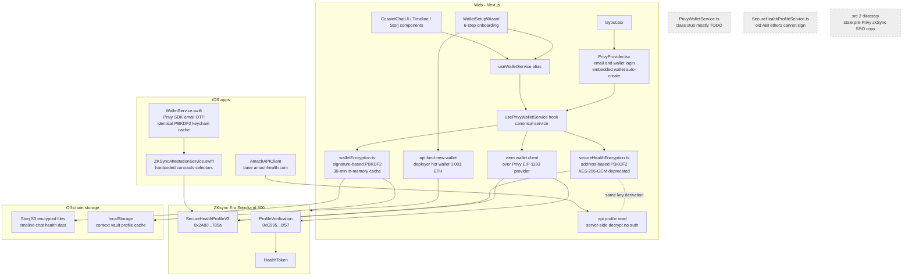
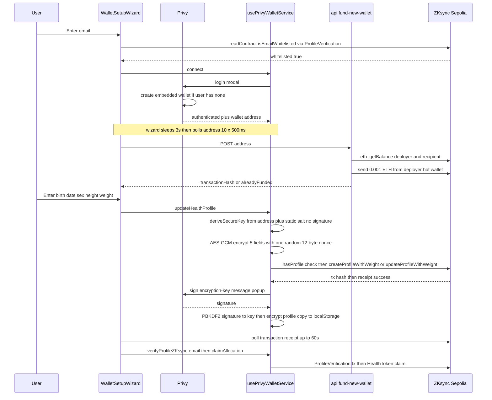
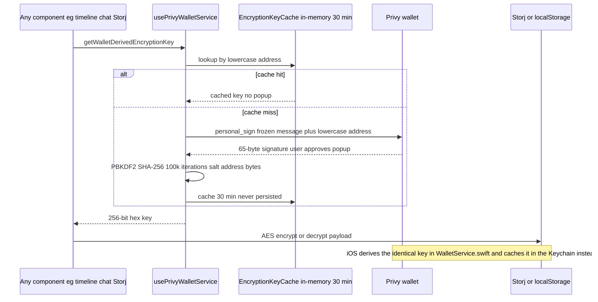

# 06 — Privy Wallet Auth + the Dual Encryption System

## Executive Summary

Privy is the single authentication layer across all Amach clients: the web app wraps the entire Next.js tree in a `PrivyProvider` configured for email + wallet login with auto-created embedded wallets ("users-without-wallets"), and the iOS apps (AmachHealth-iOS and Breathe) use the Privy iOS SDK with email-OTP login against the same Privy app ID. Once a wallet address exists, two deliberately different encryption schemes come into play. **Signature-based derivation** (`walletEncryption.ts`) signs a frozen constant message with the wallet, runs the signature through PBKDF2 (SHA-256, 100k iterations, salt = the 20 address bytes) and uses the result as an AES key for everything stored off-chain — Storj timeline/chat/health files and localStorage vaults; iOS re-implements the identical algorithm in `WalletService.swift` so keys match bit-for-bit across platforms. **Address-based derivation** (`secureHealthEncryption.ts`, self-marked deprecated) derives an AES-256-GCM key purely from the wallet address plus the hardcoded salt `"amach-health-salt"` — no signature popup — and encrypts the on-chain profile (birth date, sex, height, weight, email) that is written to the `SecureHealthProfileV3` contract on ZKsync Era Sepolia via `createProfileWithWeight`/`updateProfileWithWeight`. Onboarding is orchestrated by the 6-step `WalletSetupWizard`: email whitelist check → Privy login/embedded-wallet creation → server-side deployer funding of 0.001 ETH (`/api/fund-new-wallet`) → encrypted profile creation on-chain → on-chain verification → token claim. Because both key types are derived from the wallet (signature or address), a changed wallet means a changed key: old Storj data and old on-chain profiles become undecryptable, and there is no key-rotation or re-encryption path.

---

## Participating Files

| File                                                                     | Role                                                             | Notes                                                                                                                                                                                                                                                                                                                                                                                                                                                                                                                                                                                                                                                                                                      |
| ------------------------------------------------------------------------ | ---------------------------------------------------------------- | ---------------------------------------------------------------------------------------------------------------------------------------------------------------------------------------------------------------------------------------------------------------------------------------------------------------------------------------------------------------------------------------------------------------------------------------------------------------------------------------------------------------------------------------------------------------------------------------------------------------------------------------------------------------------------------------------------------- |
| `src/app/layout.tsx`                                                     | Root wiring                                                      | Wraps app in `<PrivyProvider>` (line 86).                                                                                                                                                                                                                                                                                                                                                                                                                                                                                                                                                                                                                                                                  |
| `src/components/PrivyProvider.tsx`                                       | Privy configuration                                              | Config memo lines 24–54: `loginMethods: ["email","wallet"]`, `embeddedWallets.ethereum.createOnLogin: "users-without-wallets"`, `defaultChain` from `getActiveChain()`, supported chains ZKsync Sepolia + Mainnet, wallet list metamask/coinbase/walletconnect. Build-time fallback + missing-appId error UI lines 97–142.                                                                                                                                                                                                                                                                                                                                                                                 |
| `src/hooks/usePrivyWalletService.ts`                                     | **Canonical wallet service** (1,673 lines, React hook)           | `signMessage` 182–261 (Privy modal, deferred via `setTimeout(0)`); `getWalletDerivedEncryptionKey` 273–329 (concurrency guard via ref); `connect` 332–376; `ensureCorrectChain` 399–493 (`wallet_switchEthereumChain` / `wallet_addEthereumChain`); `getWalletClient` 496–541 (viem client over Privy EIP-1193 provider); `getPublicClient` 544–567; `updateHealthProfile` 570–791 (on-chain profile create/update); `loadHealthProfileFromBlockchain` 794–941 (`getProfileWithWeight`); `getDecryptedProfile` 948–1184 (dual-path decryption); `verifyProfileZKsync` 1187–1255; `claimAllocation` 1258–1329; context vault save/load 1332–1408; `isEmailWhitelisted` 1517–1594 (3 retries, 30 s timeout). |
| `src/hooks/useWalletService.ts`                                          | Unified alias                                                    | One-liner: `useWalletService()` returns `usePrivyWalletService()`. All components consume this.                                                                                                                                                                                                                                                                                                                                                                                                                                                                                                                                                                                                            |
| `src/services/PrivyWalletService.ts`                                     | Legacy class stub                                                | Class-based mirror of the hook; nearly all methods are `TODO` placeholders (lines 311–378). Calls React hooks from class methods (e.g. `this.privyHooks.useWallets()` line 125) — invalid React. `getPublicClient`/`getWalletClient` exports throw (386–392). Not canonical.                                                                                                                                                                                                                                                                                                                                                                                                                               |
| `src/services/SecureHealthProfileService.ts`                             | Legacy profile service                                           | ethers-v5 based; targets an **older contract ABI** (`createSecureProfile`, line 268) not the live V3 (`createProfileWithWeight`); `getContract` (325–350) calls `provider.getSigner()` on a plain `JsonRpcProvider`, which cannot sign. Effectively dead code.                                                                                                                                                                                                                                                                                                                                                                                                                                             |
| `src/utils/walletEncryption.ts`                                          | **Signature-based encryption** (canonical off-chain crypto)      | Frozen signing message constant line 29–30; `getKeyDerivationMessage` 36; `requestEncryptionKeySignature` 47 (5-min timeout, ≥132-char check); `deriveEncryptionKeyFromSignature` 110 (WebCrypto path 170–226, CryptoJS fallback 131–164; PBKDF2 SHA-256 × 100,000, salt = address bytes); `encryptWithWalletKey`/`decryptWithWalletKey` 289/304 (CryptoJS AES, `0x`-prefixed); in-memory `EncryptionKeyCache` 325–367 (30-min TTL, never persisted); `getCachedWalletEncryptionKey` 378.                                                                                                                                                                                                                  |
| `src/utils/secureHealthEncryption.ts`                                    | **Address-based encryption** (deprecated, on-chain profile only) | Header comment lines 1–20 explains why two systems exist. `deriveSecureKey` 60–88 (PBKDF2 from wallet address, static salt `"amach-health-salt"`, 100k iters, AES-256-GCM key); `encryptHealthData` 94–139 (one random 12-byte nonce shared by all five fields); `decryptHealthData` 144–308 (nonce-format forensics + legacy buggy-nonce handling 199–245, weight decrypted best-effort 271–293); `decryptField` 412; `generateZKProofInputs` 314 (range-bucketing, _not_ a real ZK proof).                                                                                                                                                                                                               |
| `src/components/WalletSetupWizard.tsx`                                   | Onboarding flow (2,007 lines)                                    | Step definitions 185–237 (email-verification, create-wallet, deployer-funding, create-profile, verify-profile, claim-tokens); resume logic 267–415 (skips completed steps by reading chain state); `handleEmailVerification` 655; `handleCreateWallet` 690 (login + 3 s wait + 10×500 ms address polling); `handleDeployerFunding` 770 (POST `/api/fund-new-wallet`); `waitForTransactionConfirmation` 888 (30 × 2 s poll); `handleCreateProfile` 928.                                                                                                                                                                                                                                                     |
| `src/app/api/fund-new-wallet/route.ts`                                   | Server faucet                                                    | Loads `PRIVATE_KEY` or `DEPLOYER_PRIVATE_KEY` (lines 57–58), raw JSON-RPC via fetch, checks deployer + recipient balances with retries, sends 0.001 ETH (line 209) to the new embedded wallet. Returns `alreadyFunded` if recipient has balance.                                                                                                                                                                                                                                                                                                                                                                                                                                                           |
| `src/app/api/wallet/check-balance/route.ts`                              | Balance check                                                    | GET with `address` param; ethers `JsonRpcProvider`; flags `hasSufficientBalance` vs 0.001 ETH minimum.                                                                                                                                                                                                                                                                                                                                                                                                                                                                                                                                                                                                     |
| `src/app/api/profile/read/route.ts`                                      | Server-side profile decryption                                   | POST `{ userAddress }` → reads `getProfileWithWeight` from chain, decrypts with the **address-derived** key (tries EIP-55 and lowercase variants, lines 51–70), returns plaintext profile. `Access-Control-Allow-Origin: *`, **no authentication**. Used by iOS.                                                                                                                                                                                                                                                                                                                                                                                                                                           |
| `src/lib/networkConfig.ts`                                               | Network + contract config                                        | Chain defs (Sepolia id 300, Mainnet id 324) lines 11–62; `NEXT_PUBLIC_NETWORK` switch 68–88; `CONTRACT_ADDRESSES` 91–111 (mainnet all zero placeholders).                                                                                                                                                                                                                                                                                                                                                                                                                                                                                                                                                  |
| `src/lib/contractConfig.ts`                                              | ABIs                                                             | `secureHealthProfileAbi` (V3: `createProfileWithWeight`, `updateProfileWithWeight`, `getProfileWithWeight`, `hasProfile`), `profileVerificationAbi`.                                                                                                                                                                                                                                                                                                                                                                                                                                                                                                                                                       |
| iOS `AmachHealth/Sources/Services/WalletService.swift`                   | **Canonical iOS wallet + crypto**                                | Hardcoded `privyAppId`/`privyClientId` lines 39–40; frozen message prefix 56–57; email OTP login `sendEmailCode` 100 / `loginWithEmailCode` 121; `finishConnecting` 143–165 (reuse or `createEthereumWallet`, Keychain-cached key); `restoreSessionIfAvailable` 168–181 (silent session restore); `signMessage` 233 (`personal_sign`); `sendTransaction` 260 (`eth_sendTransaction`); `deriveEncryptionKeyPBKDF2` 401–430 (CommonCrypto, parameters locked to web); Keychain storage 496–551 (`kSecAttrAccessibleWhenUnlockedThisDeviceOnly`; stores derived key **and raw signature**).                                                                                                                   |
| iOS `AmachHealth/Sources/Services/ZKSyncAttestationService.swift`        | iOS on-chain writes                                              | Hardcoded chainId 300, RPC URL, `SecureHealthProfile` contract `0x2A80…785a` and MerkleCommitment `0x2385…7FbA`; pre-computed 4-byte selectors; sends calldata via Privy wallet provider.                                                                                                                                                                                                                                                                                                                                                                                                                                                                                                                  |
| iOS `AmachHealth/Sources/API/AmachAPIClient.swift`                       | iOS → web API bridge                                             | Base URL `AMACH_API_URL` env or `https://www.amachhealth.com` (lines 19–21); calls `/api/profile/read`, Storj endpoints, etc.                                                                                                                                                                                                                                                                                                                                                                                                                                                                                                                                                                              |
| Breathe `Shared/Sources/AmachBreatheShared/Services/WalletService.swift` | Third Privy/PBKDF2 copy                                          | Same `privyAppId` (line 52) and the same frozen message prefix (line 61); independent re-implementation of the key derivation.                                                                                                                                                                                                                                                                                                                                                                                                                                                                                                                                                                             |

---

## Configuration

### Environment variables (web)

| Variable                               | Purpose                                    | Fallback                                                                                                                                       |
| -------------------------------------- | ------------------------------------------ | ---------------------------------------------------------------------------------------------------------------------------------------------- |
| `NEXT_PUBLIC_PRIVY_APP_ID`             | Privy app                                  | Renders a full-page "Configuration Error" if missing; placeholder id used to keep hook order stable                                            |
| `NEXT_PUBLIC_NETWORK`                  | `testnet` (default) or `mainnet`           | testnet                                                                                                                                        |
| `NEXT_PUBLIC_ZKSYNC_RPC_URL`           | RPC endpoint                               | `https://sepolia.era.zksync.dev` hardcoded in ≥3 places (`usePrivyWalletService.ts:553`, `api/wallet/check-balance:21`, `api/profile/read:26`) |
| `PRIVATE_KEY` / `DEPLOYER_PRIVATE_KEY` | Hot wallet that funds new embedded wallets | Endpoint returns 500 with setup instructions if unset                                                                                          |

### Hardcoded values

- **Contracts (testnet, `networkConfig.ts:92–100`)**: PROFILE_VERIFICATION `0xC9950703cE4eD704d2a0B075F7FAC3d968940f57`, SECURE_HEALTH_PROFILE `0x2A8015613623A6A8D369BcDC2bd6DD202230785a`, HEALTH_TOKEN `0x057df807987f284b55ba6A9ab89d089fd8398B99`, legacy HEALTH_PROFILE, COVERAGE_VERIFIER/REGISTRY. Mainnet slots are `0x000…000` placeholders.
- **iOS**: Privy `appId cmiev4g03026zl80cpoyjccwu` + client ID compiled into both iOS apps; contract addresses and chain id 300 duplicated in `ZKSyncAttestationService.swift` rather than shared with `networkConfig.ts`.
- **Crypto constants (frozen — changing any of these bricks existing data)**:
  - Signing message: `"Amach Health - Derive Encryption Key\n\nThis signature is used to encrypt your health data.\n\nNonce: " + address.toLowerCase()`
  - PBKDF2: SHA-256, **100,000 iterations**, 256-bit output; salt = 20 address bytes (signature scheme) or literal `"amach-health-salt"` (address scheme)
  - Funding amount: 0.001 ETH; profile tx gas hardcoded `2000000n`, verification/claim `5000000n`; fee = gasPrice ×1.5, tip ×0.1
- **Chain**: ZKsync Era Sepolia, id 300, explorer `https://sepolia.explorer.zksync.io`

---

## Component Architecture

## Primary Runtime Flow — Onboarding + On-Chain Profile Creation

## Secondary Flow — Signature-Based Key for Off-Chain Data

---

## Login / Session Flow Details

- **Web**: `PrivyProvider` restores sessions automatically (Privy SDK manages tokens). `usePrivyWalletService` computes `isConnected = ready && authenticated && !!address`, preferring the **embedded** wallet (`walletClientType === "privy" | "privy-v2"`, lines 156–160) over external wallets so signing uses Privy's modal instead of MetaMask.
- **iOS**: `initializePrivy()` at app launch → `restoreSessionIfAvailable()` silently reconnects returning users and loads the encryption key from the Keychain (no signature popup on relaunch). Fresh logins are email-OTP only (`sendEmailCode` → `loginWithEmailCode`), then `finishConnecting` reuses or creates the embedded Ethereum wallet.
- **Embedded wallet creation**: web — Privy config `createOnLogin: "users-without-wallets"`; iOS — explicit `user.createEthereumWallet()` when `embeddedEthereumWallets` is empty. Privy embedded wallets are smart-contract wallets whose address exists deterministically before first deployment; the funding API relies on this (comments at `fund-new-wallet/route.ts:226–228`).

## When Each Key Type Is Used and Why

|           | Signature-based (`walletEncryption.ts`)                                                | Address-based (`secureHealthEncryption.ts`)                                   |
| --------- | -------------------------------------------------------------------------------------- | ----------------------------------------------------------------------------- |
| Data      | Storj timeline, chat history, health files, localStorage context vault + profile cache | On-chain profile fields only                                                  |
| Key input | `personal_sign` of frozen message (secret — requires wallet control)                   | Wallet address + static salt (**public inputs**)                              |
| UX        | Signature popup (mitigated by 30-min memory cache on web, Keychain on iOS)             | Zero popups — chosen so onboarding/profile reads don't spam signature prompts |
| Cipher    | CryptoJS AES (CBC, passphrase-KDF form)                                                | WebCrypto AES-256-GCM                                                         |
| Security  | Real: attacker needs the wallet                                                        | Obfuscation: anyone who knows the address can derive the key                  |

## What Breaks If a Wallet Changes

1. **Off-chain data is lost.** The signing message embeds the lowercase address and PBKDF2 salts with the address bytes, so a new wallet yields a different key. All Storj objects and localStorage vaults encrypted under the old key become unreadable. There is no re-encryption/migration path and no multi-key envelope.
2. **On-chain profile is orphaned.** The profile lives in a mapping keyed by the old address, and its AES key derives from the old address. A new wallet sees "Profile does not exist" and must re-onboard from scratch (re-fund, re-create, re-verify, re-claim).
3. **Signature determinism assumption.** The whole signature scheme assumes the wallet re-produces the identical signature for the frozen message. Privy embedded wallets do (deterministic ECDSA); the Privy config also permits external wallets (MetaMask/Coinbase/WalletConnect), where non-deterministic signers would derive a _different key each session_, silently corrupting the read path.
4. **Case-sensitivity hazard.** The address-based PBKDF2 uses the raw address string as password without normalization (`deriveSecureKey` line 64). Web (EIP-55 checksum) and iOS (lowercase) can disagree; `/api/profile/read` works around it by trying both variants (`decryptProfileFlexible`).

---

## Failure Modes and Weaknesses

1. **Address-derived on-chain encryption is decryptable by anyone (HIGH).** The key = PBKDF2(walletAddress, `"amach-health-salt"`) — both inputs are public. Any observer of the public chain can decrypt every user's birth date, sex, height, weight, and email. `/api/profile/read` industrializes this: an unauthenticated POST with any wallet address returns the plaintext profile, with `Access-Control-Allow-Origin: *`.
2. **AES-GCM nonce reuse across fields (MEDIUM).** `encryptHealthData` generates one 12-byte nonce and reuses it for all five fields under the same key. GCM nonce reuse with known plaintext structure leaks keystream/auth-key material. Version bump also re-randomizes, so cross-version reuse doesn't occur, but the within-profile reuse is against GCM's contract. Legacy "buggy nonce" recovery code (`decryptHealthData` 199–245) shows this already caused data-loss incidents.
3. **Unauthenticated faucet with a server hot wallet (MEDIUM).** `/api/fund-new-wallet` holds `PRIVATE_KEY` in the Next.js runtime and sends 0.001 ETH to any address POSTed; the only guard is "recipient already has balance". No rate limiting, no session check — drainable, and the deployer key doubles as the contract-deployment key.
4. **Timing-based state machine (MEDIUM).** `connect()` fires `login()` then sleeps 2 s and reads stale closure values of `ready/authenticated/address` (hook deps captured pre-login), so a successful login can be reported as `"Failed to connect to wallet"`; the wizard compensates with its own 3 s sleep + 10×500 ms polling, plus `setTimeout(0)` deferrals to dodge React error #300 around Privy's modal, and manual in-progress ref locks (`signatureRequestInProgressRef`, `decryptionInProgressRef`) with a busy-wait recursion (`getWalletDerivedEncryptionKey` 282–298). Fragile under slow networks and double-clicks.
5. **iOS persists the raw signature in the Keychain.** `WalletEncryptionKey` stores both derived key _and_ the signature (`deriveAndStoreEncryptionKey` line 325–330). The web deliberately keeps keys memory-only with 30-min TTL; iOS keeps them (and the recoverable input) indefinitely. `kSecAttrAccessibleWhenUnlockedThisDeviceOnly` mitigates but the posture is divergent.
6. Minor: comment drift claims "50k iterations" while using 100k (`walletEncryption.ts:140–144`); `updateHealthProfile` triggers a _signature popup immediately after_ the profile transaction just to write a redundant localStorage copy (line 719); gas hardcoded at 2M/5M wastes allowance and breaks if limits shrink; `zkProofHash` is always the zero hash — the "ZK proof" in this layer is range-bucketing, not a proof.

---

## Fragmentation Notes

| Implementation                       | Location                                     | Status                                                                                                                                                                                                                         |
| ------------------------------------ | -------------------------------------------- | ------------------------------------------------------------------------------------------------------------------------------------------------------------------------------------------------------------------------------ |
| `usePrivyWalletService` hook         | `src/hooks/usePrivyWalletService.ts`         | **Canonical (web).** Everything routes here via the `useWalletService` alias.                                                                                                                                                  |
| `PrivyWalletService` class           | `src/services/PrivyWalletService.ts`         | Competing class-based design from the SSO→Privy migration ("Phase 1"). Methods are TODO stubs; calls React hooks outside components. Dead — candidate for deletion.                                                            |
| `SecureHealthProfileService`         | `src/services/SecureHealthProfileService.ts` | Legacy ethers service targeting the pre-V3 contract ABI (`createSecureProfile`); its signer wiring cannot work. Superseded by `updateHealthProfile` in the hook. Dead.                                                         |
| `"src 2/"` directory                 | repo root (untracked)                        | Full stale copy of an older tree containing pre-Privy code: `hooks/useZkSyncSsoWallet.ts`, `utils/encryption.ts`, its own `secureHealthEncryption.ts`. Pure noise; risks being edited by mistake.                              |
| iOS `WalletService.swift`            | AmachHealth-iOS                              | **Canonical (iOS).** Faithful port of `walletEncryption.ts` derivation; parameters comment-locked to the web file.                                                                                                             |
| Breathe `WalletService.swift`        | AmachHealthBreathe `Shared/.../Services/`    | **Third independent copy** of the same Privy app ID, frozen message, and PBKDF2 derivation. Three implementations must now stay bit-identical forever; no shared test vectors are enforced across repos (iOS has local tests). |
| iOS `ZKSyncAttestationService.swift` | AmachHealth-iOS                              | Duplicates chain id, RPC URL, and contract addresses that the web keeps in `networkConfig.ts`; calls the same `0x2A80…785a` contract but labels it "V4" while web docs say V3 — version naming drift.                          |
| Server profile decryption            | `src/app/api/profile/read/route.ts`          | Second consumer of `secureHealthEncryption.deriveSecureKey`, added for iOS. Keeps the deprecated scheme load-bearing: it cannot be removed without breaking the iOS profile screen.                                            |

**Canonical picture:** web = `useWalletService` → `usePrivyWalletService` + `walletEncryption.ts` (off-chain) + `secureHealthEncryption.ts` (on-chain profile, deprecated-but-load-bearing); iOS = `WalletService.swift` + `ZKSyncAttestationService.swift` + web APIs. Everything else listed above is migration residue.
