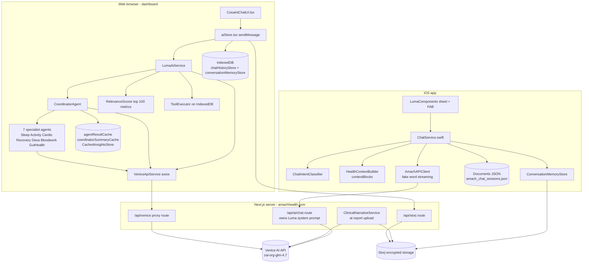
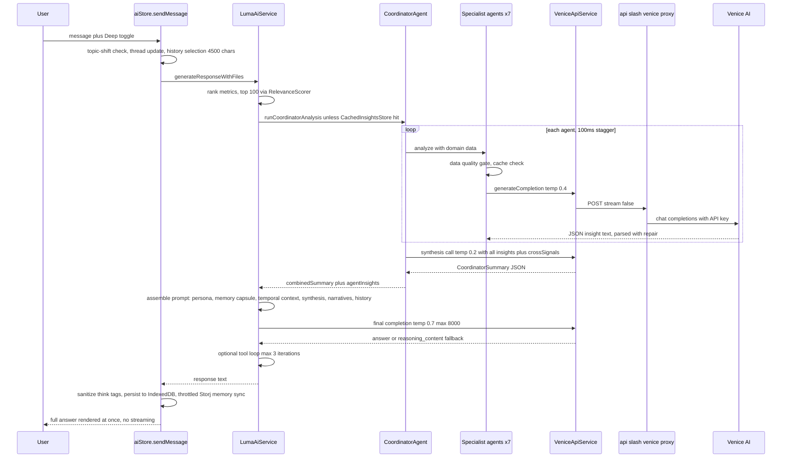
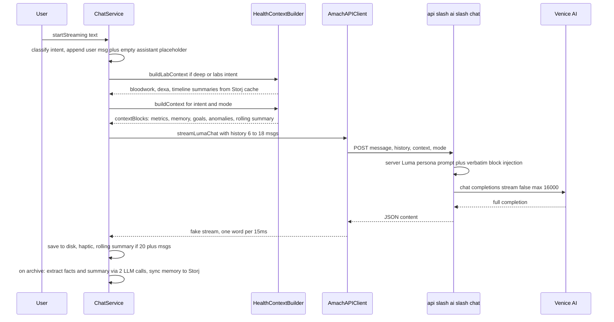

# Chapter 07 — Venice AI Integration and the Multi-Agent System

> Master architecture map, Amach Health. Repos referenced: `Amach-Website` (web, Next.js 16),
> `amach-workspace/AmachHealth-iOS` (SwiftUI iOS app). The Breathe app has no Venice/AI integration.
> All line references are as of 2026-07-02 (branch `fix/stat-card-full-dataset-average`).

## 1. Executive Summary

All AI in Amach Health ("Luma", formerly "Cosaint") is powered by the **Venice AI API** (`https://api.venice.ai/api/v1/chat/completions`, OpenAI-compatible), default model **`zai-org-glm-4.7`**, with the server-side `VENICE_API_KEY` never exposed to clients. There are **two independent chat pipelines** that share nothing but the Venice key and the model name: (a) the **web dashboard pipeline** — `aiStore.tsx` → `LumaAiService` → `VeniceApiService` (axios) → the thin `/api/venice` proxy route → Venice — which in "Deep" mode fans out to a **7-specialist multi-agent system** (`CoordinatorAgent` + `BaseHealthAgent` subclasses) that runs each specialist as its own Venice completion, synthesizes a JSON summary in an 8th call, and injects that synthesis into the final Luma prompt; and (b) the **iOS pipeline** — `ChatService.swift` → `AmachAPIClient.streamLumaChat` → `/api/ai/chat` — where the iOS app assembles all context locally as verbatim `contextBlocks`, the route builds a server-owned Luma persona system prompt and calls Venice directly, and iOS **simulates streaming** word-by-word (nothing in the entire stack does true SSE streaming; every request sets `stream: false`). Conversation persistence is layered on both platforms: in-memory thread → local store (IndexedDB on web, documents-directory JSON on iOS) → LLM-extracted "conversation memory" facts/summaries → wallet-encrypted Storj sync. `CosaintAiService.ts` **no longer exists** (renamed to `LumaAiService.ts`; CLAUDE.md is stale on this point, on the agent count — it is 7, not 6 — and on a nonexistent `assessRelevance()` method), and `ContextPreprocessor.ts` is dead code.

## 2. Participating Files

| File                                                                                                           | Role                                                                   | Notes                                                                                                                                                                                                                                                                                                                                                                                                                                                                                                                                                           |
| -------------------------------------------------------------------------------------------------------------- | ---------------------------------------------------------------------- | --------------------------------------------------------------------------------------------------------------------------------------------------------------------------------------------------------------------------------------------------------------------------------------------------------------------------------------------------------------------------------------------------------------------------------------------------------------------------------------------------------------------------------------------------------------- |
| `src/app/api/venice/route.ts` (web)                                                                            | Server proxy `/api/venice` → Venice `chat/completions`                 | `POST` handler L28–313. Injects `VENICE_API_KEY`, forces `stream: false` (L89), defaults `max_tokens` 16000 / `temperature` 0.7, default `venice_parameters` `{strip_thinking_response, include_venice_system_prompt: false}` (L97–104). `maxDuration = 300`, no timeout unless `VENICE_REQUEST_TIMEOUT_MS` set.                                                                                                                                                                                                                                                |
| `src/app/api/ai/chat/route.ts` (web)                                                                           | Server route `/api/ai/chat` used by **iOS** (and any simple client)    | Luma persona `SYSTEM_PROMPT` L114–152; verbatim `contextBlocks` injection L317–326; legacy typed-field formatter `buildContextMessage` L154–272; labData injection with field-sniffing L343–427; history capped at last 20 messages L432; recency summary system message L439–460; direct `fetch` to Venice L486–506; empty-content fallback string L523–531.                                                                                                                                                                                                   |
| `src/api/venice/VeniceApiService.ts`                                                                           | Client-side Venice wrapper (axios) used by ALL web AI code             | `generateCompletion` L178–354 (system+user messages, `stream: false`); mobile-Safari native-fetch path L360–461; `reasoning_content` fallback when `content` empty (GLM-4.7 thinking workaround) L279–301; retry with backoff, no retry on 4xx/504 L463–518. Base URL logic supports relative `/api/venice` proxy (default) or direct `api.venice.ai` via `VENICE_API_ENDPOINT`.                                                                                                                                                                                |
| `src/services/LumaAiService.ts`                                                                                | Web chat orchestrator (formerly `CosaintAiService`)                    | `generateResponseWithFiles` L321–780: relevance ranking (top 100 metrics) L354–375, coordinator run + insight caching L377–551, pre-computed metrics L553–575, prompt build `createPromptWithFiles` L811–1039, `buildSystemMessage` L1044–1249, quick-mode empty-response retry loop L656–684, prompt-based tool loop (max 3 iterations) L686–762, keyword fallback responses L1354–1449. Deep and Quick both use `maxTokens` 8000 (L609).                                                                                                                      |
| `src/services/CoordinatorService.ts`                                                                           | Bridge from raw `HealthDataByType` → agent execution context           | `runCoordinatorAnalysis` L123+: routes through `HealthDataProcessor` (tiered aggregation for `initial` mode) or legacy `transformMetricData`; supported HK metrics allowlist L111–121; builds `AgentProfile` then calls `CoordinatorAgent.analyze`.                                                                                                                                                                                                                                                                                                             |
| `src/agents/CoordinatorAgent.ts`                                                                               | Fan-out/fan-in over 7 specialists + synthesis call                     | Agent roster L85–93 (Sleep, ActivityEnergy, Cardiovascular, RecoveryStress, Dexa, Bloodwork, **GutHealth**); default per-agent queries L45–57; 100 ms staggered launch L116–120; per-agent result cache (24 h initial / 15 min ongoing) L108–145; `Promise.allSettled` + error-insight fallbacks L224–296; `buildSummary` L364–505 (temp 0.2, 8000 tokens, JSON contract `SUMMARY_SYSTEM_PROMPT` L59–79, code-fence stripping, "missing data" watch-item filtering L457–477); `buildCrossSignals` L507–595 computes cross-domain couplings from agent metadata. |
| `src/agents/BaseHealthAgent.ts`                                                                                | Abstract specialist: prompt → Venice → JSON parse                      | JSON response contract in `getEnhancedSystemPrompt` L21–37; `analyze` L39–190 (data-quality gate at score < 0.2, temp 0.4, `maxTokens` 8000, slow-response retry >60 s L91–141); `parseEnhancedResponse` L244–450 with `<think>`-strip and trailing-comma repair; subclasses implement `extractRelevantData` / `assessDataQuality` / `formatDataForAnalysis`. Note: **no `assessRelevance()` method exists** — relevance is the model-returned `relevanceToQuery` field.                                                                                        |
| `src/agents/{Sleep,ActivityEnergy,Cardiovascular,RecoveryStress,Dexa,Bloodwork,GutHealth}Agent.ts`             | The 7 domain specialists                                               | Each defines `id`, `name`, `expertise`, `systemPrompt` and the three data hooks. `src/agents/types.ts` defines `AgentInsight`, `AgentExecutionContext`, `AgentProfile`.                                                                                                                                                                                                                                                                                                                                                                                         |
| `src/ai/RelevanceScorer.ts`                                                                                    | Heuristic metric ranking (no LLM)                                      | Weighted score L102–125: goal correlation 35 %, statistical significance 30 %, clinical impact 25 % (weights table L54–85), recency 5 %, user interaction 5 %. Used by `LumaAiService` to pick top-100 metrics and by nothing else live.                                                                                                                                                                                                                                                                                                                        |
| `src/ai/ContextPreprocessor.ts`                                                                                | **Dead code**                                                          | Exported only through `src/ai/index.ts`; `preprocessHealthContext` has no callers anywhere in `src/`.                                                                                                                                                                                                                                                                                                                                                                                                                                                           |
| `src/ai/tools/ToolDefinitions.ts`                                                                              | Prompt-embedded tool schemas                                           | `query_timeseries_metrics`, `get_latest_report`, etc.; `formatToolsForPrompt(mode)` renders them into the system prompt (not native function-calling).                                                                                                                                                                                                                                                                                                                                                                                                          |
| `src/ai/tools/ToolExecutor.ts`, `ToolResponseParser.ts`                                                        | Client-side tool loop                                                  | Parser regex-extracts JSON tool calls from model text; executor runs them against `IndexedDBDataSource` in the browser. Gated by `NEXT_PUBLIC_ENABLE_TOOL_USE === "true"`.                                                                                                                                                                                                                                                                                                                                                                                      |
| `src/ai/optimization/` (`CachedInsightsStore`, `DataHasher`, `PreComputedMetrics`)                             | Deep-mode cost controls                                                | Coordinator result cached against a fingerprint hash of the metric data; pre-computed 7-day stats injected into the prompt to reduce tool calls. Feature-flagged via `src/config/featureFlags.ts`.                                                                                                                                                                                                                                                                                                                                                              |
| `src/store/aiStore.tsx`                                                                                        | React context: chat state machine for the web                          | `sendMessage` L204–627: in-memory thread with topic-shift/45-min-inactivity segmentation L233–242; regex fact extraction into `conversationMemoryStore` on thread close L250–368; `buildPromptMessages` char-budgeted history selection (4500 deep / 2200 quick) L409–416; write-behind IndexedDB persistence via `chatHistoryStore`; `<think>`/tool-JSON sanitization L73–122; throttled (5 min) wallet-encrypted Storj memory sync via `/api/storj` `conversation/sync` L563–601.                                                                             |
| `src/components/ai/CosaintChatUI.tsx`                                                                          | Web chat UI (~3 000 lines; still named "Cosaint", renders Luma)        | Consumes `useAi()` (L17, L58–64); Quick/Deep toggle L1924–1945 (Deep gated on wallet connection L630–633); dev-only quick-token controls; cache-clear button L2350.                                                                                                                                                                                                                                                                                                                                                                                             |
| `src/services/ClinicalNarrativeService.ts`                                                                     | Server-side one-shot narrative generation at report upload             | Calls Venice **directly** (bypasses `/api/venice`), `disable_thinking`, 2 200 tokens; narrative cached on Storj and later inlined into Luma's prompt by `LumaAiService` L983–991.                                                                                                                                                                                                                                                                                                                                                                               |
| `src/services/MemoryExtractionService.ts`, `src/data/hooks/useVeniceAI.ts`, `GoalsTab.tsx`, `HealthReport.tsx` | Secondary Venice consumers                                             | `useVeniceAI` posts raw prompts to `/api/venice` (used by `HealthReport.tsx`); `GoalsTab` uses `LumaAiService.generateGoalsFromHealthData` (L1501–1536).                                                                                                                                                                                                                                                                                                                                                                                                        |
| iOS `Sources/Services/ChatService.swift`                                                                       | iOS chat state machine (singleton, `@MainActor`)                       | `sendStreaming` L156–320 (placeholder message + token append, cancel/retry/fallback handling); proactive Luma-initiated insights L363–415; rolling summary after 20 msgs L678–714; LLM memory extraction (2 parallel calls: facts JSON + session summary JSON) L505–593; dynamic history window 6–18 msgs by token budget L719–748; local JSON persistence L789–809; archive-only wallet-encrypted Storj session sync L824–843.                                                                                                                                 |
| iOS `Sources/Services/HealthContextBuilder.swift`                                                              | Builds `contextBlocks` from cached dashboard data                      | Block types: `data_note`, `metrics`, `today_partial`, `labs_bloodwork`, `labs_dexa`, `goals`, `memory`, `timeline`, `hr_zones`, `workouts`, `anomalies` (L457–633). Data contract: `latest` = previous complete day, never today's partial. `buildLabContext` L29–60 pulls bloodwork/DEXA from Storj via `LabContextService` cache.                                                                                                                                                                                                                             |
| iOS `Sources/Services/ChatIntentClassifier.swift`                                                              | Keyword intent routing                                                 | `ChatMode` quick/deep; `ChatIntent` sleep/activity/recovery/vitals/labs/medications/bodyComp/general; intent decides which blocks and whether labs are fetched.                                                                                                                                                                                                                                                                                                                                                                                                 |
| iOS `Sources/API/AmachAPIClient.swift`                                                                         | HTTP client to `AMACH_API_URL` (default `https://www.amachhealth.com`) | `sendChatMessage` L571–596 → `POST /api/ai/chat`; `streamLumaChat` L606–656 wraps the non-streaming response and **fake-streams it word-by-word at 15 ms/word**; vestigial `VeniceChatRequest`/`SSEChunk` structs for a never-shipped SSE endpoint L1122–1136.                                                                                                                                                                                                                                                                                                  |
| iOS `Sources/Components/LumaComponents.swift`                                                                  | Luma UI                                                                | `LumaContextService` (current screen/metric for context), FAB button, half-sheet chat view, message bubbles with feedback buttons, medical disclaimer.                                                                                                                                                                                                                                                                                                                                                                                                          |

## 3. Configuration

**Endpoints / hardcoded values**

- Venice API base: `https://api.venice.ai/api/v1` — hardcoded in `src/app/api/venice/route.ts:39`, `src/app/api/ai/chat/route.ts:487`, `src/services/ClinicalNarrativeService.ts:19`.
- Default model: `zai-org-glm-4.7` — hardcoded fallback in both routes, `VeniceApiService.fromEnv`, and `LumaAiService.createFromEnv`.
- iOS backend: `AMACH_API_URL` env (Xcode scheme) → default `https://www.amachhealth.com` (`AmachAPIClient.swift:19–20`).
- `stream: false` everywhere; `maxDuration = 300` (Vercel Pro) on both web AI routes; CORS `Access-Control-Allow-Origin: *` on both.

**Environment variables (web)**

| Var                                                                             | Side             | Purpose                                                                                                                                                                   |
| ------------------------------------------------------------------------------- | ---------------- | ------------------------------------------------------------------------------------------------------------------------------------------------------------------------- |
| `VENICE_API_KEY`                                                                | server           | Auth to Venice (both routes + ClinicalNarrativeService). CLAUDE.md lists `NEXT_PUBLIC_VENICE_API_KEY`, which the chat stack does **not** use — the key stays server-side. |
| `NEXT_PUBLIC_VENICE_MODEL_NAME` / `VENICE_MODEL_NAME`                           | both             | Model override; NEXT_PUBLIC read first even on the server (route.ts L41–44).                                                                                              |
| `VENICE_REQUEST_TIMEOUT_MS`                                                     | server           | Optional proxy-side abort; unset = no timeout.                                                                                                                            |
| `NEXT_PUBLIC_VENICE_CLIENT_TIMEOUT_MS`                                          | client           | Optional axios/fetch timeout; unset = none.                                                                                                                               |
| `VENICE_API_BASE_URL`, `VENICE_API_ENDPOINT`                                    | client           | Redirect `VeniceApiService` away from the `/api/venice` proxy (e.g. direct Venice).                                                                                       |
| `NEXT_PUBLIC_ENABLE_TOOL_USE`                                                   | client           | Enables the prompt-embedded tool loop in `LumaAiService`.                                                                                                                 |
| `NEXT_PUBLIC_VENICE_QUICK_MAX_TOKENS` + localStorage `cosaint_quick_max_tokens` | client, dev-only | Quick-mode token override (clamped 1500–8000).                                                                                                                            |

**Sampling parameters in use**

| Call site                            | temp      | max_tokens | venice_parameters                                                                    |
| ------------------------------------ | --------- | ---------- | ------------------------------------------------------------------------------------ |
| Final Luma answer (web deep & quick) | 0.7       | 8000       | strip_thinking (+ `disable_thinking` in quick)                                       |
| Each specialist agent                | 0.4       | 8000       | strip_thinking (+ conditional disable via `shouldDisableVeniceThinking("analysis")`) |
| Coordinator synthesis                | 0.2       | 8000       | same as agents                                                                       |
| `/api/ai/chat` (iOS)                 | 0.7       | 16000      | strip_thinking, no venice system prompt                                              |
| Clinical narrative                   | (default) | 2200       | disable_thinking                                                                     |
| Goal generation                      | (default) | 500        | disable_thinking                                                                     |

## 4. Architecture Diagrams

### 4.1 Component flowchart

### 4.2 Primary runtime flow — web Deep-mode message

### 4.3 iOS message flow

## 5. Failure Modes and Weaknesses

1. **Unauthenticated open proxies to a paid API.** Both `/api/venice` and `/api/ai/chat` accept anonymous POSTs, set `Access-Control-Allow-Origin: *`, and forward to Venice with the server key. Anyone can burn Venice credits (up to 16 000 tokens/request, 300 s duration) from any origin. No rate limiting, auth, or origin check exists on either route.
2. **Deep mode is expensive and slow by construction.** One Deep message = up to 9 Venice calls (7 agents + synthesis + final answer), each up to 8 000 tokens, with retries on top. The 100 ms stagger and caches (24 h/15 min TTL) mitigate but a cache-miss cold run routinely takes minutes; there is deliberately **no timeout** anywhere in the chain (`REQUEST_TIMEOUT_MS` unset by default), so a hung Venice call hangs the UI until Vercel's 300 s kill.
3. **Wasteful slow-response retry.** `BaseHealthAgent.analyze` (L118–125) **discards a successful response** if it took >60 s and re-issues the identical request — doubling cost and latency exactly when Venice is already slow.
4. **Fragile JSON-by-prompt contract.** Agents, coordinator, and iOS memory extraction all depend on the model emitting parseable JSON in free text (no `response_format` is passed on these paths, though the proxy supports it). Failures degrade to error-insights or silently dropped memories; `parseEnhancedResponse` resorts to regex repair of trailing commas and `<think>` blocks.
5. **GLM-4.7 empty-content thinking failure is patched in five different places** (proxy `venice_parameters`, `reasoning_content` fallback in `VeniceApiService`, quick-mode retry loop in `LumaAiService`, `<think>`-extraction in `aiStore.sanitizeAssistantResponse`, fallback string in `/api/ai/chat`), each with slightly different behavior — a symptom of no single owner for the workaround.
6. **Duplicate tool-prompt injection bug.** `LumaAiService.buildSystemMessage` appends `formatToolsForPrompt` twice when tool use is enabled: once gated on deep mode (L1086–1088) and again unconditionally (L1090–1093) — deep prompts get the tool catalog twice, and quick prompts get tools they are told not to use.
7. **Health data leaves the encryption boundary.** Prompts containing metrics, bloodwork values, and clinical narratives flow in plaintext through the Next.js server to Venice (a third party). Additionally `BaseHealthAgent` logs **full system and user prompts** via `console.log` unconditionally (L79–80, not dev-gated), and `aiStore` sends the wallet-derived Storj encryption key in a POST body to `/api/storj` on every throttled memory sync.
8. **Concurrency/race gaps.** `aiStore.sendMessage` has no in-flight guard (a second send interleaves thread state); web has no cancel path at all (iOS does). iOS mutates the assistant placeholder by captured index (`assistantIdx`) — mostly guarded, but the retry path recomputes the index heuristically (`lastIndex(where:)`, L270).
9. **History-cap comment drift and lossy memory.** `/api/ai/chat` comment says "last 10 exchanges" but slices 20 messages; web fact extraction on thread close is regex keyword-matching (goals = "want to"/"goal"), far cruder than iOS's LLM extraction, so cross-platform memory quality diverges.

## 6. Fragmentation Notes

- **`CosaintAiService.ts` vs `LumaAiService.ts` — not competing; a rename.** `CosaintAiService.ts` no longer exists in the tree. `LumaAiService.ts` is the canonical successor (header comment `// src/services/LumaAiService.ts`). Cosaint survives as vestigial naming: `CosaintChatUI.tsx` (the live web chat component), the localStorage key `cosaint_quick_max_tokens`, and CLAUDE.md's stale references (including a stale `src/agents/` roster of 6 agents — `GutHealthAgent` makes 7 — and an `assessRelevance()` API that was never how relevance works in the current code).
- **Two parallel chat backends, both live and canonical for their platform.** `/api/venice` (dumb proxy; prompt assembled client-side, sent as a _single user message_ with no system role — see `generateVeniceResponse`) serves web chat; `/api/ai/chat` (server-owned persona system prompt, context injected as multiple system messages) serves iOS. The Luma persona is therefore **defined twice with different voices**: the empathetic/holistic persona in `LumaAiService.buildSystemMessage` + `src/components/ai/luma.ts` characteristics, and the "calm authority, quiet edge" persona in `/api/ai/chat` `SYSTEM_PROMPT`. Same product identity, two divergent prompt implementations.
- **Two conversation-memory systems** with the same concepts (critical facts, session summaries, Storj sync under the wallet key) but different extraction: web `conversationMemoryStore` fed by regex heuristics in `aiStore` + `MemoryExtractionService`; iOS `ConversationMemoryStore` fed by two dedicated Venice calls in `ChatService.extractAndStoreConversationMemory`. They sync to the same Storj `conversation-memory` data type, which is the intended cross-platform bridge.
- **Streaming exists in name only.** iOS `streamLumaChat` fake-streams a completed response; the `VeniceChatRequest`/`SSEChunk` structs in `AmachAPIClient.swift` (L1122–1136) target a `/api/venice` SSE endpoint that was never built. `CoordinatorService.ts`'s `veniceService` param and `VeniceApiService` comments also reference streaming formats defensively while always sending `stream: false`.
- **Dead/orphaned AI code:** `src/ai/ContextPreprocessor.ts` (no callers), `LumaAiService.generateResponse` (superseded by `generateResponseWithFiles`; only the files variant is called from `aiStore`), and the hardcoded keto-specific fallback answers in `getFallbackResponse` (L1383–1436) that ship product copy for one user's diet scenario.
- **Direct-to-Venice callers besides the two routes:** `ClinicalNarrativeService` (server-side, at upload time — deliberate) and `useVeniceAI.ts` (client hook posting raw prompts to `/api/venice`, used by `HealthReport.tsx`) — a third, thinner client wrapper that duplicates `VeniceApiService`'s `<think>` sanitization logic.
- **Canonical picture:** for web chat, `aiStore → LumaAiService → CoordinatorService/CoordinatorAgent → VeniceApiService → /api/venice`; for iOS chat, `ChatService → AmachAPIClient → /api/ai/chat`. Anything else touching Venice is either a scoped utility (narratives, goals, memory extraction) or legacy residue.
