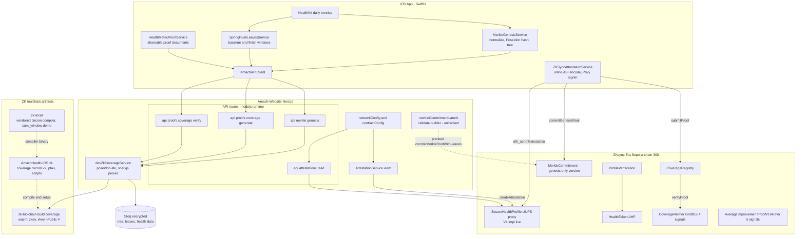
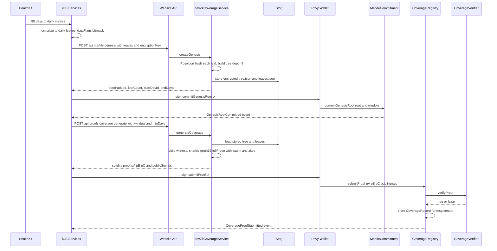
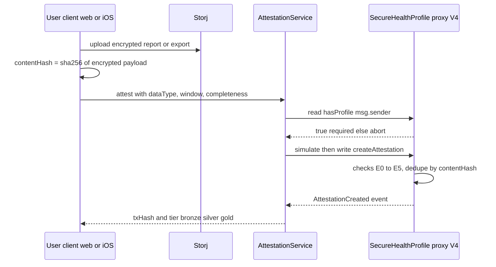

# 08 — Integration: Smart Contracts + ZK Proof Pipeline

> Chapter of the Amach Health master architecture map. Covers the Solidity contract stack on
> ZKsync Era Sepolia, the on-chain attestation model, the Merkle commitment lanes, and the
> Groth16 (circom/snarkjs) proving pipeline that spans the website repo and the iOS repo.
> On-chain facts below were verified against the live chain via RPC on 2026-07-03.

## 1. Executive Summary

Amach anchors health data integrity on ZKsync Era Sepolia (chain id 300) through two contract
families: (a) a single UUPS-upgradeable **SecureHealthProfile proxy** at
`0x2A8015613623A6A8D369BcDC2bd6DD202230785a`, currently running the **V4 implementation**
(`getContractVersion() == 4`, implementation `0x2CbC539dA2578eC00807601A36F0e66Ef867796A`,
38 attestations at time of writing), which stores encrypted profile fields, a searchable-encrypted
health timeline (with Storj URI pointers), and V4 "data attestations" (content hash + completeness
score + tier); and (b) a **ZK coverage stack** — an immutable snarkJS-generated `Groth16Verifier`
("CoverageVerifier"), a `CoverageRegistry` that verifies-and-records coverage proofs per wallet,
and a `MerkleCommitment` contract that stores each wallet's Poseidon Merkle root of daily health
leaves. Proving is **never done on the iPhone**: iOS normalizes daily HealthKit data into leaves,
uploads them via website API routes, the website's Node runtime (`devZkCoverageService.ts`,
poseidon-lite + snarkjs) builds trees and Groth16 proofs, and the user's Privy wallet signs the
resulting transactions (from iOS via hand-rolled ABI encoding, from web via viem). The pipeline is
mid-migration: a newer "Lane A" leaf-digest commitment scheme and an `AverageImprovementProofV1Verifier`
(Spring Push improvement proofs) are deployed or drafted, but their client/server code is spread
across untracked files and unmerged `claude/*` branches, and the checked-in coverage circuit (v2,
5 public signals) no longer matches the deployed verifier (v1, 4 public signals).

## 2. Participating Files

Paths are repo-relative to `Amach-Website` unless prefixed. `iOS-A` = `/Users/dave/AmachHealth-iOS`
(checkout that contains the untracked `zk/` toolchain), `iOS-W` = `/Users/dave/amach-workspace/AmachHealth-iOS`
(same git repo/head, no `zk/` dir).

| File                                                                     | Role                                    | Notes                                                                                                                                                                                          |
| ------------------------------------------------------------------------ | --------------------------------------- | ---------------------------------------------------------------------------------------------------------------------------------------------------------------------------------------------- |
| `contracts/SecureHealthProfileV1.sol`                                    | Base UUPS implementation                | Encrypted profile + event timeline + legacy `submitZKProof` (range-string "proofs", not Groth16)                                                                                               |
| `contracts/SecureHealthProfileV2.sol`                                    | V2 implementation                       | Adds Storj off-chain events: `addHealthEventV2 searchTag storjUri contentHash eventHash`                                                                                                       |
| `contracts/SecureHealthProfileV3.sol`                                    | V3 implementation                       | Adds weight via separate `encryptedWeights` mapping (storage-compat); `createProfileWithWeight` at L49                                                                                         |
| `contracts/SecureHealthProfileV4.sol`                                    | **Live implementation**                 | Attestations: `createAttestation` L117, `createAttestationBatch` L213, `verifyAttestation` L260, `getHighestTierAttestation` L419; custom errors `E0`–`E7` to fit 24KB                         |
| `contracts/SecureHealthProfileV3_FromV1.sol`                             | Alternate V3 lineage                    | `addHealthEventWithStorj` (different signature) — dead branch of upgrade history                                                                                                               |
| `contracts/ProfileVerification.sol` / `ProfileVerificationV2.sol`        | Email whitelist + AHP allocation        | Deployed instance at `0xC995…0f57`; 1000 AHP per user, max 5000 users                                                                                                                          |
| `contracts/HealthToken.sol`                                              | AHP ERC20                               | Pausable/burnable, 1B max / 500M initial supply, owner-granted allocations                                                                                                                     |
| `contracts/CoverageVerifier.sol`                                         | snarkJS Groth16 verifier (copy)         | `verifyProof … uint[4] _pubSignals` — **4 public signals = circuit v1**                                                                                                                        |
| `contracts/CoverageRegistry.sol`                                         | Coverage proof registry                 | `submitProof` L64 verifies then stores `CoverageRecord` per `msg.sender`; `hasCoverageProof` L96                                                                                               |
| `contracts/AverageImprovementProofV1Verifier.sol`                        | Groth16 verifier for improvement proofs | **Untracked file**; `verifyProof … uint[5] _pubSignals` (L71); deployed at `0x2248…615b` per iOS config                                                                                        |
| `contracts/ERC1967ProxyWrapper.sol`                                      | Proxy import shim                       | Makes OZ `ERC1967Proxy` compilable by Hardhat                                                                                                                                                  |
| `src/lib/networkConfig.ts`                                               | Chain + address book                    | Chain defs (300 / 324), `CONTRACT_ADDRESSES` per network (L91), mainnet = zero placeholders                                                                                                    |
| `src/lib/contractConfig.ts`                                              | ABIs + addresses                        | `secureHealthProfileAbi` (V1–V4 union), `computeStorjEventHash` L5, address constants L763–774                                                                                                 |
| `src/storage/AttestationService.ts`                                      | Web attestation client                  | `createAttestation` L436 (simulate→write→wait), `createAttestationBatch` L520, revert decoding `getAttestationErrorMessage` L191, tier mapping L790                                            |
| `src/zk/devZkCoverageService.ts`                                         | Server-side Merkle + Groth16 prover     | `createGenesis` L242, `generateCoverage` L319, `verifyCoverage` L399; poseidon-lite leaf hashing L106; artifact root resolution L16 (falls back to hardcoded `/Users/dave/AmachHealth-iOS/zk`) |
| `src/zk/merkleCommitmentLaneA.ts`                                        | Lane A calldata builder                 | **Untracked**; `foldLeavesDigest` L12 mirrors contract digest fold; `buildLaneAOnChainCommitPayload` L105 decides initial/append/skip/migrate. No caller on this branch                        |
| `src/app/api/merkle/genesis/route.ts`                                    | iOS→server genesis endpoint             | Gated in prod by `ALLOW_DEV_ZK_ENDPOINTS`                                                                                                                                                      |
| `src/app/api/proofs/coverage/generate/route.ts`                          | Proof generation endpoint               | Accepts `walletAddress + encryptionKey + window`; **no production gate**                                                                                                                       |
| `src/app/api/proofs/coverage/verify/route.ts`                            | Off-chain proof verify                  | snarkjs verify against local `verification_key.json`                                                                                                                                           |
| `src/app/api/attestations/route.ts`                                      | Attestation read API                    | viem `getUserAttestations` reads from proxy; writes stay client-side                                                                                                                           |
| `scripts/deploy-v4-attestation.js`                                       | V4 upgrade script                       | Manual UUPS `upgradeTo` (no OZ upgrades plugin), proxy hardcoded L19                                                                                                                           |
| `scripts/deploy-coverage-verifier.js` / `deploy-coverage-registry.js`    | ZK stack deploy                         | Registry wraps verifier address hardcoded at L22                                                                                                                                               |
| `scripts/test-attestation.ts`, `scripts/test-v4-deployment.ts`           | Diagnostics                             | Post-upgrade smoke tests                                                                                                                                                                       |
| `deployments/latest-upgradeable-deployment.json`                         | Deploy record                           | Proxy + V1 impl (2025-11-20), UUPS notes, old-contract migration note                                                                                                                          |
| `deployments/production-upgrade-v1-to-v3-1764786417816.json`             | Upgrade record                          | V1→V3 via `upgradeToAndCall` (2025-12-03); **no V4 record exists** — only `deployments/DEPLOY-V4.md` instructions                                                                              |
| `zk-toolchain/build/coverage/`                                           | Committed proving artifacts             | `coverage_final.zkey`, `verification_key.json` (`nPublic: 4`), `coverage_js/coverage.wasm` + witness JS (untracked) — **no circuit source in this repo**                                       |
| `zk-local/circom/`                                                       | Vendored circom compiler                | Full Rust source tree of the circom compiler (untracked)                                                                                                                                       |
| `zk-local/circuits/sum_window.circom` + `zk-local/scripts/full-prove.sh` | Teaching circuit                        | `SumWindow(8)` demo with its own ptau/zkey chain in `zk-local/build/` — not production                                                                                                         |
| `iOS-A zk/circuits/coverage/coverage.circom`                             | **Canonical circuit source**            | v2: `CoverageProof(60, 10)`, public `[root, start_day_id, end_day_id, min_days, required_flags]` = **5 signals**                                                                               |
| `iOS-A zk/circuits/coverage/merkle_verify.circom`                        | Merkle path verify template             | Poseidon-based, used by coverage circuit                                                                                                                                                       |
| `iOS-A zk/circuits/coverage/MerkleCommitment.sol`                        | Newest commitment contract              | `commitGenesisRoot` L111 + Lane A `commitMerkleRootWithLeaves` L243                                                                                                                            |
| `iOS-A zk/deploy/contracts/MerkleCommitment.sol`                         | Deployed (older) version                | `commitGenesisRoot` only — matches live `0x2385…7FbA` (Lane A getters revert on-chain)                                                                                                         |
| `iOS-A zk/scripts/`                                                      | Node toolchain                          | `build_tree.js`, `hash_leaf.js`, `generate_proof.js`, `rebuild_circuit.sh`, ptau files (`pot17_final.ptau`, hez_final_15/20)                                                                   |
| `iOS-W …/Services/ZKSyncAttestationService.swift`                        | iOS tx submitter                        | Hardcodes all ZK addresses + 4-byte selectors (L28–58); ABI-encodes inline, sends via Privy `eth_sendTransaction`                                                                              |
| `iOS-W …/Services/MerkleGenesisService.swift`                            | Genesis pipeline orchestrator           | HealthKit → normalize → Poseidon → tree → Storj → `commitGenesisRoot`; header: keep out of iOS app target, proving is Mac/CI-side                                                              |
| `iOS-W …/Services/HealthMetricProofService.swift`                        | Shareable proof documents               | Metric registry (L32) → `HealthMetricProofDocument`; anchoring delegated to backend V4 attestations (not Groth16)                                                                              |
| `iOS-W …/Services/SpringPushLeavesService.swift`                         | Improvement-proof data capture          | Captures baseline/finish windows, uploads to `/api/merkle/v2/upload` (route exists only on unmerged branches)                                                                                  |
| `iOS-W …/API/AmachAPIClient.swift`                                       | iOS→website API client                  | `/api/merkle/genesis` L840, `/api/proofs/coverage/generate` L893, Lane A server-built calldata note L1469                                                                                      |

## 3. Configuration

### Environment variables (website)

| Variable                                        | Purpose                                                         | Default                                                                |
| ----------------------------------------------- | --------------------------------------------------------------- | ---------------------------------------------------------------------- |
| `NEXT_PUBLIC_NETWORK`                           | `testnet` (default) or `mainnet` — selects chain + address book | `testnet`                                                              |
| `NEXT_PUBLIC_ZKSYNC_RPC_URL` / `ZKSYNC_RPC_URL` | RPC endpoint for reads/writes                                   | `https://sepolia.era.zksync.dev`                                       |
| `PROFILE_VERIFICATION_CONTRACT`                 | Optional override of the verification contract                  | from `networkConfig`                                                   |
| `ZK_TOOLCHAIN_DIR`                              | Root containing `build/coverage/` proving artifacts             | `<repo>/zk-toolchain`, then hardcoded `/Users/dave/AmachHealth-iOS/zk` |
| `ALLOW_DEV_ZK_ENDPOINTS`                        | Must be `"true"` to enable `/api/merkle/genesis` in production  | disabled                                                               |
| `PRIVATE_KEY`                                   | Deployer key for Hardhat scripts (proxy owner)                  | —                                                                      |

### Live addresses (ZKsync Era Sepolia, chain 300 — all confirmed to have code on-chain)

| Contract                                      | Address                                                                                     | Where configured                                                              |
| --------------------------------------------- | ------------------------------------------------------------------------------------------- | ----------------------------------------------------------------------------- |
| SecureHealthProfile **UUPS proxy** (V4 live)  | `0x2A8015613623A6A8D369BcDC2bd6DD202230785a`                                                | `contractConfig.ts`, `networkConfig.ts`, iOS `ZKSyncAttestationService.swift` |
| — current implementation (V4)                 | `0x2CbC539dA2578eC00807601A36F0e66Ef867796A`                                                | ERC1967 impl slot (read live); not recorded in `deployments/`                 |
| — V1 impl / V3 impl (history)                 | `0x9aD92C50548c7D0628f21836c48230041330D277` / `0x378e8ec2507c6987a3A2a075bB9c21817e4e8453` | `deployments/*.json`                                                          |
| ProfileVerification                           | `0xC9950703cE4eD704d2a0B075F7FAC3d968940f57`                                                | `networkConfig.ts`                                                            |
| HealthToken (AHP)                             | `0x057df807987f284b55ba6A9ab89d089fd8398B99`                                                | `contractConfig.ts`, `networkConfig.ts`                                       |
| CoverageVerifier (Groth16, 4 signals)         | `0x58a856a2b11817f8B5E9fd96F797dDD48E57D884`                                                | `networkConfig.ts`, iOS Swift, `deploy-coverage-registry.js`                  |
| CoverageRegistry                              | `0x8ce1bBeda99D629b1357133175E349990257EFda`                                                | `networkConfig.ts`, iOS Swift                                                 |
| MerkleCommitment (old, genesis-only)          | `0x2385cFF536C738C133EC4779441A591732aC7FbA`                                                | **iOS Swift only** — absent from website `networkConfig.ts`                   |
| AverageImprovementProofV1Verifier (5 signals) | `0x2248040f9833A6C91bfC161F244E0238da64615b`                                                | **iOS Swift only**                                                            |
| Spring Push escrow                            | `0x877BEe22bDC7eB38ec02a97872A7E3E615646CE8`                                                | iOS `SpringPushContestService.swift` only                                     |
| Legacy HealthProfile (deprecated)             | `0x6C7e52F1FfBCc0Bf001BB9458B64D85d7D7eC9F8`                                                | `contractConfig.ts`                                                           |
| Old non-upgradeable SecureHealthProfile       | `0xb1e41c4913D52E20aAaF4728c0449Bc6320a45A3`                                                | `contractConfig.ts` (migration reference)                                     |

All **mainnet** entries in `CONTRACT_ADDRESSES.mainnet` are `0x000…000` placeholders.

### Proxy / upgrade pattern

- ERC1967 **UUPS** proxy; implementations inherit `V1 → V2 → V3 → V4` (each version appends
  storage via new mappings, never modifying prior structs).
- Upgrades are performed by manual scripts (`scripts/deploy-v4-attestation.js` deliberately avoids
  `@openzeppelin/hardhat-upgrades`, deploying the impl and calling `upgradeTo` directly).
- Upgrade authority is the single deployer EOA `0xC9fFD981932FA4F91A0f31184264Ce079d196c48`.
- V4 exceeds the 24,576-byte mainnet code-size limit (documented in `deployments/DEPLOY-V4.md`);
  custom errors `E0`–`E7` were introduced to shave size.

## 4. Architecture

### Component map

### Primary runtime flow: iOS coverage proof, end to end

### Secondary flow: V4 data attestation (web or iOS)

### What gets attested on-chain

| Data               | Contract            | Fields stored                                                                                                                                                                                                                        |
| ------------------ | ------------------- | ------------------------------------------------------------------------------------------------------------------------------------------------------------------------------------------------------------------------------------ |
| Profile            | proxy (V1/V3)       | AES ciphertext strings: birth date, sex, height, weight (V3), email; `dataHash`; nonce                                                                                                                                               |
| Timeline events    | proxy (V1/V2)       | `searchTag` = keccak of eventType + user secret (searchable encryption), encrypted payload or `storjUri` + `contentHash` + `eventHash`                                                                                               |
| Data attestations  | proxy (V4)          | `contentHash` (SHA-256 of encrypted upload), `dataType` 0=DEXA 1=Bloodwork 2=AppleHealth 3=CGM, date window (uint40), `completenessScore` in basis points, `recordCount`, `coreComplete`; tiers: bronze ≥40%, silver ≥60%, gold ≥80% |
| Merkle roots       | MerkleCommitment    | Poseidon root of daily-leaf tree + day-id window, rootType, syncType                                                                                                                                                                 |
| Coverage proofs    | CoverageRegistry    | `proofHash` (keccak of proof+signals), startDayId, endDayId, minDays, timestamp — one record per wallet, overwritten on resubmit                                                                                                     |
| Email verification | ProfileVerification | email→wallet mapping, AHP allocation state                                                                                                                                                                                           |

### Merkle commitment lanes

- **Genesis lane (deployed, live)** — `commitGenesisRoot(root, …, rootType, syncType)`; iOS calls it
  directly with hand-computed selector `5a8b10ca`. The live contract at `0x2385…7FbA` supports
  only this lane (probing `maxCommittedDayId` / `leavesDigest` reverts on-chain).
- **Lane A (built, not wired)** — `commitMerkleRootWithLeaves(root, window, leafCount, rootType,
syncType, dayIds[], leafHashes[])`. The contract folds a running digest
  `h = keccak256(h ‖ dayId ‖ leafHash)` per leaf; `src/zk/merkleCommitmentLaneA.ts` mirrors this in
  `foldLeavesDigest` and builds calldata server-side with four dispositions: `initial` (no genesis
  yet), `append` (only day-ids beyond `maxCommittedDayId`), `migrate` (legacy backfill: genesis
  exists but digest/maxDay are zero), `skip` (nothing new or chain read failed). iOS
  `AmachAPIClient` already models the "server-built Lane A calldata; sign and send as data"
  response shape (L1469). The Lane A-capable contract source sits at
  `iOS-A zk/circuits/coverage/MerkleCommitment.sol` L243 but is **not the deployed bytecode**.
- **v2 windows lane (branch-only)** — Spring Push baseline/finish leaf bundles uploaded to
  `/api/merkle/v2/upload` (route exists only on unmerged `claude/*` branches), stored in Storj
  under `merkle-v2-baseline-leaves` / `merkle-v2-finish-leaves`, consumed by
  `improvementWitnessBuilder.ts` (also branch-only) to prove average metric improvement
  (default vo2max) via `AverageImprovementProofV1Verifier` (uint[5] public signals).

### Groth16 circuit lifecycle

1. **Author** — `coverage.circom` (canonical copy in `iOS-A zk/circuits/coverage/`). v2 proves:
   k=60 distinct day-ids inside `[start_day_id, end_day_id]`, each leaf opens to `root` via a
   depth-10 Poseidon Merkle path, and each leaf's 16-bit `dataFlags` covers `required_flags`
   (0x0039 = Steps, HRV, Resting HR, Sleep).
2. **Compile** — circom compiler (vendored Rust source in website `zk-local/circom/`) → `.r1cs` +
   `coverage.wasm` witness calculator.
3. **Trusted setup** — Powers-of-Tau ptau files (`pot17_final.ptau`, `powersOfTau28_hez_final_15/20.ptau`
   in `iOS-A zk/`) → snarkjs `coverage_final.zkey` + `verification_key.json` + exported Solidity
   `Groth16Verifier` (see `iOS-A zk/scripts/rebuild_circuit.sh`).
4. **Witness + prove** — server-side only: `devZkCoverageService.generateCoverage` loads the user's
   stored tree from Storj, assembles witness (leaf day-ids, hashes, dataFlags, Merkle paths), runs
   `snarkjs.groth16.fullProve` against `zk-toolchain/build/coverage/{coverage_js/coverage.wasm, coverage_final.zkey}`.
5. **Verify** — off-chain via `snarkjs.groth16.verify` (`/api/proofs/coverage/verify`), and
   on-chain via `CoverageRegistry.submitProof → CoverageVerifier.verifyProof`.

## 5. Failure Modes and Weaknesses

1. **Coverage proof replay / theft (security).** `CoverageRegistry.submitProof` records the proof
   under `msg.sender` but nothing binds the proof's public signals to the caller: `root` is not
   checked against the caller's committed root in `MerkleCommitment`, and the wallet address is not
   a public signal. Any observer can copy a valid proof from the mempool/explorer and register
   someone else's coverage as their own.
2. **Circuit/verifier version skew.** The checked-in circuit is v2 — `CoverageProof(60, 10)` with
   **5** public signals (adds `required_flags`) — but the deployed CoverageVerifier, both
   checked-in `CoverageVerifier.sol` copies, and `zk-toolchain/build/coverage/verification_key.json`
   (`nPublic: 4`) are all v1 (and `devZkCoverageService.ts` builds depth-8 trees for
   `CoverageProof(20, 8)`). Rebuilding from circuit source today would produce proofs the chain
   rejects; conversely the dataFlags metric-presence check is **not enforced** by anything deployed.
3. **`dataFlags` not cryptographically bound (acknowledged in circuit comments).** In v2,
   `leaf_data_flags[i]` is a free private witness alongside `leaf_hashes[i]`; the leaf hash is not
   recomputed in-circuit from raw fields, so a dishonest prover can claim metric presence bits that
   the hashed leaf does not contain.
4. **Wallet encryption keys sent to the server.** `/api/proofs/coverage/generate` and
   `/api/merkle/genesis` take the caller's `WalletEncryptionKey` in the POST body so the Node
   runtime can decrypt Storj data and prove. The genesis route is gated in production behind
   `ALLOW_DEV_ZK_ENDPOINTS`; **the coverage-generate route has no such gate**, and both trust the
   caller-supplied `walletAddress` without authentication.
5. **Single-EOA upgrade authority + unrecorded upgrades.** The UUPS proxy owner is one deployer
   EOA (no multisig/timelock); it can replace the implementation (and therefore all profile,
   timeline, and attestation semantics) at will. The live V4 implementation address exists only in
   the ERC1967 slot — there is no `deployments/` record for the V3→V4 upgrade.
6. **Non-atomic upload→attest.** Storj upload and on-chain attestation are separate user actions;
   an upload can exist unattested indefinitely, and re-attesting identical content reverts with `E5`
   (surfaced via `getAttestationErrorMessage`). Content hashes are computed client-side
   (`AttestationService.computeContentHash` uses `JSON.stringify`, which is key-order sensitive),
   so the same logical data can hash differently across platforms.
7. **Toolchain fragility.** Artifact resolution falls back to the hardcoded developer path
   `/Users/dave/AmachHealth-iOS/zk`; the wasm/witness JS under `zk-toolchain/build/coverage/coverage_js/`
   is untracked; ptau files and circuit sources live only in the iOS repo checkout that is not the
   workspace copy. A fresh clone of the website repo cannot rebuild or even reliably run the prover.

## 6. Fragmentation Notes

- **Two iOS checkouts.** `/Users/dave/AmachHealth-iOS` and
  `/Users/dave/amach-workspace/AmachHealth-iOS` are the same git repo at the same HEAD, but the
  entire ZK toolchain (`zk/`: circuits, ptau, scripts, deploy hardhat project) exists **only in
  the former** (untracked). The workspace checkout — the one this architecture map treats as the
  iOS repo — has no circuit sources at all.
- **Three circuit/toolchain homes.** (1) `iOS-A/zk` — canonical circom sources, setup scripts,
  deploy project; (2) website `zk-toolchain/build/coverage` — runtime artifacts only, one circuit
  version behind the source; (3) website `zk-local` — a vendored circom **compiler** source tree
  plus a `sum_window` teaching circuit with its own ptau/zkey chain. Canonical: `iOS-A/zk` for
  sources, `zk-toolchain` for what production actually executes.
- **Two `MerkleCommitment.sol` versions inside the iOS repo.** `zk/deploy/contracts/` (genesis-only —
  matches deployed bytecode at `0x2385…7FbA`) vs `zk/circuits/coverage/` (adds Lane A
  `commitMerkleRootWithLeaves`). The website's Lane A client targets the latter, which is not
  deployed; Lane A is currently dead code on this branch (no caller imports
  `merkleCommitmentLaneA.ts`).
- **Three `CoverageVerifier.sol` copies** (website `contracts/`, iOS `zk/circuits/coverage/`,
  iOS `zk/deploy/contracts/`) — currently identical v1, but nothing keeps them in sync with the
  v2 circuit.
- **Improvement-proof pipeline split across branches.** iOS ships `SpringPushLeavesService` and
  API models referencing `/api/merkle/v2/upload`, `improvementWitnessBuilder.ts`,
  `improvementLeafFetcher.ts` — none of which exist on the website `main` branch; they live on
  unmerged `claude/*` branches. `AverageImprovementProofV1Verifier.sol` is untracked in the website
  working tree even though the verifier is already deployed and referenced by shipped iOS code.
  The deployed contract + iOS Swift constants are effectively the source of truth.
- **Address book duplication.** Website `networkConfig.ts` vs iOS `ZKSyncAttestationService.swift`
  hardcode overlapping-but-different address sets: MerkleCommitment, the improvement verifier, and
  the Spring Push escrow exist **only** in Swift; the profile/verification/token addresses exist in
  both and must be updated in lockstep (deploy scripts' comments instruct copying addresses into
  both files by hand). ABIs are similarly duplicated (`contractConfig.ts` union ABI vs
  `AttestationService.ts` subset vs iOS hand-computed 4-byte selectors).
- **Legacy contract debris.** `SecureHealthProfileV3_FromV1.sol` (alternate upgrade lineage with a
  different Storj function signature), `ProfileVerification.sol` vs `ProfileVerificationV2.sol`,
  the deprecated `HealthProfile` contract, and the pre-UUPS `0xb1e4…45A3` instance all remain in
  tree/config; the union ABI in `contractConfig.ts` deliberately includes functions from multiple
  lineages, so callers must know which functions the live implementation actually has.
