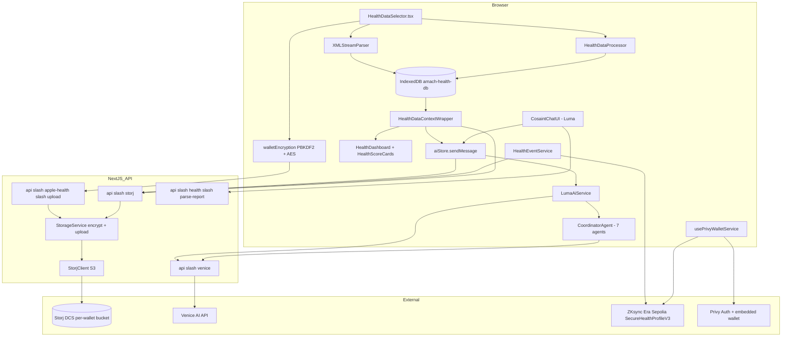
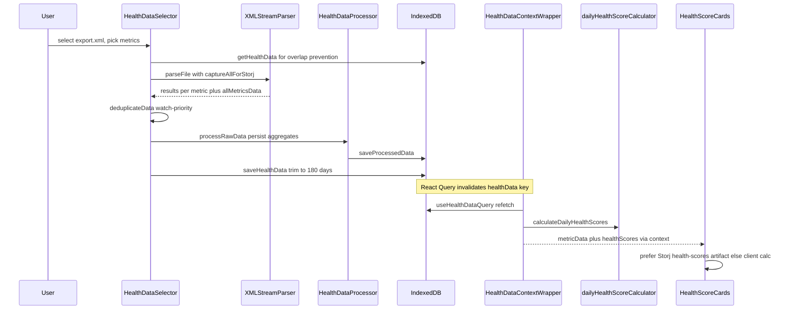
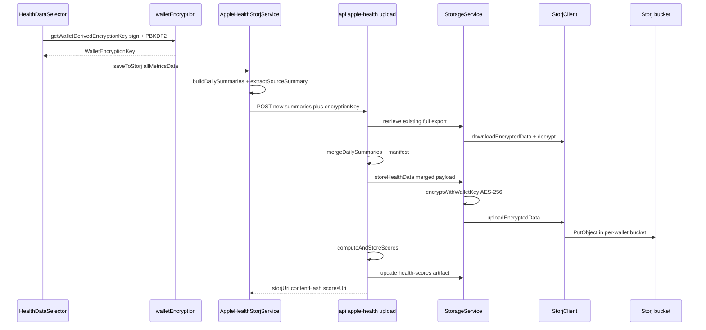
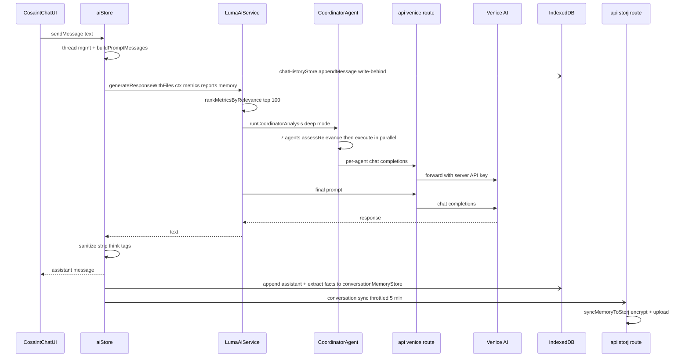
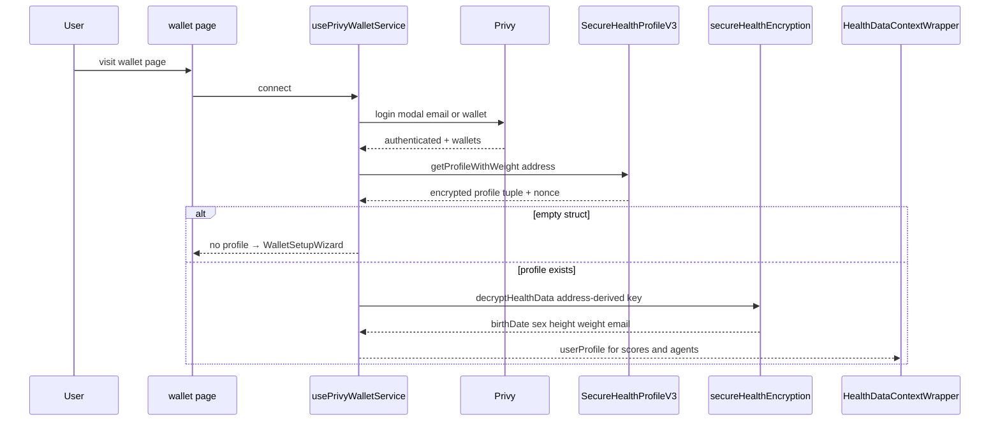

# 09 — End-to-End Data Flows: Website

> Repo: `/Users/dave/Amach-Website` (Next.js 16 App Router, TypeScript strict, pnpm).
> Companion chapters: `05-integration-storj.md`, `06-integration-privy.md`, `07-integration-venice-ai.md`, `10-data-flows-ios.md`.

## Executive Summary

The website moves health data through three storage tiers — browser IndexedDB (`amach-health-db`, primary working set), Storj S3 (encrypted long-term canonical history), and ZKsync Era Sepolia (on-chain profile + timeline event references) — with all server interaction funneled through three Next.js API routes: `/api/storj` (encrypt/store/retrieve proxy), `/api/venice` (LLM proxy that injects the server-side `VENICE_API_KEY`), and `/api/apple-health/upload` (server-side merge of daily summaries + health-score computation). Encryption is wallet-derived: the user signs a fixed message (`walletEncryption.ts`), PBKDF2-SHA256 (100k iterations) turns the signature into an AES key, and that key — critically — is shipped to the server in every `/api/storj` request body, so encryption happens server-side on the user's behalf (trust-the-server, not end-to-end). The AI chat ("Luma", UI component still named `CosaintChatUI`) assembles context from React context (`HealthDataContextWrapper`) fed by a Storj-first/IndexedDB-fallback merge, runs an optional 7-agent multi-agent analysis (`CoordinatorAgent`), and persists conversation memory back to Storj on a 5-minute throttle. Timeline events are dual-written: encrypted payload to Storj, then a `searchTag + storjUri + contentHash` reference on-chain via `addHealthEventV2`.

## Participating Files

| File                                                         | Role                                                | Notes                                                                                                                                                                                                                                            |
| ------------------------------------------------------------ | --------------------------------------------------- | ------------------------------------------------------------------------------------------------------------------------------------------------------------------------------------------------------------------------------------------------ |
| `src/components/HealthDataSelector.tsx`                      | Apple Health XML/CSV import UI                      | `handleProcess()` L613 parses + dedupes + saves; Storj save at ~L201 via `getWalletDerivedEncryptionKey` (always fresh signature)                                                                                                                |
| `src/data/parsers/XMLStreamParser.ts`                        | Streaming Apple Health `export.xml` parser          | `parseFile()` L99; `captureAllForStorj` captures all 56+ metric types; overlap-prevention against existing IndexedDB data                                                                                                                        |
| `src/utils/dataDeduplicator.ts`                              | Watch-priority / iPhone-fallback hourly-block dedup | Applied to both UI and Storj paths                                                                                                                                                                                                               |
| `src/data/store/healthDataStore.ts`                          | IndexedDB service (`amach-health-db`, v4)           | Stores: `health-data`, `goals`, `daily-scores`, `uploaded-files`, `processed-data`; `saveHealthData()` L196 trims raw data to 180 days (`RAW_RETENTION_DAYS` L20); `getHealthData()` L308; `saveUploadedFile()` L600                             |
| `src/data/processors/HealthDataProcessor.ts`                 | Long-range daily aggregates ("bins")                | `processRawData()` L148 persists to `processed-data` store; `getDataForAIAgents()` L482; `loadFromDb()` L276 on startup                                                                                                                          |
| `src/data/hooks/useHealthDataQuery.ts`                       | React Query wrapper over IndexedDB                  | `queryKey: ["healthData"]` L35                                                                                                                                                                                                                   |
| `src/data/hooks/useHealthDataMutations.ts`                   | Save/clear mutations                                | `useSaveHealthDataMutation()` L14 → `healthDataStore.saveHealthData` + query invalidation                                                                                                                                                        |
| `src/components/HealthDataContextWrapper.tsx`                | Central React context for health data               | Storj-vs-IndexedDB source selection `metricData` memo L205 (1.5x step-average dirty-data guard L232); client-side score computation L753 (`calculateDailyHealthScores`)                                                                          |
| `src/utils/dailyHealthScoreCalculator.ts`                    | Daily health score math                             | `calculateDailyHealthScores()` L45; `calculateDailyHealthScoresFromByType()` L226; `calculateDailyHealthScoresFromProcessed()` L254; scoring weights in `calculateScoresForDay()` L377                                                           |
| `src/components/dashboard/HealthDashboard.tsx`               | Dashboard page body                                 | Reads `metrics`, `metricData` from context L30; renders `HealthScoreCards` L469                                                                                                                                                                  |
| `src/components/ai/HealthScoreCards.tsx`                     | Score cards                                         | Prefers server-computed Storj scores (`useStorjHealthScores` L35), falls back to client calc L41                                                                                                                                                 |
| `src/data/hooks/useStorjHealthScores.ts`                     | Reads `health-scores` artifact from Storj           | L90; artifact written server-side by `/api/apple-health/upload`                                                                                                                                                                                  |
| `src/utils/walletEncryption.ts`                              | Signature-based encryption (primary)                | Fixed message L29; PBKDF2 100k iters (`deriveEncryptionKeyFromSignature` L110, WebCrypto path L170); AES via CryptoJS (`encryptWithWalletKey` L289); 30-min in-memory key cache (`EncryptionKeyCache` L325, `getCachedWalletEncryptionKey` L378) |
| `src/utils/secureHealthEncryption.ts`                        | Address-based encryption (on-chain profile)         | `deriveSecureKey()` L60 (PBKDF2 100k, WebCrypto AES-GCM); `decryptHealthData()` L144                                                                                                                                                             |
| `src/app/api/storj/route.ts`                                 | Server proxy for all Storj ops                      | `POST` L40; actions: `timeline/*`, `conversation/*`, `storage/*`, `report/*`; only `*-legacy` actions verify a wallet signature (L345, L428) — all others authenticate solely by possession of the derived key                                   |
| `src/storage/StorageService.ts`                              | Encrypt→upload / download→decrypt orchestration     | `storeHealthData()` L64, `retrieveHealthData()` L123, `updateHealthData()` L194                                                                                                                                                                  |
| `src/storage/StorjClient.ts`                                 | S3 client for Storj                                 | `uploadEncryptedData()` L389, `downloadEncryptedData()` L497; per-wallet bucket, name from `generateBucketName()`                                                                                                                                |
| `src/utils/storjAccessControl.ts`                            | Bucket naming/validation                            | `generateBucketName()` L36: `sha256(address + first-32-chars-of-key)[0..16]` — key required so server creds + public address ≠ access                                                                                                            |
| `src/storage/appleHealth/AppleHealthStorjService.ts`         | Client-side daily-summary builder                   | `saveToStorj()` L123 POSTs only _new_ summaries to `/api/apple-health/upload` (avoids Vercel 4.5 MB body limit)                                                                                                                                  |
| `src/app/api/apple-health/upload/route.ts`                   | Server-side merge + score computation               | Fetches existing `apple-health-full-export`, merges, stores; `computeAndStoreScores()` L69 writes `health-scores` artifact                                                                                                                       |
| `src/hooks/useStorjHealthSync.ts`                            | Storj → IndexedDB backfill                          | `useStorjHealthSync()` L249: when local data absent, pulls latest full export and converts via `convertDailySummariesToHealthData()` L96                                                                                                         |
| `src/data/hooks/useStorjAppleHealthQuery.ts`                 | Storj read path for dashboard/chat                  | `fetchAppleHealthFromStorj()` L57: `storage/list` + `storage/retrieve` for full export, then timeline breathing sessions L142                                                                                                                    |
| `src/components/ai/CosaintChatUI.tsx`                        | Chat UI (Luma)                                      | `handleSendMessage()` L1469; PDF upload `handleUploadSubmit()` L1725 → `parsePDF` → `parseHealthReport`; saved-file reload `loadSavedFileIntoContext()` L1552                                                                                    |
| `src/store/aiStore.tsx`                                      | Chat state + orchestration                          | `sendMessage()` L204: thread mgmt, context assembly, `generateResponseWithFiles`, IndexedDB write-behind, Storj `conversation/sync` throttle L565–601                                                                                            |
| `src/services/LumaAiService.ts`                              | AI coordinator service                              | `generateResponseWithFiles()` L321: relevance ranking (top-100 metrics), multi-agent trigger, prompt build, Venice call                                                                                                                          |
| `src/services/CoordinatorService.ts`                         | Agent pipeline entry                                | `runCoordinatorAnalysis()` L123; supported HK metrics allowlist L111                                                                                                                                                                             |
| `src/agents/CoordinatorAgent.ts`                             | Fan-out to 7 agents                                 | `analyze()` L96; agents instantiated L85–92 (Sleep, ActivityEnergy, Cardiovascular, RecoveryStress, Dexa, Bloodwork, GutHealth) — note: 7 agents, CLAUDE.md says 6                                                                               |
| `src/api/venice/veniceApiService.ts` (dir `src/api/venice/`) | HTTP client to `/api/venice`                        | `generateVeniceResponse()` L165; endpoint resolution L48–67                                                                                                                                                                                      |
| `src/app/api/venice/route.ts`                                | Venice proxy                                        | `POST` L28; injects `VENICE_API_KEY`; model default `zai-org-glm-4.7` L44; no auth, CORS `*`                                                                                                                                                     |
| `src/utils/pdfParser.ts`                                     | Client-side PDF text extraction                     | `parsePDF()` L91 via `pdfjs-dist`, worker at `/pdf-worker/pdf.worker.mjs`                                                                                                                                                                        |
| `src/utils/reportParsers/index.ts`                           | Report parsing facade                               | `parseHealthReport()` L26 → `universalParser.parseHealthReportUniversal()` L34; registry-based per-report-type parsers + LLM pipeline + `hallucinationGuard`                                                                                     |
| `src/utils/reportParsers/veniceClient.ts`                    | Dual-mode LLM client for parsers                    | Server-side: direct `https://api.venice.ai/api/v1/chat/completions` L68; client-side: `/api/venice` proxy L102                                                                                                                                   |
| `src/app/api/health/parse-report/route.ts`                   | Server parse endpoint                               | Wraps `parseHealthReport(text, {useAI:true})`; unauthenticated, CORS `*`                                                                                                                                                                         |
| `src/services/HealthEventService.ts`                         | Timeline CRUD                                       | `readHealthTimeline()` L66 (N+1 pattern), `addHealthEventV2()` L349 (Storj → chain dual write), `deleteHealthEvent()` L742 (`deactivateHealthEvent` on-chain soft delete)                                                                        |
| `src/utils/searchableEncryption.ts`                          | Search tags for timeline events                     | `getUserSecret()` + `generateSearchTag(eventType, secret)` used in `addHealthEventV2` L382–393                                                                                                                                                   |
| `src/storage/StorjTimelineService.ts`                        | Timeline event Storj storage                        | `storeTimelineEvent` / `retrieveTimelineEvent` (invoked by `/api/storj`)                                                                                                                                                                         |
| `src/storage/StorjConversationService.ts`                    | Conversation persistence                            | `syncMemoryToStorj()` L278; dataTypes `conversation-session` L75 / `conversation-history` L160                                                                                                                                                   |
| `src/data/store/conversationMemoryStore.ts`                  | IndexedDB conversation memory                       | Read/written by `aiStore` fact extraction; restored from Storj via `conversation/restore`                                                                                                                                                        |
| `src/data/store/chatHistoryStore.ts`                         | IndexedDB chat transcript                           | Write-behind `appendMessage` from `aiStore` L436, L549                                                                                                                                                                                           |
| `src/hooks/usePrivyWalletService.ts`                         | Central wallet hook (~1,600 lines)                  | `connect()` L331 → Privy `login()`; `signMessage` L182; `getWalletClient()` L496; `loadHealthProfileFromBlockchain()` L794 (`getProfileWithWeight`); `getDecryptedProfile()` L948                                                                |
| `src/components/PrivyProvider.tsx`                           | Privy SDK setup                                     | `NEXT_PUBLIC_PRIVY_APP_ID` L16; login methods email+wallet L26; default chain from `getActiveChain()`                                                                                                                                            |
| `src/app/wallet/page.tsx`                                    | Wallet/onboarding page                              | Renders `WalletSetupWizard` L380 when no profile                                                                                                                                                                                                 |
| `src/lib/networkConfig.ts`                                   | Chain + contract addresses                          | `CONTRACT_ADDRESSES` L91; `getActiveChain()` L83; `NEXT_PUBLIC_NETWORK` switch L68–77                                                                                                                                                            |
| `src/lib/contractConfig.ts`                                  | ABIs                                                | `secureHealthProfileAbi`, `SECURE_HEALTH_PROFILE_CONTRACT` re-export                                                                                                                                                                             |

## Configuration

**Environment variables** (from `.env.local`; see also `CLAUDE.md`):

| Var                                                                             | Used by                                                | Purpose                                                          |
| ------------------------------------------------------------------------------- | ------------------------------------------------------ | ---------------------------------------------------------------- |
| `NEXT_PUBLIC_PRIVY_APP_ID`                                                      | `PrivyProvider.tsx` L16                                | Privy app; falls back to `"placeholder-missing-app-id"` at build |
| `NEXT_PUBLIC_NETWORK`                                                           | `networkConfig.ts` L68                                 | `testnet` (default) / `mainnet`                                  |
| `NEXT_PUBLIC_ZKSYNC_RPC_URL`                                                    | `HealthEventService.ts` L82, `usePrivyWalletService`   | RPC; default `https://sepolia.era.zksync.dev`                    |
| `VENICE_API_KEY` (server-only)                                                  | `/api/venice` L38, `reportParsers/veniceClient.ts` L23 | Venice AI auth                                                   |
| `NEXT_PUBLIC_VENICE_MODEL_NAME` / `VENICE_MODEL_NAME`                           | `/api/venice` L41                                      | Model; default `zai-org-glm-4.7`                                 |
| `VENICE_REQUEST_TIMEOUT_MS`                                                     | `/api/venice` L11                                      | Optional; **no timeout by default**                              |
| `STORJ_ACCESS_KEY`, `STORJ_SECRET_KEY`, `STORJ_ENDPOINT`, `STORJ_BUCKET_PREFIX` | `StorjClient.ts` L124–155                              | S3 creds; prefix default `amach-health`                          |

**Hardcoded values:**

- Contracts (testnet, `networkConfig.ts` L91): `SECURE_HEALTH_PROFILE_CONTRACT = 0x2A8015613623A6A8D369BcDC2bd6DD202230785a`; also ProfileVerification `0xC995…0f57`, HealthToken `0x057d…8B99`, legacy HealthProfile `0x6C7e…C9F8`, CoverageVerifier `0x58a8…D884`, CoverageRegistry `0x8ce1…EFda`. All mainnet slots are zero-address placeholders.
- Chain: ZKsync Era Sepolia, chain id 300, RPC `https://sepolia.era.zksync.dev` (`networkConfig.ts` L11–35).
- Encryption-key message (`walletEncryption.ts` L29): `"Amach Health - Derive Encryption Key\n\n…Nonce: <lowercased address>"` — must never change or all data is unrecoverable.
- PBKDF2: 100,000 iterations, SHA-256, 256-bit key — mirrored in both encryption utils and the two Swift ports (see Fragmentation).
- Venice API base: `https://api.venice.ai/api/v1` (`/api/venice` L39, `veniceClient.ts` L8).
- IndexedDB: db `amach-health-db` v4; raw-sample retention 180 days (`healthDataStore.ts` L11–20).
- Gas for `addHealthEventV2`: fixed `2000000n` (`HealthEventService.ts` L597).
- Route budgets: `/api/venice` `maxDuration=300`, `/api/storj` 60, `/api/apple-health/upload` 120, `/api/health/parse-report` 300.

## Component Architecture

## Flow 1 — Apple Health XML / PDF Import → IndexedDB → Scores → Dashboard

**XML path.** `HealthDataSelector.handleProcess()` (L613) loads existing IndexedDB data (`healthDataStore.getHealthData()`) for overlap prevention, then runs `new XMLStreamParser({captureAllForStorj: true, existingData}).parseFile(file)` (`XMLStreamParser.ts` L99). Selected metrics are deduplicated (`deduplicateData`, Watch-priority hourly blocks) and typed into `HealthMetric[]` (L720–773). Before raw save, `healthDataProcessor.processRawData(results, true)` (L791) computes long-range daily aggregates into the `processed-data` store; then `useSaveHealthDataMutation` → `healthDataStore.saveHealthData()` (L196) writes raw samples, trimming to the last 180 days. Desktop XML uploads also auto-download a CSV backup (L803–856), which is the fast re-import path.

**PDF path** (labs/DEXA/gut-health) lives in the chat UI: `CosaintChatUI.handleUploadSubmit()` (L1725) → `parsePDF()` (`pdfParser.ts` L91, pdfjs-dist in-browser) → `parseHealthReport(text, {useAI:true})` (`reportParsers/index.ts` L26 → `universalParser` → registry parsers + Venice LLM extraction through `veniceClient.ts`, guarded by `hallucinationGuard.ts`). Parsed reports are cached in IndexedDB `uploaded-files` (`saveUploadedFile()` L600, including `parsedReports` to skip re-parse) and offered for Storj save (`report/store` action, which also generates a clinical narrative server-side via `ClinicalNarrativeService`).

**Scores + render.** `HealthDataContextWrapper` selects `metricData` (Storj-first, see Flow 2 read path) and computes `healthScores` via `calculateDailyHealthScores()` (wrapper L753, calculator L45: sleep 0.7 duration/0.3 efficiency, HRV/resting-HR/variability normalization by age+sex, per-day scores for overall/activity/sleep/heart/energy). `HealthDashboard` (L30, L469) renders `HealthScoreCards`, which prefers the _server-computed_ `health-scores` Storj artifact (`useStorjHealthScores` L90) and falls back to client-side `calculateDailyHealthScoresFromByType` (L41).

## Flow 2 — Health Data → walletEncryption → Storj, and Back

**Write.** After import, `HealthDataSelector` (~L201) calls `getWalletDerivedEncryptionKey(address, signMessage)` (`walletEncryption.ts` L236 — note: _not_ the cached variant, so this always pops a signature), then `new AppleHealthStorjService().saveToStorj(allMetricsForStorj, walletKey)` (L123). The service builds per-day `DailySummary` objects client-side and POSTs **only new summaries + a source summary + the full `WalletEncryptionKey`** to `/api/apple-health/upload`. The route (L69+) downloads the existing `apple-health-full-export` object, merges (`mergeDailySummaries`), stores via `StorageService.storeHealthData()` (L64: `JSON → encryptWithWalletKey AES → StorjClient.uploadEncryptedData` L389 into the per-wallet bucket named by `generateBucketName()` = `prefix-sha256(address + key[0..32])[0..16]`), then recomputes and upserts the `health-scores` artifact (`computeAndStoreScores` L69).

**Read.** Two consumers: (1) `useStorjHealthSync` (L249) backfills IndexedDB from Storj when local data is empty; (2) `useStorjAppleHealthQuery` (L219/L57) feeds the dashboard/chat directly — `POST /api/storj {action: "storage/list", dataType: "apple-health-full-export"}` then `storage/retrieve` (server: `StorjClient.downloadEncryptedData` L497 → `decryptWithWalletKey` → JSON), plus timeline breathing sessions. `HealthDataContextWrapper` L205 treats Storj as canonical full history and falls back to IndexedDB while loading or when the 1.5× step-average dirty-data guard (L232) detects pre-dedup doubled uploads.

## Flow 3 — Chat Message → Agents → Venice → Response → Storj Persistence

`CosaintChatUI.handleSendMessage()` (L1469) → `aiStore.sendMessage()` (L204). The store: (1) appends the user message to an in-memory thread (`threadRef`) and decides whether to start a new thread (topic shift / 30-min inactivity); (2) on thread close, extracts goals/concerns/preferences into `conversationMemoryStore` (IndexedDB) as a write-behind task (L250–335); (3) assembles context — `metricData`, `metrics`, `uploadedFiles`, `userProfile`, `reports` all come from `useHealthDataContext()` (L126) — and selects prompt history with `buildPromptMessages` (`chatContextSelector`, 2,200–4,500 char budget); (4) persists the user message to `chatHistoryStore` (IndexedDB, write-behind, L436).

`LumaAiService.generateResponseWithFiles()` (L321) then: converts `metricData` → `HealthMetric[]`, ranks by relevance (`RelevanceScorer.rankMetricsByRelevance`, top-100), and — in deep mode (`useMultiAgent`) — calls `runCoordinatorAnalysis()` (`CoordinatorService.ts` L123), which pulls pre-aggregated data from `HealthDataProcessor.getDataForAIAgents()` and fans out to `CoordinatorAgent.analyze()` (L96): 7 agents (`SleepAgent`, `ActivityEnergyAgent`, `CardiovascularAgent`, `RecoveryStressAgent`, `DexaAgent`, `BloodworkAgent`, `GutHealthAgent`) each `assessRelevance()` then `execute()` in parallel (L116), every agent making its own Venice call. The final prompt (characteristics from `lumaCharacteristics` + agent summaries + memory capsule) goes through `VeniceApiService.generateVeniceResponse()` (L165) → `POST /api/venice` → route injects `VENICE_API_KEY` and forwards to `https://api.venice.ai/api/v1/chat/completions` with `strip_thinking_response: true` (route L83–104).

The response is sanitized (`sanitizeAssistantResponse` strips `<think>` tags, empty → canned fallback L489), rendered, appended to the thread, written-behind to `chatHistoryStore` (L549), and — if a wallet is connected and 5 minutes have passed since the last sync — the `conversationMemoryStore` snapshot is pushed via `POST /api/storj {action: "conversation/sync"}` (L565–601) → `StorjConversationService.syncMemoryToStorj()` (L278, dataType `conversation-history`). The reverse path is `conversation/restore` (route L186), which rebuilds a `ConversationMemory` from the latest Storj snapshot.

## Flow 4 — Timeline Event CRUD via HealthEventService

**Create** — `addHealthEventV2()` (L349): derive encryption key (fresh signature, L371); derive user secret + `generateSearchTag(eventType, secret)` (`searchableEncryption`, L382–393); build event `{id: uuid, eventType, timestamp, data}`; `POST /api/storj {action: "timeline/store"}` → `StorjTimelineService.storeTimelineEvent` (encrypt + upload, returns `storjUri` + `contentHash`); verify profile exists on-chain (`isProfileActive`/`getProfile`, L474–530); then `walletClient.writeContract` `addHealthEventV2(searchTag, storjUri, contentHash, eventHash)` on `SecureHealthProfileV3` (L590, fixed 2M gas), wait for receipt and re-read `getHealthTimeline` to verify (L605–632). **If the chain tx fails after the Storj upload succeeds, the Storj object is orphaned — no rollback.**

**Read** — `readHealthTimeline()` (L66): `publicClient.readContract getHealthTimeline(user)`, then for each V2/V3 event (empty `encryptedData`) two more contract reads (`eventStorjUri` L135, `eventContentHash` L148) plus one `POST /api/storj {action: "timeline/retrieve", expectedHash}` — a sequential 3-reads-plus-1-fetch-per-event N+1 loop. Display timestamp prefers the Storj event date over the blockchain audit timestamp (L190–197).

**Delete** — `deleteHealthEvent()` (L742): on-chain soft delete via `deactivateHealthEvent(eventId, deletionHash?)` (keccak256 of optional reason); the Storj object is _not_ deleted here (bulk cleanup lives in `StorjPruningService` / dev tooling).

## Flow 5 — Login → Privy → Profile Load

`PrivyProvider.tsx` wraps the app (appId from `NEXT_PUBLIC_PRIVY_APP_ID`, login methods email + wallet, default chain from `getActiveChain()`, embedded wallets enabled). On the wallet page, `usePrivyWalletService().connect()` (L331) calls Privy `login()` (modal); `useWallets()` supplies the active wallet, `signMessage` (L182) and `getWalletClient()` (L496) wrap the Privy provider into viem.

Profile load: `loadHealthProfileFromBlockchain()` (L794) reads `getProfileWithWeight(address)` on `SecureHealthProfileV3` (`0x2A80…785a`), destructures the `[profile, weight]` tuple, treats an all-empty struct as "no profile" (→ `WalletSetupWizard` onboarding at `wallet/page.tsx` L380), and requires a `nonce` for decryption. `getDecryptedProfile()` (L948) then decrypts with the **address-based** scheme — `secureHealthEncryption.decryptHealthData()` (L144; `deriveSecureKey` L60, PBKDF2 100k → AES-GCM, keyed on wallet address so no signature popup) — with a localStorage fallback lane for timing issues. The decrypted `{birthDate, sex, height, weight, email}` feeds `HealthDataContextWrapper` (`userProfile`), which parameterizes score normalization and agent context.

## Failure Modes & Weaknesses

1. **The derived encryption key leaves the browser on every server call.** `/api/storj`, `/api/apple-health/upload` and timeline ops all receive the full `WalletEncryptionKey` in the JSON body; encryption/decryption happens server-side (`StorageService` L64/L123). The server transiently holds plaintext health data + key — this is trust-the-server, not E2E. Server logs are chatty (`route.ts` logs results; `usePrivyWalletService` logs decrypted-profile metadata and full encrypted profile responses), enlarging the leak surface. Identical finding on iOS (doc 10, item 1).
2. **Unauthenticated, CORS-open API routes.** `/api/venice` (CORS `*`, no auth) is an open proxy to a paid LLM with no rate limiting and _no default timeout_ (`VENICE_REQUEST_TIMEOUT_MS` unset ⇒ none); `/api/health/parse-report` likewise. `/api/storj` "authenticates" by possession of the derived key for all non-legacy actions — only `storage/list-legacy`/`retrieve-legacy` verify a wallet signature (route L345–465). Anyone who obtains a request capture can replay indefinitely; there is no key rotation.
3. **Dual-write without rollback / nested-success traps.** `addHealthEventV2` uploads to Storj, then writes on-chain; a chain failure orphans the Storj object. `/api/storj` returns HTTP 200 `{success: true, result}` even when `result.success === false` (e.g. `timeline/store` catch at route L88–97), so every client must remember to check the inner flag — `HealthEventService` does (L442), other callers vary.
4. **N+1 and main-thread hot spots.** `readHealthTimeline` does 1 + 3n sequential RPC/HTTP calls per timeline load; `useStorjAppleHealthQuery` retrieves breathing-session events one fetch each; XML parsing and PBKDF2 run in the browser (the UI itself warns XML "can cause issues" on mobile; `HealthDataSelector` uses the _non-cached_ key derivation so every Storj save costs an extra signature popup).
5. **Score/source divergence and race windows.** Daily scores are computed in at least three places (server `/api/apple-health/upload`, client `HealthDataContextWrapper` L753, client `HealthScoreCards` fallback L41) that can disagree with each other and with the Storj artifact until the next upload. The Storj-vs-IndexedDB 1.5× step heuristic (wrapper L232) can flap the entire dashboard between datasets. The conversation-sync throttle lives in component state (`aiStore` L154), so a remount resets it; the 30-min encryption key cache is per-tab memory, so multi-tab use multiplies signature prompts and sync writes.

## Fragmentation Notes

- **Two "healthDataStore"s in this repo**: `src/data/store/healthDataStore.ts` (**canonical**, the IndexedDB service) vs `src/store/healthDataStore/` (dead stub — `index.ts` contains a single comment line). CLAUDE.md still documents the stub location. Similarly CLAUDE.md names `CosaintAiService.ts` (doesn't exist — renamed `LumaAiService.ts`) and says 6 agents (there are 7: `GutHealthAgent` was added).
- **Score calculation** exists on the website client, the website server route, and (per doc 10) is _not_ re-implemented on iOS — iOS consumes the server-written `health-scores` Storj artifact. Canonical math: `src/utils/dailyHealthScoreCalculator.ts`.
- **PBKDF2/AES wallet encryption is triplicated across repos**: `src/utils/walletEncryption.ts` (**canonical** — both Swift ports cite it), `AmachHealth-iOS .../WalletService.swift`, `AmachHealthBreathe .../WalletCrypto.swift`. Within the website itself there are also **two distinct schemes** by design (signature-based `walletEncryption.ts` for Storj vs address-based `secureHealthEncryption.ts` for the on-chain profile) — both 100k-iteration PBKDF2 but different key material and cipher modes (CryptoJS AES-CBC vs WebCrypto AES-GCM).
- **Venice clients duplicated in-repo**: `src/api/venice/` (`VeniceApiService`, used by chat/agents) and `src/utils/reportParsers/veniceClient.ts` (used by report parsing, with its own server-direct/client-proxy split). Both target the same `/api/venice` route; the route is canonical for auth/model selection.
- **Timeline services duplicated across platforms**: web `src/storage/StorjTimelineService.ts` vs iOS `StorjTimelineService.swift` — same `timeline-event` dataType, independent logic; iOS additionally registers events on-chain itself (doc 10).
- **Conversation memory shape** is shared by convention only: web `src/types/conversationMemory.ts` (closest to canonical) vs iOS `ConversationMemoryStore` — both read/write the same Storj dataTypes through `/api/storj`.
- **Untracked `src 2/` directory** at the repo root is a stale duplicate source tree (contains its own `api/`, `components/`, `data/`, …). It should be deleted; it will otherwise poison greps and future analyses.
