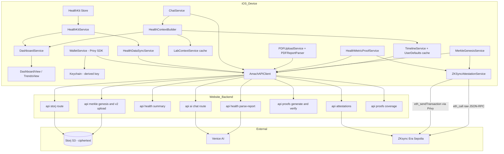
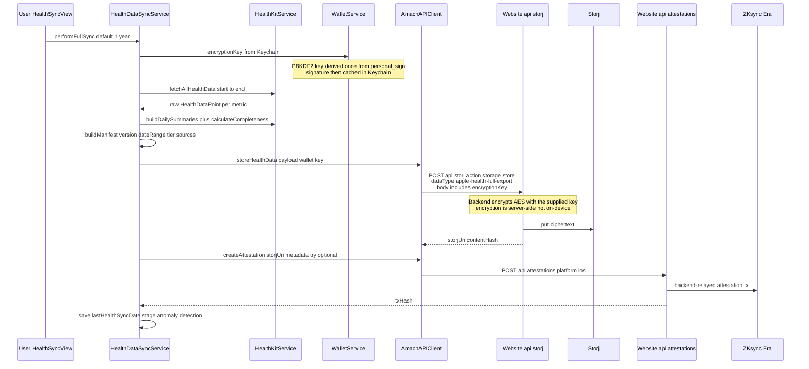
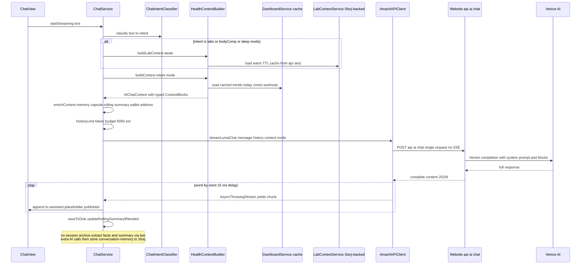
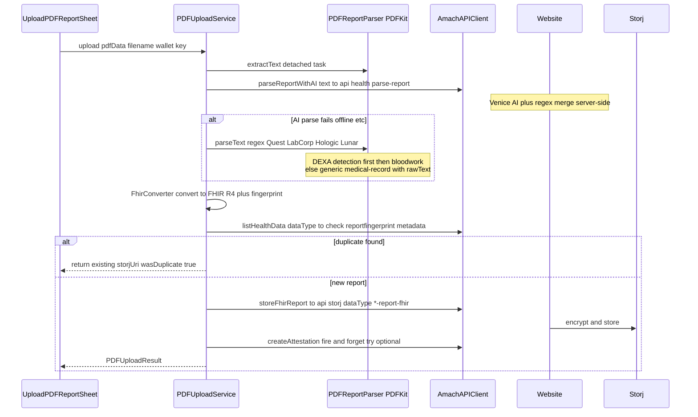
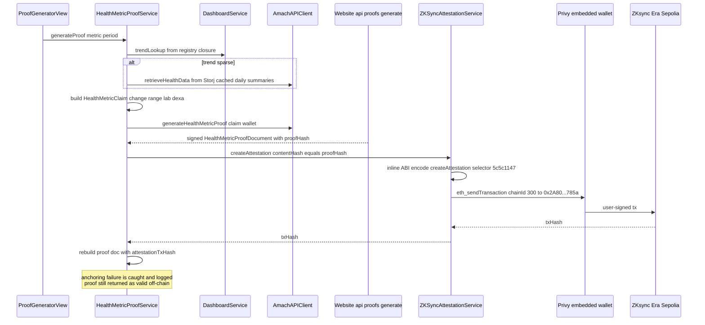

# Chapter 10 — End-to-End iOS App Data Flows

Repo: `/Users/dave/amach-workspace/AmachHealth-iOS` (Swift Package `AmachHealth`, SwiftUI, iOS)
Companion: `/Users/dave/AmachHealthBreathe` (Amach Breathe, iPhone + Apple Watch)
Backend: the Next.js website (`/Users/dave/Amach-Website`) — the iOS app has **no direct Storj, Venice, or database access**; every remote operation goes through the website's `/api/*` routes at `https://www.amachhealth.com`.

## Executive Summary

The iOS app is a thin-ish native client over the website's API layer. HealthKit is the only true local data source: `HealthKitService` reads raw samples, `DashboardService` aggregates them into today-cards and 7/30/90-day trends for `DashboardView`, and `HealthDataSyncService` packages a 1-year daily-summary payload and POSTs it to `/api/storj` (action `storage/store`), followed by a backend-mediated on-chain attestation via `/api/attestations`. Critically, **encryption of Storj payloads happens server-side**: the app derives a PBKDF2 key from a wallet signature (`WalletService.deriveEncryptionKeyPBKDF2`, parameter-identical to the web's `walletEncryption.ts`), caches it in the Keychain, and then **sends that key in the JSON body of every `/api/storj` request** so the backend can encrypt/decrypt on the user's behalf. Luma chat (`ChatService` → `HealthContextBuilder` → `POST /api/ai/chat`) is request/response, not SSE — "streaming" is simulated client-side by word-splitting the completed response. PDF lab reports are parsed AI-first via `/api/health/parse-report` with an offline regex fallback (`PDFReportParser`), converted to FHIR, and stored to Storj with fingerprint dedup. Proof generation (`HealthMetricProofService`) asks the backend to build and sign a proof document (`/api/proofs/generate`), then anchors its `proofHash` on ZKsync Era Sepolia directly from the device via the Privy embedded wallet (`ZKSyncAttestationService.createAttestation`, hand-rolled ABI encoding, no web3 library). A parallel ZK pipeline (Merkle genesis roots, Groth16 coverage proofs, Spring Push leaf uploads) also flows through website endpoints with on-chain commits signed on-device.

---

## Participating Files

| File                                                                                                                                      | Role                                                 | Notes                                                                                                                                                                                                                                                                          |
| ----------------------------------------------------------------------------------------------------------------------------------------- | ---------------------------------------------------- | ------------------------------------------------------------------------------------------------------------------------------------------------------------------------------------------------------------------------------------------------------------------------------ |
| `AmachHealth/Sources/App/AmachHealthApp.swift`                                                                                            | App entry, 5-tab shell + Luma FAB                    | `initializePrivy()` + silent HealthKit auth in `.task` (L33–53); Spring Push auto-sync on launch/foreground/wallet-connect (L52, L64, L76)                                                                                                                                     |
| `AmachHealth/Sources/App/AppState.swift`                                                                                                  | Lightweight observable app state                     | Seeded from service singletons                                                                                                                                                                                                                                                 |
| `AmachHealth/Sources/Services/HealthKitService.swift`                                                                                     | HealthKit reads + aggregation                        | `requestAuthorization()` L41; `fetchAllHealthData()` L60; `buildDailySummaries()` L267; `calculateCompleteness()` L380 (score/tier/coreComplete)                                                                                                                               |
| `AmachHealth/Sources/Services/DashboardService.swift`                                                                                     | Live dashboard data (today + trends)                 | `load(force:)` L240 with 300 s TTL; `fetchToday()` L317; `fetchDailyTrend()` L415 (HKStatisticsCollectionQuery); HR zones L667–771; publishes `@Published` trend dictionaries keyed by `TrendPeriod` (7D/30D/3M)                                                               |
| `AmachHealth/Sources/Services/HealthDataSyncService.swift`                                                                                | Sync orchestrator HealthKit → Storj → chain          | `performFullSync()` L37 (9-step flow); `retrySync()` L173; `performBackgroundSync()` L229 (24 h gate, 7-day window)                                                                                                                                                            |
| `AmachHealth/Sources/Services/WalletService.swift`                                                                                        | Privy auth, signing, PBKDF2 key derivation, Keychain | Email-OTP login L100–139; `deriveEncryptionKeyPBKDF2()` L401 (100k iters, SHA-256, salt = address bytes — MUST match web `walletEncryption.ts`); Keychain CRUD L496–551; `sendTransaction()` L260                                                                              |
| `AmachHealth/Sources/API/AmachAPIClient.swift`                                                                                            | The single HTTP client to the website                | `post()` L942; Storj store/list/retrieve/delete L34–318; `getHealthSummary()` L492; `sendChatMessage()` L571; `streamLumaChat()` L606 (simulated streaming); attestations L723–766; proofs L794–825; Merkle/coverage L829–918; `submitChatFeedback()` L926                     |
| `AmachHealth/Sources/API/AmachAPIClient+AIReportParsing.swift`                                                                            | AI PDF parse                                         | `parseReportWithAI()` L107 → `POST /api/health/parse-report`                                                                                                                                                                                                                   |
| `AmachHealth/Sources/API/AmachAPIClient+PDFReports.swift`                                                                                 | FHIR report store/retrieve                           | `storeFhirReport()` L14 → `/api/storj` with dataType `bloodwork-report-fhir` / `dexa-report-fhir` / `medical-record-fhir`                                                                                                                                                      |
| `AmachHealth/Sources/Services/ChatService.swift`                                                                                          | Luma session state, persistence, memory              | `sendStreaming()` L156; `startStreaming()` L149 (cancellable Task); `deliverProactiveInsight()` L363; memory extraction L505–593; rolling summary L678; token budget `historyLimit()` L719; disk persistence L789–809; `syncSessionToStorj()` L824                             |
| `AmachHealth/Sources/Services/HealthContextBuilder.swift`                                                                                 | Builds `AIChatContext` from cached dashboard data    | `buildLabContext()` L29 (Storj-backed labs); `buildCurrentContext()` L362; `buildContext(for:mode:)` L530 (intent-filtered blocks); emits typed `ContextBlock`s (`metrics`, `labs_bloodwork`, `labs_dexa`, `hr_zones`, `workouts`, `anomalies`, `timeline`, `memory`, `goals`) |
| `AmachHealth/Sources/Services/ChatIntentClassifier.swift`                                                                                 | Keyword intent classification                        | Gates expensive lab context (`labs`/`bodyComp` intents or deep mode only)                                                                                                                                                                                                      |
| `AmachHealth/Sources/Services/LabContextService.swift`                                                                                    | TTL cache of bloodwork/DEXA from Storj               | Warmed by `HealthContextBuilder.buildLabContext()`                                                                                                                                                                                                                             |
| `AmachHealth/Sources/Services/PDFReportParser.swift`                                                                                      | PDFKit text extraction + regex parsing               | `extractText()` L21; `parseText()` L42 (DEXA → bloodwork → generic medical-record fallback); vendor heuristics for Quest/LabCorp/Hologic/GE Lunar                                                                                                                              |
| `AmachHealth/Sources/Services/PDFUploadService.swift`                                                                                     | PDF → FHIR → Storj pipeline                          | `upload()` L51: extract → AI parse (fallback regex) → fingerprint dedup L176 → `storeFhirReport` → fire-and-forget attestation L131                                                                                                                                            |
| `AmachHealth/Sources/Services/FhirConverter.swift`                                                                                        | Bidirectional FHIR R4 conversion + fingerprints      | `convertBloodworkToFhir`, `fingerprintBloodwork`, etc.                                                                                                                                                                                                                         |
| `AmachHealth/Sources/Services/HealthMetricProofService.swift`                                                                             | Shareable metric-proof documents                     | `registry` L32 (22 provable metrics: 9 HealthKit + 8 lab + 5 DEXA); `generateProof()` L211; `anchorOnChain()` L272                                                                                                                                                             |
| `AmachHealth/Sources/Services/ZKSyncAttestationService.swift`                                                                             | Direct on-chain writes via Privy wallet              | Hardcoded chain 300 + 5 contract addresses L27–58; `createAttestation()` L292 (inline ABI encoding); `commitGenesisRoot()` L213; `submitCoverageProof()` L126 (eth_call pre-check then registry submit); `ethCall()` L391 (raw JSON-RPC to `sepolia.era.zksync.dev`)           |
| `AmachHealth/Sources/Services/MerkleGenesisService.swift`                                                                                 | Merkle genesis pipeline orchestrator                 | `generateGenesisRoot()` L114: HealthKit bundle → normalize → `/api/merkle/genesis` L180 → `commitGenesisRoot` on-chain L289–324                                                                                                                                                |
| `AmachHealth/Sources/Services/MerkleNormalizationService.swift`, `LeafHashingService.swift`, `MerkleTreeBuilder.swift`, `Keccak256.swift` | On-device leaf normalization/hashing                 | Poseidon-compatible leaf field prep; keccak for selectors                                                                                                                                                                                                                      |
| `AmachHealth/Sources/Services/SpringPushLeavesService.swift`                                                                              | Contest baseline/finish leaf capture                 | `autoSyncIfNeeded()` — idempotent; uploads v2 leaves via `/api/merkle/v2/upload`                                                                                                                                                                                               |
| `AmachHealth/Sources/Services/TimelineService.swift`                                                                                      | Timeline feed with UserDefaults cache                | `loadEvents()` L28 cache-first then Storj merge; delegates to `StorjTimelineService`                                                                                                                                                                                           |
| `AmachHealth/Sources/Services/StorjTimelineService.swift`                                                                                 | Timeline ↔ Storj + on-chain event registration       | `saveEvent()` L72; `registerOnChain()` L169 (ABI-encodes `addHealthEventWithStorj`)                                                                                                                                                                                            |
| `AmachHealth/Sources/Services/LumaProactiveService.swift`, `AnomalyDetector.swift`, `HealthMemoryStore.swift`                             | Proactive anomaly insights                           | Fed by `performFullSync()` step 9 (`evaluateAndStage`)                                                                                                                                                                                                                         |
| `AmachHealth/Sources/Services/ChatService.swift` + `ConversationMemoryStore` (in `HealthMemoryModels.swift`)                              | Cross-platform conversation memory                   | Distilled facts/summaries stored as dataType `conversation-memory`                                                                                                                                                                                                             |
| `AmachHealth/Sources/Views/DashboardView.swift`                                                                                           | Dashboard UI                                         | Calls `dashboard.load()` on appear, `load(force: true)` on pull-to-refresh (L63, L69)                                                                                                                                                                                          |
| `AmachHealth/Sources/Views/ChatView.swift`                                                                                                | Luma chat UI                                         | `sendMessage()` → `chatService.startStreaming()`; typing indicator, retry banner, quick/deep mode toggle L375                                                                                                                                                                  |
| `AmachHealth/Sources/Views/HealthSyncView.swift`, `ProofGeneratorView.swift`, `UploadPDFReportSheet.swift`, `ConnectWalletSheet.swift`    | Feature entry points                                 | Drive the sync, proof, PDF, and login flows respectively                                                                                                                                                                                                                       |

---

## Configuration

| Item                         | Value                                                                                                                                                                                           | Where                                                              |
| ---------------------------- | ----------------------------------------------------------------------------------------------------------------------------------------------------------------------------------------------- | ------------------------------------------------------------------ |
| API base URL                 | `https://www.amachhealth.com`, overridable via env `AMACH_API_URL`                                                                                                                              | `AmachAPIClient.init` L19–21 (same pattern in Breathe's client)    |
| HTTP timeouts                | 180 s request / 300 s resource (sized for Venice latency)                                                                                                                                       | `AmachAPIClient.init` L26–27                                       |
| Privy App ID / Client ID     | `cmiev4g03026zl80cpoyjccwu` / `client-WY6TLxngkdjGfUtmZkKe5evREPGvJ7Z7jeQXBd5BcxJE5` — **hardcoded**                                                                                            | `WalletService.swift` L39–40                                       |
| Key-derivation message       | `"Amach Health - Derive Encryption Key\n\n…Nonce: " + address`                                                                                                                                  | `WalletService.swift` L56–57 (must match web)                      |
| PBKDF2 params                | 100,000 iterations, HMAC-SHA-256, 32-byte key, salt = 20-byte address                                                                                                                           | `WalletService.swift` L60–63, L401–430                             |
| Keychain                     | service `com.amach.health`, account `encryption_key_<address>`, `WhenUnlockedThisDeviceOnly`                                                                                                    | `WalletService.swift` L504–509                                     |
| Chain                        | ZKsync Era Sepolia, chainId 300, RPC `https://sepolia.era.zksync.dev`                                                                                                                           | `ZKSyncAttestationService.swift` L27–28                            |
| SecureHealthProfile V4 proxy | `0x2A8015613623A6A8D369BcDC2bd6DD202230785a` (matches web `contractConfig.ts` L768)                                                                                                             | L29                                                                |
| MerkleCommitment             | `0x2385cFF536C738C133EC4779441A591732aC7FbA`                                                                                                                                                    | L39                                                                |
| CoverageVerifier (Groth16)   | `0x58a856a2b11817f8B5E9fd96F797dDD48E57D884`                                                                                                                                                    | L46                                                                |
| ImprovementVerifier          | `0x2248040f9833A6C91bfC161F244E0238da64615b`                                                                                                                                                    | L47                                                                |
| CoverageRegistry             | `0x8ce1bBeda99D629b1357133175E349990257EFda`                                                                                                                                                    | L55                                                                |
| Function selectors           | Pre-computed keccak4 constants (e.g. `createAttestation` = `5c5c1147`)                                                                                                                          | L32–58                                                             |
| Local persistence            | Chat: `Documents/amach_chat_sessions.json`; Timeline cache: UserDefaults `amach_timeline_events`; last sync: UserDefaults `lastHealthSyncDate`; onboarding: `@AppStorage("onboardingComplete")` | ChatService L34–38, TimelineService L19, HealthDataSyncService L29 |

**Website API routes consumed by iOS** (all POST): `/api/storj` (actions `storage/store|list|retrieve|delete`, `report/retrieve`), `/api/health/summary`, `/api/health/parse-report`, `/api/ai/chat`, `/api/attestations`, `/api/profile/read`, `/api/proofs/generate`, `/api/proofs/verify`, `/api/proofs/coverage/generate`, `/api/proofs/coverage/verify`, `/api/merkle/genesis`, `/api/merkle/v2/upload`, `/api/feedback`. All exist in `Amach-Website/src/app/api/` **except `/api/feedback`, which has no route directory** — the iOS call is fire-and-forget (`try?`) so it silently 404s.

---

## Component Architecture

---

## Flow 1 — HealthKit → Dashboard

`DashboardView.onAppear` → `DashboardService.load()` (L240, 5-minute TTL; pull-to-refresh forces). `load()` fans out ~15 concurrent `async let` fetches: `fetchToday()` (per-metric `HKStatisticsQuery` via `stat()` L384), `fetchAllPeriods()` (per-day `HKStatisticsCollectionQuery` via `fetchDailyTrend()` L415 for steps/HR/HRV/calories/exercise/RHR/RR/VO2), sleep sample queries (`fetchLastNightSleep()` L500 uses an 18:00-yesterday→14:00-today window; stage mapping 0=inBed/1=asleep/2=awake/3=core/4=deep/5=rem), HR-zone interpolation (`fetchTodayHRZones()` L667, gap-capped at 5 min, fixed maxHR 185), and last-7-day workouts for Luma context. Results land in `@Published` properties (`today`, `stepsTrend[.week]`, …) that SwiftUI observes. `DashboardTodayData.recoveryScore` (L73) computes a WHOOP-style recovery score on the fly (HRV 40% + RHR 25% + sleep duration 20% + sleep efficiency 15%).

This path is entirely local — no wallet, no network. The separate `HealthKitService` (used by sync, not the dashboard) fetches **raw samples** per metric (`fetchAllHealthData()` L60) and aggregates into `[String: DailySummary]` via `buildDailySummaries()` L267, matching the web app's `AppleHealthStorjService` shapes.

## Flow 2 — Sync to Storj + Attestation

Key points: the device does **not** encrypt the payload; it transmits plaintext JSON + the derived AES key over TLS and the backend encrypts before writing to Storj (`/api/storj/route.ts` requires `userAddress` + `encryptionKey` in every body). Attestation failure is swallowed (`try?` at HealthDataSyncService L111) — sync reports success with `attestationTxHash = nil`. `performBackgroundSync()` (L229) syncs only the last 7 days and only if >24 h since last sync. Retry keeps `pendingPayload` in memory only — lost on app kill.

## Flow 3 — Luma Chat

Notable details: streaming is **simulated** — `streamLumaChat()` (AmachAPIClient L606) waits for the full `/api/ai/chat` response, then yields word chunks with 15 ms sleeps ("Designer's Intent" comment at ChatService L143). An unused `VeniceChatRequest` struct (L1123) and SSE chunk type point at an abandoned real-streaming path against `/api/venice`. Empty responses trigger exactly one silent retry, then a canned fallback (ChatService L256–303). Context is assembled entirely on-device as typed `ContextBlock`s that the backend injects verbatim — adding a data source requires zero backend changes. Memory: `startNewSession()` archives via detached Task → `summarizeAndArchive()` + `extractAndStoreConversationMemory()` (two additional AI calls parsing JSON out of LLM text) → `ConversationMemoryStore.syncToStorj()` (dataType `conversation-memory`, readable by the web app). Raw sessions also sync to Storj on archive (`storeChatSession`, dataType `chat-session`).

## Flow 4 — PDF Report Upload

Retrieval for Luma context goes the other way: `AmachAPIClient.retrieveBloodworkReport`/`retrieveDexaReport` use `/api/storj` action `report/retrieve`, and `HealthContextBuilder` collapses them into `LabResultSummary`/`DexaResultSummary` via keyword matching (glucose, HbA1c, LDL…).

## Flow 5 — Proof Generation & On-Chain Anchoring

The **Merkle/ZK lane** is parallel: `MerkleGenesisService.generateGenesisRoot()` fetches a HealthKit bundle, normalizes leaves (`MerkleNormalizationService`), sends them to `/api/merkle/genesis` (server builds the Poseidon tree, stores tree/leaves/metadata to Storj, returns root + optional `onChainCommitCalldata`), then commits on-chain via `ZKSyncAttestationService.commitGenesisRoot()` (selector `5a8b10ca`, MerkleCommitment contract). Groth16 coverage proofs are generated server-side (`/api/proofs/coverage/generate`), pre-checked with a free `eth_call` to CoverageVerifier, then persisted through `CoverageRegistry.submitProof` — both signed on-device. `SpringPushLeavesService.autoSyncIfNeeded()` (run at launch, foreground, and wallet-connect) uploads canonical 124-byte v2 leaf bundles to `/api/merkle/v2/upload` for the improvement-proof contest, where the web-side `improvementLeafFetcher.ts` consumes them.

---

## The Breathe App

`/Users/dave/AmachHealthBreathe` is a resonance-breathing trainer (iPhone + Apple Watch, early TestFlight beta): paced breathing with live HRV, on-device coherence scoring (Goertzel filter), 4.5–7.0 BPM resonance calibration, session history, and a post-session AI coach. Architecture: `Shared/` Swift Package (`AmachBreatheShared`) consumed by both `iOS/` and `watchOS/` targets.

**What it shares with the main app (by pattern, not by code):**

- **Same backend, same endpoints.** `Shared/Sources/AmachBreatheShared/Networking/AmachAPIClient.swift` is a _separate copy_ of the API client hitting `amachhealth.com` — `/api/storj` (session data, dataType `subscription-state` among others), `/api/ai/chat` (Luma coach — explicitly the same Venice-backed route), and `/api/tracking`. Same `AMACH_API_URL` override.
- **Same key derivation.** `Shared/.../Services/WalletCrypto.swift` reimplements `deriveEncryptionKey` / `pbkdf2SHA256` / `hexToBytes` — a third copy of the PBKDF2 derivation (web `walletEncryption.ts`, main-app `WalletService`, Breathe `WalletCrypto`).
- **Same Privy + Storj model**, optional (app works wallet-less), with watch↔phone wallet handoff via WatchConnectivity.
- **Not shared:** no HealthKit full-export sync, no timeline, no proofs/ZK, no PDF parsing. All HRV/coherence signal processing is on-device. Its README claims sessions are "AES-256-GCM encrypted before upload," but like the main app its client sends `encryptionKey` in `/api/storj` bodies, so encryption is backend-side there too.

---

## Failure Modes & Weaknesses

1. **Derived encryption key leaves the device on every Storj call.** `WalletEncryptionKey` (key **and** the raw wallet signature) is serialized into request bodies (`AmachAPIClient.StorjRequest` L1049–1056). TLS protects transit, but the backend sees plaintext health data plus the key — "encrypted health storage" is trust-the-server, not end-to-end. Server logs / memory dumps are in the threat model. Same for Breathe.
2. **Simulated streaming = worst-case latency.** The user watches a fake typewriter only after the full Venice round-trip (up to 180 s timeout) completes. The dead `VeniceChatRequest`/`SSEChunk` code suggests real SSE was planned and dropped; timeout failures surface as canned fallback text with no partial content.
3. **Silently swallowed failures.** Attestations after sync (`try?` HealthDataSyncService L111), after lab store (AmachAPIClient L393), after PDF upload (PDFUploadService L131), and `/api/feedback` (a route that does not exist on the website) all fail without user-visible signal — data can be on Storj with no on-chain anchor and no reconciliation job to backfill.
4. **N+1 and unbounded fetch patterns.** `listTimelineEvents()` (AmachAPIClient L209–247) does one `storage/list` then a serial `storage/retrieve` per event — O(n) round-trips through the backend to Storj, and a single slow item stalls the feed (individual failures are at least skipped). `deleteTimelineEvent`'s legacy fallback decodes every event to find one ID.
5. **Race/consistency gaps.** `ChatService.saveToDisk()` writes the whole session file on every token batch with no debounce; `updateRollingSummaryIfNeeded()` fires an unstructured `Task` that can interleave with an active send; `pendingPayload` retry state is memory-only; `DashboardService.load()` has no in-flight guard, so pull-to-refresh during initial load double-queries HealthKit. `hasCoverageProof` parses the eth_call result with `result.hasSuffix("1")` — fragile against padded return data.
6. **Hardcoded secrets-adjacent config.** Privy app/client IDs, all five contract addresses, and function selectors are compiled in; a contract redeploy requires an App Store release (the web app reads `contractConfig.ts` — only the V4 proxy address is shared/consistent between the two).
7. **Dev-mock wallet in production code path.** Without PrivySDK, `connectDevMock()` (WalletService L185) silently creates a fixed dev address with a fake signature — gated only by `canImport(PrivySDK)`, not by `#if DEBUG`.

## Fragmentation Notes

- **Three PBKDF2 implementations** of the identical algorithm: `Amach-Website/src/utils/walletEncryption.ts` (**canonical** — both Swift files cite it as source of truth), `AmachHealth/Sources/Services/WalletService.swift` L401, `AmachHealthBreathe/Shared/.../WalletCrypto.swift` L18. Any drift bricks cross-platform decryption; only comments enforce parity (tests exist in Breathe's `WalletEncryptionTests.swift`).
- **Two Swift `AmachAPIClient`s** (main app vs `AmachBreatheShared`) duplicating request/response types (`StorjRequest`, `WalletEncryptionKey`, error handling). The main app's is the richer, canonical one; Breathe's is a trimmed fork. A shared package would collapse them.
- **PDF parsing exists in three places**: website `src/utils/pdfParser.ts` + `/api/health/parse-report` (AI merge — **canonical**), iOS `PDFReportParser.swift` (regex fallback, intentionally offline-capable), and the website's report services. The iOS fallback mirrors but does not share fixtures/heuristics with the web parser.
- **Attestation writing has two lanes**: backend-relayed (`/api/attestations`, used by sync/labs/PDF) vs device-signed (`ZKSyncAttestationService`, used by metric proofs, genesis roots, coverage proofs, timeline `registerOnChain`). Same V4 contract, two signers — attribution on-chain differs (relayer wallet vs user wallet), which matters for anything verifying `msg.sender`.
- **Timeline services duplicated across platforms**: web `src/storage/StorjTimelineService.ts` vs iOS `StorjTimelineService.swift` — same dataType `timeline-event`, independent CRUD logic (the iOS side additionally does per-event on-chain registration).
- **Chat memory**: iOS `ConversationMemoryStore` and the web's conversation services both read/write dataType `conversation-memory` via `/api/storj`; the shape contract lives only in code on both sides (website `src/types/conversationMemory.ts` is the closer thing to canonical).
- The website repo also contains an untracked `src 2/` directory (visible in git status) — a stale duplicate source tree worth deleting to avoid confusing future greps.
